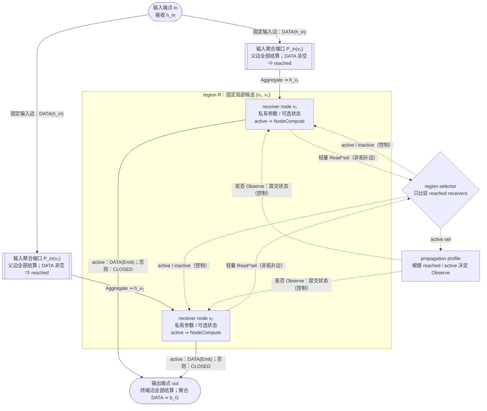

# TIDE 实验语义、命名与数学符号

> 本文从更上层研究计划继承 **[TIDE](https://github.com/ZichaoLong/ObsidianVault.git)** 这个名字，其余内容均可独立阅读。
>
> 本文描述的是新实验的目标语义，只定义“模型实际怎样计算”和“实验名称怎样反映计算图”。
>
> 实验晋级、结果报告组织和 checkpoint 保留策略另行讨论。
>
> 第 4.6 节拓扑生成规则中的候选默认值仍待逐项核验，详见核验台帐 [`experiment-semantics-review-ledger.md`](experiment-semantics-review-ledger.md)。

## 阅读入口：先看完整图景

**GraphBranch** 是一个可独立输入输出、可接入原始 Transformer 的计算图，它用一个固定空间拓扑的 Graph 表示，其空间 Graph 的每个节点，是一个 **receiver node**，表示一个有“记忆模块+计算模块”的计算单元，可接受多个上游父节点输出、按需激活、激活消息发送给下游所有节点，节点内部设计的典型例子是 Transformer block，节点的具体定义见 2.3 节。

这套 GraphBranch 的语义服务于三个要求：**固定空间拓扑**（底层节点和边固定，但每个 Token 的 active 子图可以变化）、**单节点成本有界**（每个节点的参数、状态、连接和工作量有上界）以及**可达容量增长**（扩容后仍能沿这些固定局部连接到达更多节点）。

GraphBranch 的工作方式是，对每个 Token，接受一个输入 hidden，沿内部固定边传播 hidden，在固定的局部候选中选择少量 receiver 做昂贵计算，再把结果送往下游并最终输出一个与输入 hidden 同维度的张量。

本文档还特别注重，应可从原始 Transformer checkpoint 的良好基线出发，在满足上述三个要求的前提下逐步扩容，避免基于尚未验证的不成熟神经网络组件进行研究起步时，永远无法获得有效正面验证结果。因此，额外要求 GraphBranch 接入后可通过适当的初始化方式，保持与原始模型的函数级等价。

本文还定义允许不等长路径和异步物理到达的**规范固定 DAG**：每条边最终结算为“有数据”或“不会再有数据”，每个 region 对每个 Token 只结算一次，每个 receiver 至多执行一次完整计算。任给一张满足约束的 DAG，都可自动校验并完全展开为一份静态记录（Plan），再由同一个通用参考解释器执行；单层特例和 HB-Lattice 都是这种 DAG 的规则化特例。高性能通用 prefill 执行器，以及有环或需要节点多次结算的 Graph，仍属于上层研究计划。

下文第 1 节说明 GraphBranch 与 base Transformer 的接入边界，第 2 节定义内部组件和规范固定 DAG，第 3、4 节给出单层特例和 HB-Lattice，后文说明基线、损失、命名和实验记录。

## 1. Base block 与 GraphBranch 顶层边界

### 1.1 Base 与顶层符号

本节只引入理解 base block 和 GraphBranch 接入位置所需的符号。

| 符号 | 含义 |
| --- | --- |
| \(b\) | 当前 micro-batch 中的序列行号；正文通常省略这一维 |
| \(\mathrm{sid}\) | 稳定的序列标识；跨 batch/chunk 继承状态和缓存时使用它 |
| \(\ell\) | base Transformer block 编号 |
| \(j\) | GraphBranch 插入位置（site）编号；site \(j\) 所在的 base block 记为 \(\ell(j)\) |
| \(t\) | 序列中的 Token 位置 |
| \(d_{\mathrm{model}}\) | base hidden 的维度 |
| \(x_{\ell,t}\) | 实际送入第 \(\ell\) 个 base block 的 hidden |
| \(u_{\ell,t}\) | 当前 block 完成 Attention residual merge 后的 hidden |
| \(v_{\ell,t}\) | 当前 block 完成原 dense MLP residual merge 后的 hidden |
| \(y_{\ell,t}\) | 当前 block 连同可选 GraphBranch 最终送往下一个 block 的 hidden |
| \(h^{\mathrm{in}}_{j,t}\) | site \(j\) 的 GraphBranch 实际入口 hidden |
| \(b_{\mathcal G,j,t}\) | GraphBranch 返回的完整 hidden |
| \(\Delta_{\mathcal G,j,t}\) | GraphBranch 相对入口产生的 residual |

这里的 \(b\) 只表示当前 batch 的序列行号，与输出 hidden \(b_{\mathcal G,j,t}\) 无关；跨 batch 或 chunk 重排时，状态和缓存使用稳定的 \(\mathrm{sid}\)。

若同一 base block 放置多个 site，实验设置必须给出它们的执行顺序；默认每个 base block 至多放置一个 site。

后文按作用复用基本符号：归一化写成 \(N\)，私有状态写成 \(s\)，receiver node 内部状态操作写成 \(\operatorname{Update}\)、\(\operatorname{Read}^{\mathrm{sel}}\) 和 \(\operatorname{Read}^{\mathrm{ffn}}\) 等，激活节点的完整计算写成 \(\operatorname{NodeCompute}\)。相同符号表示相同职责，不表示共享参数或采用相同算法。

### 1.2 Base Qwen3 block

令 \(N_A\) 和 \(N_F\) 分别表示 Attention 前与 MLP 前、逐 Token 执行的归一化操作；当前 Qwen3 base block 中二者都实现为 RMSNorm。\(A_\ell\) 表示 causal self-attention，\(F_\ell\) 表示原 dense SwiGLU MLP。先把第 \(\ell\) 个 block 到位置 \(t\) 为止的输入前缀记为：

$$
X_{\ell,\le t}
:=(x_{\ell,0},x_{\ell,1},\ldots,x_{\ell,t}).
$$

\(N_A(X_{\ell,\le t})\) 表示分别归一化前缀中的每个 Token，方括号后的下标 \(t\) 表示取 self-attention 在当前位置的输出。一个原始 Pre-Norm Qwen3 block 对位置 \(t\) 计算：

$$
u_{\ell,t}
=x_{\ell,t}
+\left[
A_\ell\!\left(N_A(X_{\ell,\le t})\right)
\right]_t,
$$

$$
v_{\ell,t}
=u_{\ell,t}
+F_\ell\!\left(N_F(u_{\ell,t})\right).
$$

因此 \(x_{\ell,t}\) 是实际送入第 \(\ell\) 个 base block 的当前 Token hidden；对 \(\ell>0\)，有 \(x_{\ell,t}=y_{\ell-1,t}\)。

Dense 基线没有 receiver，直接令：

$$
y_{\ell,t}=v_{\ell,t}.
$$

### 1.3 GraphBranch 的单入口、单出口契约

每个 site 在原有 base computation 之外只接入一个 GraphBranch，记为 \(\mathcal G_j\)。它是一个单入口、单出口子图，外部语义由本节的输入、输出和合并公式完整定义。

**placement** 表示 GraphBranch 相对当前 base block 的接入位置；对当前 Token，四种 placement 的入口分别是：

$$
h^{\mathrm{in}}_{j,t}
=
\begin{cases}
v_{\ell,t}, & \text{POST},\\
x_{\ell,t}, & \text{PARBLK},\\
x_{\ell,t}, & \text{PARATTN},\\
u_{\ell,t}, & \text{PARMLP},
\end{cases}
\qquad \ell=\ell(j).
$$

GraphBranch 内部采用第 2.7 节的固定 DAG 语义；第 3 节的单层结构和第 4 节的 HB-Lattice 是两个规则化特例。它对外始终只返回一个同维 hidden：

$$
b_{\mathcal G,j,t}
=\mathcal G_j\!\left(h^{\mathrm{in}}_{j,t}\right),
\qquad
\Delta_{\mathcal G,j,t}
=b_{\mathcal G,j,t}-h^{\mathrm{in}}_{j,t}.
$$

这里的 \(\mathcal G_j\) 省略了逐序列持久状态；第 2 节定义状态及其具体读写顺序。无论内部多复杂，placement 只看见入口 \(h^{\mathrm{in}}\)、完整输出 \(b_{\mathcal G}\) 和唯一 residual \(\Delta_{\mathcal G}\)。

每个有效 Token 都执行的原 base 路径是 **always-on** 的，把 placement 的 base always-on 输出记为 \(b^0_{j,t}\)，外部统一采用 **RESIDUAL_ADD**；合并结果为：

$$
b^0_{j,t}+\Delta_{\mathcal G,j,t}
=b^0_{j,t}+\left(b_{\mathcal G,j,t}-h^{\mathrm{in}}_{j,t}\right).
$$

该式保留 base always-on 路径，只叠加 GraphBranch 相对共同入口产生的变化；它与第 2.2 节定义的 GraphBranch 内部消息聚合是两种不同操作。

对 PARATTN，边界合并后还要继续执行原 dense MLP；其他 placement 的合并结果直接作为 block 输出。

### 1.4 四种 placement

四种 placement 只改变 \(h^{\mathrm{in}}\)、always-on 输出和 residual 合入位置，不改变 GraphBranch 的内部语义。

#### 1.4.1 POST：完整 block 后串联

先按第 1.2 节得到完整 base block 输出 \(v_{\ell,t}\)，再令：

$$
h^{\mathrm{in}}_{j,t}=v_{\ell,t},
\qquad
y_{\ell,t}
=v_{\ell,t}+\Delta_{\mathcal G,j,t}
=b_{\mathcal G,j,t}.
$$

~~~text
x → Attention → u → 原 dense MLP → v → GraphBranch → y
~~~

GraphBranch 能看到当前 block 的 Attention 和原 MLP 结果。POST 是串联结构。

#### 1.4.2 PARBLK：与完整 block 并列

GraphBranch 和完整 base block 都从 \(x_{\ell,t}\) 开始，最后在 block 出口合并：

$$
h^{\mathrm{in}}_{j,t}=x_{\ell,t},
\qquad
y_{\ell,t}
=v_{\ell,t}+\Delta_{\mathcal G,j,t}.
$$

~~~text
          ┌→ 完整 base block → v ─────┐
x ────────┤                            + → y
          └→ GraphBranch → Δ_G(x) ────┘
~~~

GraphBranch 看不到当前 block 的 Attention 或 MLP 结果，也不改变它们的输入；两条路径可以并行执行。

#### 1.4.3 PARATTN：与 Attention 并列

GraphBranch 与 Attention 都读取 \(x_{\ell,t}\)。先在 Attention residual 位置合并，再让原 dense MLP 读取合并后的表示：

$$
h^{\mathrm{in}}_{j,t}=x_{\ell,t},
\qquad
u'_{\ell,t}=u_{\ell,t}+\Delta_{\mathcal G,j,t},
$$

$$
y_{\ell,t}
=u'_{\ell,t}+F_\ell\!\left(N_F(u'_{\ell,t})\right).
$$

~~~text
          ┌→ self-attention ─┐
x ────────┤                   + → u' → 原 dense MLP → y
          └→ GraphBranch ────┘
~~~

PARATTN 只说明 GraphBranch residual 的接入位置，不限制 GraphBranch 内部只能使用 Attention。

#### 1.4.4 PARMLP：与 MLP 并列

Attention residual 先得到 \(u_{\ell,t}\)；原 dense MLP 与 GraphBranch 都读取这个共同输入，最后在 MLP residual 位置合并：

$$
h^{\mathrm{in}}_{j,t}=u_{\ell,t},
\qquad
y_{\ell,t}
=v_{\ell,t}+\Delta_{\mathcal G,j,t}.
$$

~~~text
x → self-attention → u
                      ├→ 原 dense MLP ─┐
                      └→ GraphBranch ── + → y
~~~

GraphBranch 能看到当前 Attention 的结果，但看不到当前原 MLP 的结果，也不改变原 MLP 的输入。本文统一使用 **PARMLP**；**PARFFN** 指同一个 placement。原 dense MLP 是 always-on 路径，GraphBranch 是与它并列的稀疏、可有状态主旁路。

#### 1.4.5 直接比较与初始化

| Placement | \(h^{\mathrm{in}}\) | always-on 输出 | 看见当前 Attention | 看见当前原 MLP | 改变原 MLP 输入 | GraphBranch merge 后 |
| --- | --- | --- | ---: | ---: | ---: | --- |
| **POST** | \(v\) | \(v\) | 是 | 是 | 否 | 直接得到 \(y\) |
| **PARBLK** | \(x\) | \(v\) | 否 | 否 | 否 | 直接得到 \(y\) |
| **PARATTN** | \(x\) | \(u\) | 否 | 否 | 是 | 得到 \(u'\)，再执行原 MLP |
| **PARMLP** | \(u\) | \(v\) | 是 | 否 | 否 | 直接得到 \(y\) |

若 GraphBranch 初始化为 identity，且内部端口聚合在相同输入上保持该输入（当前默认是对实际消息取均值），则 \(b_{\mathcal G}=h^{\mathrm{in}}\)、\(\Delta_{\mathcal G}=0\)，四种 placement 都保持原 base 函数不变；采用其他聚合策略时必须单独验证这一条件。这只约束当前前向，状态是否仍按第 2.4 节的 profile 更新须在实验设置中声明。离开初始点后，它们的前向耦合、梯度路径和有效深度不同，不能视为同一架构。

## 2. GraphBranch 内部的基础组件及语义

### 2.1 内部组件与职责边界

以下固定一个 site \(j\)、一个稳定序列 \(\mathrm{sid}\) 和其中的 Token \(t\)；后文在不影响理解时省略 \(j\) 和 \(\mathrm{sid}\)。receiver node 的 ID 记为 \(v\)，与第 1.2 节的 base hidden \(v_{\ell,t}\) 不是同一个量。

在 GraphBranch 的拓扑中，只有 receiver node 属于计算节点。输入端点、输出端点和聚合端口负责传递或合并消息，不持有 receiver 的私有状态，也不执行 receiver 的昂贵计算；selector 是控制模块，不是拓扑节点。每个 receiver node 只属于一个固定 region；对给定拓扑，regions 的划分固定且互不重叠，每个 region 由一个 selector 负责。

| 组件 | 职责 |
| --- | --- |
| 输入端点 \(\mathrm{in}\) | 接收 \(h^{\mathrm{in}}\)，并沿固定输入边发送 |
| 固定有向边 | 规定消息可以从哪个发送方到达哪个接收位置；每个 Token 最终结算一次 |
| 输入聚合端口 \(P_v^{\mathrm{in}}\) | 等待固定父边全部结算，只聚合实际携带 hidden 的消息 |
| receiver node \(v\) | 持有自己的参数和可选私有状态；active 时执行完整计算 |
| region selector | 等待本 region 的成员端口都收齐父边完成结果（final），再在 reached receivers 中选择 active receivers |
| 输出端点 \(\mathrm{out}\) | 等待固定终端边全部结算，聚合其中的数据并返回 \(b_{\mathcal G}\) |

下图中的 \(\operatorname{DATA}(y)\) 表示固定边为当前 Token 携带 hidden \(y\)，\(\operatorname{CLOSED}\) 表示该边确认不会再有数据；精确定义见第 2.2 节。

对一个给定 Token，需要分别判断同一个 receiver 是否 reached、active 和 Observe：

| 概念 | 由什么决定 | 含义 |
| --- | --- | --- |
| **reached** | 固定父边全部结算后，至少一条边携带数据 | 当前有可供 receiver 处理的输入 hidden |
| **active** | 所属 region 的 selector | 当前执行完整计算并向固定下游发送 |
| **Observe** | propagation profile（状态传播规则） | 当前把收到的内容提交到持久状态 |

active 和 Observe 都以 reached 为前提，但二者是不同决定：有状态 receiver 可以 Observe 而不 active；无状态 receiver 即使 active，也没有状态需要提交。固定边决定消息能够到达哪里，selector 不创建分支，只决定 reached receivers 中哪些继续完整计算和发送。

第 2.2 节定义消息、端点与聚合，第 2.3 节定义 receiver node，第 2.4 节定义 selector、propagation profile 与发送规则，第 2.5—2.6 节给出执行顺序和跨 Token 状态规则，第 2.7 节再定义不等长路径下的规范固定 DAG、Plan 与通用解释器。

### 2.2 输入/输出端点、固定边与消息聚合

对同一个 Token，每条固定边最终恰好产生一种完成结果：

- \(\operatorname{DATA}(y)\)：该边实际携带一个 \(d_{\mathrm{model}}\) 维 hidden \(y\)；
- \(\operatorname{CLOSED}\)：该边确认本 Token 不会再有数据。

\(\operatorname{CLOSED}\) 只是调度完成标记，不是模型 hidden，也不参加聚合。边一旦完成就不能改写或再次完成；物理上先到的结果可以缓存，不能据此提前重复执行 receiver。第 2.7 节给出规范固定 DAG 的完整结算规则。

消息在端口内按固定 sender/edge ID 顺序提供；下文的花括号记号表示这些消息成员，传入聚合前按该顺序排成序列。`AGG-MEAN` 默认置换不敏感；任何依赖顺序或 edge ID 的聚合规则都必须把该依赖写入配置。

每个 receiver node 前都有一个输入聚合端口。令 \(\operatorname{In}(v)\) 为 node \(v\) 的固定入边集合；只有这些边都已返回 \(\operatorname{DATA}\) 或 \(\operatorname{CLOSED}\)，端口才算 final：

$$
\operatorname{Final}(P_{v,t}^{\mathrm{in}})
\iff
\forall e\in\operatorname{In}(v),\ e\text{ 已完成}.
$$

端口 final 后，只把其中的 \(\operatorname{DATA}\) 按固定 edge ID 排成有序序列 \(\operatorname{Inbox}_{v,t}\)；\(\operatorname{CLOSED}\) 不进入 inbox。随后端口只聚合一次，同一 Token 不会因为消息先后到达而重复更新 node：

$$
h_{v,t}
:=\operatorname{Aggregate}_{P_v^{\mathrm{in}}}
\left(\operatorname{Inbox}_{v,t}\right)
\quad\text{仅在 }q_{v,t}=1\text{ 时定义},
\qquad
q_{v,t}=\mathbf 1[\operatorname{Inbox}_{v,t}\ne\varnothing].
$$

端口 final 后，收到至少一条 \(\operatorname{DATA}\) 即 \(q_{v,t}=1\) 时 receiver 才是 **reached**。在默认的 `AGG-MEAN`（以及声明为“单消息保持原样”（singleton-preserving）的其他规则）下，只有一条消息时聚合就是该消息；`AGG-CUSTOM` 若采用其他行为必须在设置中写明。没有数据时端口不产生 hidden，receiver 不参加当前选择、状态更新或计算。输出端点后不再接 receiver node，它只把最终数据聚合为 \(b_{\mathcal G}\)。

对 `AGG-MEAN` 和 `AGG-LEARNED`，聚合函数统一写成：

$$
\operatorname{Aggregate}_{P}(\mathcal M_{P,t})
=\sum_{(k,y)\in\mathcal M_{P,t}}\alpha_{P,k,t}y,
\qquad
\alpha_{P,k,t}\ge0,
\qquad
\sum_{(k,y)\in\mathcal M_{P,t}}\alpha_{P,k,t}=1.
$$

这是两种聚合的统一形式；`AGG-CUSTOM` 可以使用其他确定性聚合，但输出仍必须是 \(d_{\mathrm{model}}\) 维，并在设置中给出公式。

上述聚合公式中的 \(k\) 是 sender/edge 的局部标识；附录中的 \(k\) 另指 key 向量，按所在公式理解。

`AGG-MEAN` 取 \(\alpha_{P,k,t}=1/|\mathcal M_{P,t}|\)。首个设置使用实际 \(\operatorname{DATA}\) 消息的均值；每条固定父边的 source-presence 是一个 0/1 值，表示该边最终是 \(\operatorname{DATA}\) 还是 \(\operatorname{CLOSED}\)，供聚合和诊断使用。节点级 \(q_{v,t}\) 始终用于构造候选集；只有实验明确声明时，source-presence 或 \(q_{v,t}\) 才作为 \(\operatorname{Score}\) 的可学习额外特征。若使用 `AGG-LEARNED`，端口内的轻量打分函数产生并归一化 \(\alpha\)；其他权重策略在实验设置中另行声明。

多个 active receiver 的消息在同一端口汇合时，也使用同一个 \(\operatorname{Aggregate}\)，不另设一套“分支聚合”语义。

常见的合并方式都必须返回一个 \(d_{\mathrm{model}}\) 维 hidden。下表中 \(g_i\) 是端口收到的第 \(i\) 条完整消息，\(n_{\mathrm{msg}}\) 只表示本次实际消息数；拼接需要固定槽位时，令 \(F\) 为槽位数（与 base MLP 的 \(F_\ell\) 无关），\(\widetilde g_i\) 为带 mask/pad 的槽位值：

| 方式 | 示例 | 适用说明 |
| --- | --- | --- |
| 均值 | \(\frac1{n_{\mathrm{msg}}}\sum_i g_i\) | 首个设置；同一输入的 identity 输出保持不变 |
| 学习加权 | \(\sum_i\alpha_i g_i\)，\(\alpha_i\ge0,\sum_i\alpha_i=1\) | 权重由端口内轻量打分函数产生 |
| 拼接后投影 | \(W_P[\widetilde g_1;\ldots;\widetilde g_F]\) | 仅用于固定 slots 的 fan-in（未到达消息用 mask/pad），并把投影成本计入节点预算 |

这些都是 \(\operatorname{Aggregate}\) 的具体规则；它们不改变发送方的 selector 或状态语义。

空的 receiver inbox 不产生 hidden；输出端点等待全部固定终端边完成后，也只聚合其中的 \(\operatorname{DATA}\)。拓扑配置和选择规则必须保证输出端点在每个有效 Token 上至少收到一条数据，否则该 run 记为配置失败并停止。聚合端口不持有 receiver 私有状态，不参加 selector，也不执行 \(\operatorname{NodeCompute}\)。一个 receiver 向多个 children 发送消息只是固定边的 fan-out，不需要额外的“发散点”。拓扑配置默认禁止同一发送方到同一端口的重复平行边。

输入端点 \(\mathrm{in}\) 对每条固定 input edge 产生 \(\operatorname{DATA}(h^{\mathrm{in}}_{j,t})\)；输出端点 \(\mathrm{out}\) 等所有固定 output edges 完成后，用同一个聚合函数收集其中实际送达的数据：

$$
\operatorname{Inbox}_{\mathrm{out},t}
=\{(v,\widehat g_{v,t})\mid v\to\mathrm{out}\text{ 是固定边且 }v\text{ 已发送}\},
\qquad
b_{\mathcal G,j,t}
=\operatorname{Aggregate}_{\mathrm{out}}
\left(\operatorname{Inbox}_{\mathrm{out},t}\right).
$$

全部固定 output edges 完成后，输出 inbox 仍为空，表示动态路径保证失效，该次运行必须报告配置失败。

### 2.3 Receiver node

本节沿用 2.1 节表中的 \(N_{R,v}\)、\(N_{F,v}\) 和 \(E_v\)：带下标的 \(N\) 表示 normalization；两种归一化默认不共享，\(E_v\) 是 node \(v\) 的昂贵 FFN（或声明的等价昂贵计算）。无状态 profile 记作 **N**（详见 2.4 节）。

**receiver node** 是固定拓扑上持有自己的参数（默认不与其他 node 共享）、可选私有状态和昂贵计算的计算节点；实验设置决定它是否采用私有状态，采用后哪些消息提交由第 2.4 节的 propagation profile 决定。拓扑只依赖下面的输入、状态和输出语义，不依赖节点内部采用 EMA、Gated DeltaNet、Attention 还是其他算法。

| 契约项 | 输入 | 结果 |
| --- | --- | --- |
| 入口准备 | \(h_{v,t}\) | \(m_{v,t}=N_{R,v}(h_{v,t})\) |
| 状态 proposal（按 selector 时序和 profile 按需） | \(s^-_{v,t}\)、\(m_{v,t}\) | \(\widetilde s_{v,t}=\operatorname{Update}_v(s^-_{v,t},m_{v,t})\) |
| selector 读出 | \(m_{v,t}\) 与指定时刻的状态 | 轻量 \(r^{\mathrm{sel}}_{v,t,\tau}\) |
| 状态提交 / Observe（把本 Token 写入持久状态） | \(s^-_{v,t}\)、\(\widetilde s_{v,t}\) 与 propagation profile | \(s^{\mathrm{cmp}}_{v,t}\)，供当前 \(\operatorname{NodeCompute}\) 使用；本步末的其他写回得到 \(s_{v,t}\) |
| 激活计算 | \(h_{v,t}\)、\(m_{v,t}\) 与 \(s^{\mathrm{cmp}}_{v,t}\) | 同维完整 hidden \(g_{v,t}=\operatorname{NodeCompute}_v(h_{v,t},m_{v,t},s^{\mathrm{cmp}}_{v,t})\) |

\(\operatorname{Update}\) 只产生 proposal；只有 commit 把 proposal 保存为持久状态时，当前消息才算被该节点 **Observe**。receiver 不自行决定是否 active，也不在内部乘 selector 概率。它只向 selector 提供轻量读出；较大的状态读出和昂贵计算只由 active nodes 执行。

未 reached 的 node 不执行上述任何 receiver 步骤，receiver 私有状态保持不变；独立的 selector-history 若存在，按其自身规则处理；无状态 node 的 \(\operatorname{Update}\)、commit 和状态读出均为空操作。

\(\operatorname{Update}\) 本身的成本由状态模块决定；若某个时序要求在选择前为全部 reached nodes 生成 proposal，该成本必须单独记录。在声明单节点成本有界的设置中，\(\operatorname{Read}^{\mathrm{sel}}\) 的输出维度和计算量均固定且有界，不随图宽或序列长度增长。

当前默认的 receiver 内部计算采用 Pre-Norm 双 residual；其他内部算法只要继续满足轻量 selector 读出、状态提交和完整 hidden 输出语义，就不改变拓扑、selector 或消息聚合。

\(\widetilde s_{v,t}\) 是当前消息能决定的完整状态 proposal；本步不更新的复合状态分量从 \(s^-_{v,t}\) 原样复制。依赖 active 结果的历史统计不属于这个 proposal，按 2.6 节在 Token 末写回。

pre-update 时序只描述 selector 读取旧状态；active node 的默认 \(\operatorname{NodeCompute}\) 仍在状态提交后读取本 Token 的 \(s^{\mathrm{cmp}}_{v,t}\)。

三种 selector 时刻的轻量读出统一写成：

$$
r^{\mathrm{sel}}_{v,t,\mathrm{content}}
=\operatorname{Read}^{\mathrm{sel}}_v(m_{v,t}),
\qquad
r^{\mathrm{sel}}_{v,t,\mathrm{pre}}
=\operatorname{Read}^{\mathrm{sel}}_v(s^-_{v,t},m_{v,t}),
\qquad
r^{\mathrm{sel}}_{v,t,\mathrm{post}}
=\operatorname{Read}^{\mathrm{sel}}_v(\widetilde s_{v,t},m_{v,t}).
$$

其中 post-update 需要在 selector 前为该 node 生成 proposal；content-only 和 pre-update 在选择后只为实际 Observe 的 node 生成 proposal。

默认的 \(\operatorname{NodeCompute}\) 在 active 后先执行较大的状态/上下文读出，再执行昂贵 FFN；\(\operatorname{Read}^{\mathrm{ffn}}\) 是其内部步骤（可包含归一化、Attention/SSM 和 output projection），不是额外的拓扑 node：

$$
r^{\mathrm{ffn}}_{v,t}
=\operatorname{Read}^{\mathrm{ffn}}_v(s^{\mathrm{cmp}}_{v,t},m_{v,t}),
\qquad
u^{\mathrm{node}}_{v,t}=h_{v,t}+r^{\mathrm{ffn}}_{v,t},
$$

$$
g_{v,t}
=u^{\mathrm{node}}_{v,t}
+E_v\!\left(N_{F,v}(u^{\mathrm{node}}_{v,t})\right).
$$

按 Pre-Norm 约定，第一条 residual 的基底是未归一化的 \(h_{v,t}\)；\(m_{v,t}\) 只作为状态模块和相关归一化的输入，\(\operatorname{Read}^{\mathrm{ffn}}\) 可包含 Attention output projection。

\(\operatorname{Read}^{\mathrm{ffn}}\) 在 receiver 局部完成必要的状态投影并返回 \(d_{\mathrm{model}}\) 维 residual；无状态 node 令 \(r^{\mathrm{ffn}}_{v,t}=0\)。这里的 \(s^{\mathrm{cmp}}_{v,t}\) 是本 Token commit 后、当前计算可见的状态；本步末若还有历史写回，则形成下一 Token 使用的 \(s_{v,t}\)。

\(u^{\mathrm{node}}_{v,t}\) 与第 1 节 base 的 \(u_{\ell,t}\) 无关。

无状态 node 默认不使用 \(\operatorname{Read}^{\mathrm{ffn}}\) 的状态 residual；若要让它读取当前内容，须把该设置标为 CUSTOM。

### 2.4 Selector、传播 profile 与发送规则

#### 2.4.1 Candidate 与 Score

**selector** 与一个固定的局部 receiver 集合（region）关联。它只在 \(\mathcal R\) 中所有 receiver 的输入聚合端口都 final、每个 \(q_{v,t}\) 都已确定，并且所需的旧状态与 selector-history 已满足第 2.6 节的跨 Token 因果顺序后执行一次；这只是 region 内的局部等待，不要求其他无依赖 region 同步。第 2.7 节给出保证这种等待不会形成控制环的静态约束。此时的候选集只包括已经 reached 的 nodes：

$$
\mathcal C_{\mathcal R,t}
=\{v\in\mathcal R\mid q_{v,t}=1\}.
$$

selector 只接收这些 receiver 在本地产生的轻量 \(r^{\mathrm{sel}}\)；未 reached node 不实际计算 readout。令 \(c^{\mathrm{ctx}}_{\mathcal R,t}\) 表示可选的少量公共上下文（没有时取空），则局部 \(\operatorname{Score}\) 一次返回 reached candidates 的 logits；\(q\) 默认只用于构造候选集，只有明确声明时才把节点级或逐父边 presence 作为额外特征。

\(c^{\mathrm{ctx}}_{\mathcal R,t}\) 的来源必须是该 region 或其固定、有界上游提供的局部摘要，来源和时序与所选 `SELECTOR` 一致；`SEL-CONTENT` 的公共摘要也只能来自当前内容，不含持久状态或历史激活。

$$
(a_{v,t})_{v\in\mathcal C_{\mathcal R,t}}
=\operatorname{Score}_{\mathcal R}
\left(
 c^{\mathrm{ctx}}_{\mathcal R,t},
 \left(r^{\mathrm{sel}}_{v,t,\tau}\right)_{v\in\mathcal C_{\mathcal R,t}}
\right).
$$

随后只在 \(\mathcal C_{\mathcal R,t}\) 上做 masked softmax。下文的 \(\operatorname{TopKIndex}(p,K)\) 返回 \(p\) 最大的 \(K\) 个候选下标；平票时按固定 node id 的升序打破。

$$
(p_{v,t})_{v\in\mathcal C_{\mathcal R,t}}
=\operatorname{softmax}\left((a_{v,t})_{v\in\mathcal C_{\mathcal R,t}}\right),
\qquad
\mathcal A_{\mathcal R,t}
=\operatorname{TopKIndex}\!\left(p,
\min\!\left(K^{\mathrm{req}}_{\mathcal R,t},|\mathcal C_{\mathcal R,t}|\right)\right).
$$

其中候选非空时：

$$
K^{\mathrm{req}}_{\mathcal R,t}\in\mathbb N,
\qquad
1\le K^{\mathrm{req}}_{\mathcal R,t}\le K^{\max}_{\mathcal R},
\qquad
\lvert\mathcal A_{\mathcal R,t}\rvert
=\min\!\left(K^{\mathrm{req}}_{\mathcal R,t},|\mathcal C_{\mathcal R,t}|\right).
$$

候选为空时 \(\mathcal A_{\mathcal R,t}=\varnothing\)。这里的 \(p_{v,t}\) 是候选 node \(v\) 的 soft 选择概率，不是消息聚合权重；未 reached node 没有本次 \(p\)。selector 不直接读取完整私有状态，只接收 receiver 声明的轻量 \(\operatorname{Read}^{\mathrm{sel}}\)，也不执行昂贵计算。单层特例可另外提供共同入口的轻量内容摘要；非平凡固定 DAG 的 region 不要求存在这样的公共摘要。

**candidate** 只是当前参加选择的 reached receiver；被选中的 candidate 称为 **active**。二者都是 receiver 在当前 Token 的运行时角色，不是新的拓扑角色。

selector 是控制模块，不是拓扑节点或发散点：固定边决定消息能到达哪里，selector 只决定 reached receivers 中哪些可以继续完整计算和发送。

若某个拓扑声明 forced-active node，当前规范要求它位于单独的 singleton region；它只要 reached 就自动 active，可跳过 \(\operatorname{Read}^{\mathrm{sel}}\) 和 \(\operatorname{Score}\)，发送时取固定 active 权重 1，不产生 selector 的主任务梯度或 balance 统计。若要把 forced-active node 与普通候选混在同一 region，必须使用 CUSTOM，并明确 \(K^{\max}/K^{\mathrm{req}}\)、active set 和 balance loss 的计数方式。

#### 2.4.2 Selector 时序与 propagation profile

selector 读取状态的时刻有三种。下表中的 **N** 指 stateless profile；\(N_{R,v}\)、\(N_{F,v}\) 等带下标的 \(N\) 仍指归一化算子：

| 时序 | selector 使用的 receiver 信息 | 自然兼容的 profile |
| --- | --- | --- |
| **Content-only** | 当前本地消息的轻量读出 | N、SD、BO |
| **Pre-update state** | 当前消息到来前的旧状态读出 | SD、BO |
| **Post-update state** | 当前消息产生的状态 proposal 读出 | BO |

核心规范中，一个 GraphBranch/site 的所有有状态 receiver 统一采用同一个 propagation profile，节点和 region 只继承该设置。N 只配 content-only，SD 配 content-only 或 pre-update，BO 可配三种时序；混合 N、SD、BO 或采用其他组合时，必须作为自定义 profile 给出 Observe 集合和命名。N 若另有独立 selector-history，也使用 SEL-CUSTOM。

`SEL-CUSTOM` 不由三种预设标签完整定义，必须在设置中列出可读信息和 proposal/commit 顺序。Pre 与 post 不是包含关系：若 \(\operatorname{Update}\) 会覆盖、压缩或遗忘旧状态，post-update 不能必然恢复 pre-update 的信息。

若 proposal 参与 selector（例如 post-update），proposal→\(\operatorname{Read}^{\mathrm{sel}}\)→\(\operatorname{Score}\) 的计算图默认保留；是否有主任务梯度由发送规则（例如 EMIT-HST 或 EMIT-SOFTP）决定，若截断或 stop-gradient，必须在实验设置中记录。content-only 和 pre-update 的 proposal 在选择之后生成，不经过这条“当前 proposal→selector”路径；selector 若读取由更早 Token 递归得到的旧状态，梯度是否沿该状态递归传播，仍按 chunk 内与跨 chunk 的规则记录。

传播 profile 决定哪些 reached nodes 提交状态；selector 决定哪些 active nodes 执行完整计算：

| Profile | 状态提交 / Observe | 完整 \(\operatorname{NodeCompute}\) 与发送 |
| --- | --- | --- |
| **N（stateless）** | 无私有状态 | active nodes |
| **SD（selected-dispatch）** | active nodes | active nodes |
| **BO（broadcast-observe）** | 全部 reached nodes | active nodes |

SD 并不表示只有 active node 收到输入：所有 reached node 仍先做本地入口归一化和所需的 \(\operatorname{Read}^{\mathrm{sel}}\)，只是只有 active node Observe、Compute 和发送。

令 \(\mathcal O_{\mathcal R,t}\) 分别取 \(\varnothing\)、\(\mathcal A_{\mathcal R,t}\) 或 \(\mathcal C_{\mathcal R,t}\)（对应统一的 N、SD、BO）。对有状态 node，当前 Token 的内容 commit 统一写成：

$$
s^{\mathrm{cmp}}_{v,t}
=\begin{cases}
\widetilde s_{v,t}, & v\in\mathcal O_{\mathcal R,t},\\
s^-_{v,t}, & v\notin\mathcal O_{\mathcal R,t}.
\end{cases}
$$

因此 content-only / pre-update 是“先选择、再按 \(\mathcal O\) commit”，而 post-update + BO 是“全部 reached node 先产生 proposal，选择后全部 commit”。前者只为需要 Observe 的 node 生成 proposal；后者会为全部 reached node 生成 proposal。若没有独立的本步末历史写回，则 \(s_{v,t}=s^{\mathrm{cmp}}_{v,t}\)。

#### 2.4.3 发送规则与主任务梯度

active receiver 得到完整输出 \(g_{v,t}\) 后，发送规则产生实际消息：

$$
\widehat g_{v,t}
=\operatorname{Emit}_v(h_{v,t},g_{v,t},p_{v,t}).
$$

同一个 \(\widehat g_{v,t}\) 被复制到该 receiver 的全部固定出边。selector 的 soft 概率对主任务前向的额外权重或梯度作用统一由发送规则处理，不在 receiver 内部或消息聚合中重复使用；Top-K 的离散成员选择仍由 selector 直接决定，soft 概率 \(p\) 不替代这个离散成员选择。训练期均衡规则只根据选择事件产生辅助 loss，不改变推理数据流。

当前推荐的 **EMIT-HST（Hard-ST，hard straight-through）** 为：

$$
\rho_{v,t}
=1+\zeta^{\mathrm{ST}}_{v}\bigl(p_{v,t}-\operatorname{sg}(p_{v,t})\bigr),
\qquad
\widehat g_{v,t}
=h_{v,t}+\rho_{v,t}\bigl(g_{v,t}-h_{v,t}\bigr).
$$

\(\operatorname{sg}\) 表示 stop-gradient：前向值不变、反向梯度为零。因此 EMIT-HST 前向恒有 \(\widehat g=g\)，但主任务梯度可经 \(p\) 返回 selector；Top-K 的离散成员选择本身不求导。EMIT-HARD 令 \(\widehat g=g\) 且不传这条梯度，EMIT-SOFTP 令 \(\widehat g=h+p(g-h)\) 并同时改变前向强度；后者若用于 GraphBranch 内部，必须作为探索性扩展单独标记。
\(\zeta^{\mathrm{ST}}_{v}\) 是 active node \(v\) 的固定梯度缩放常数，不参与反向传播；首个 Top-1 设置取 \(\zeta^{\mathrm{ST}}_{v}=1\)，其他值必须在实验设置中记录。

若初始化时 \(g_{v,t}=h_{v,t}\)，经 Emit-HST 由主任务返回 selector 的这条梯度暂为零；需要非零分支初始化或其他主任务梯度路径、warmup 等方式让分支离开 identity 点，balance loss 只能改变路由倾向。

### 2.5 共用执行顺序

前面的符号已经定义完毕。下面描述一个已经 ready 的 region 如何完成一次结算：region 中所有 receiver 的输入端口都已 final，所需的 receiver state 和 selector-history 也已满足跨 Token 因果顺序；其中 inbox 非空的 nodes reached，空 inbox 的 nodes 已确定不会参加本次选择。单层特例只有一个 region，HB-Lattice 可以用 Line barrier 批量结算同一 Line 的多个 regions，规范固定 DAG 则允许互不依赖的 regions 在不同时间 ready。

这里 \(h\) 是输入聚合端口得到的入口 hidden，\(p\) 是所属 region selector 给 reached candidate 的 soft 选择概率。

为便于阅读，下面的伪代码省略 \(v,t,\mathcal R\) 等下标：\(h,m,s^-,\widetilde s,s^{\mathrm{cmp}},s\) 仍分别表示入口 hidden、本地归一化消息、旧状态、proposal、当前计算可见的 commit 后状态和 Token 末最终状态；\(a,p,\mathcal A,\mathcal O\) 分别表示 logits、soft 概率、active 集和 Observe 集，\(g,\widehat g\) 分别表示节点完整输出和实际发送消息。

1. 每条固定父边完成为 \(\operatorname{DATA}\) 或 \(\operatorname{CLOSED}\)；输入端口在所有父边完成后 final，只把 \(\operatorname{DATA}\) 放入 inbox，空 inbox 不产生 reached node。

2. reached node 聚合得到 \(h\)，并做本地入口归一化得到 \(m\)。

3. 按 selector 时序产生 \(\operatorname{Read}^{\mathrm{sel}}\)：content-only 读当前 \(m\)，pre-update 读旧状态 \(s^-\)，post-update 先由当前 \(m\) 生成 proposal \(\widetilde s\) 再读它。

4. 该 region 在 reached candidates 上产生 logits \(a\)、概率 \(p\) 和 active set \(\mathcal A\)。

5. 按 N/SD/BO 或已声明的自定义 profile 确定 Observe 集 \(\mathcal O\)；content-only/pre-update 此时为 \(\mathcal O\) 生成 proposal，随后得到 \(s^{\mathrm{cmp}}\)；post-update + BO 直接提交第 3 步已生成的 proposal。

6. active nodes 用 \(s^{\mathrm{cmp}}\) 做 \(\operatorname{NodeCompute}\) 得到 \(g\)，再按发送规则得到 \(\widehat g\)，沿固定边发送。

7. active node 的每条固定出边完成为 \(\operatorname{DATA}(\widehat g)\)；inactive 或未 reached node 的每条固定出边完成为 \(\operatorname{CLOSED}\)。下游端口缓存这些结果，全部固定终端边完成后，输出端点只聚合其中的 \(\operatorname{DATA}\)，得到 \(b_{\mathcal G}\)。

其中 post-update 的 proposal 必须发生在第 4 步之前；content-only 和 pre-update 在第 4 步选择后、提交前，只为需要 Observe 的 nodes 计算 proposal。自定义 profile 若采用其他顺序，必须在配置中显式写出。每个 region 对每个 Token 只结算一次，每个 receiver 最多执行一次 \(\operatorname{NodeCompute}\)；“单次结算”不表示所有 receiver 都会 active。除本节已定义的符号外，拓扑专用规则见第 2.7、3、4 节。

当 receiver state 跨 Token 保留时，同一 \((\mathrm{site},\mathrm{receiver\ node},\mathrm{sid})\) 内必须按全局 \(t=0,1,\ldots\) 的因果顺序结算；当 selector-history 跨 Token 保留时，同一 \((\mathrm{site},\mathrm{region},\mathrm{sid})\) 或 node-level 键内也遵守同样顺序。scan、批量 kernel 或其他加速方式都不得改变相应状态或历史从 \(t-1\) 到 \(t\) 的因果顺序。

### 2.6 状态生命周期与跨 Token 执行

本节规则适用于所有拓扑。每条独立序列从空状态开始：EMA、GDN/KDA、SSM 状态置零，Attention 历史为空，历史激活计数清零；若实验使用可学习首状态，必须在设置中明确记录。padding 等无效 Token 不进入 GraphBranch，GraphBranch 输出取入口，因此 \(\Delta_{\mathcal G}=0\)；base 的 always-on 路径仍按第 1.4 节执行，也不把该 Token 放入路由 loss。

每个 receiver 状态按 \((\mathrm{site},\mathrm{receiver\ node},\mathrm{sid})\) 隔离，默认不跨 site 或 node 共享。chunk 是一次前向接收的连续 Token 片段；prefill 指一次处理一段已有 Token，decode 指逐 Token 生成。跨 chunk 继承状态值，边界默认 detach（只截断 chunk 之间的梯度，chunk 内仍保留因果梯度）；在 deterministic/eval（或固定随机掩码）且聚合顺序相同的条件下，同一有效前缀的整段 prefill、分块 prefill 和逐 Token decode 应得到相同的逐 Token 输出与最终状态。

若状态还包含历史激活等复合部分，先按所选 selector 时序完成 proposal、相应读出和选择，再按 propagation profile 提交内容状态，得到 \(s^{\mathrm{cmp}}_{v,t}\)；当前 \(\operatorname{NodeCompute}\) 默认只读取这一步已提交的内容状态。随后按专用规则写回历史，新历史从下一有效 Token 起可见；若要让当前 \(\operatorname{NodeCompute}\) 读取它，必须标为 CUSTOM。

历史并入 receiver state 时在本步末合入，形成最终状态 \(s_{v,t}\)；独立 history 按自身规则写回。下一有效 Token 使用 \(s^-_{v,t+1}=s_{v,t}\)。

本文前述 \(\operatorname{NodeCompute}\) 公式中的 \(s^{\mathrm{cmp}}_{v,t}\) 指计算时可见的已提交内容状态。历史写回不把当前尚未决定的 active 结果放进 post-update proposal；写入 \(p\) 或 active 的历史默认 stop-gradient。

独立的 selector-history 也按其粒度隔离：region-level 使用 \((\mathrm{site},\mathrm{region},\mathrm{sid})\)，node-level 使用 \((\mathrm{site},\mathrm{receiver\ node},\mathrm{sid})\)；它从空或声明的首状态开始，跨 chunk 继承并默认 detach，无效 Token 不更新。

物理调度可以让后续 Token 的某个端口更早 final，但同一状态键的 Token \(t+1\) 必须等 Token \(t\) 结算后才能读取、提交或写回状态；提前完成的边结果保存在对应 Token 的缓存中。Token \(t\) 在某个 node 未 reached 时，也以“不更新状态”的空操作完成该 node 的因果位置。selector-history 使用相同规则，不能因异步到达而越过前一个 Token。

这里若写作 \(s_{t-1}\)，仅表示该稳定序列上一个有效 Token 结算后的状态；\(t\) 是跨 chunk 不重置的全局 Token 索引，chunk 内位置只是实现索引。

具体状态模块的可选样例见文末附录 A。

### 2.7 规范固定 DAG、Plan 与通用参考解释器

第 2.1—2.6 节的组件可以组装成任意有限、固定、满足本节约束的 DAG。对于每一张这样的 DAG，都可以先自动校验并规范化其描述，再由同一个通用参考解释器执行；解释器不需要识别“单层”“HB-Lattice”或其他拓扑名称，也不需要枚举完整路径。

本节定义的是数学语义和正确性参照，并不表示仓库已经实现通用 DAG 软件执行器。任何高性能并行调度、HB Line 批处理和 prefill 执行都必须与这里的参考结果一致。

#### 规范 DAG 与 Plan

一张可执行的规范 DAG 由四部分共同确定：

| 部分 | 必须给出的内容 |
| --- | --- |
| 静态拓扑 | 唯一输入/输出端点、receiver nodes、固定有向边、region 划分，以及每条边的逻辑延迟 |
| 显式控制依赖 | 不能由固定数据边表达的跨 region selector 输入或共享可变状态读写：来源、目标和固定逻辑延迟 |
| 组件绑定 | 每个端口的 \(\operatorname{Aggregate}\)，每个 receiver 的状态、\(\operatorname{Update}\)、读出和 \(\operatorname{NodeCompute}\)，每个 region 的 selector、\(K\) 与 profile，以及每个 node 的 \(\operatorname{Emit}\) |
| Tensor 与状态契约 | hidden、参数、读出和状态的形状与 dtype，状态初值和键，以及必要的有效 Token mask |

本文把原始 DAG 描述经过静态校验、完全展开和规范化后得到的静态记录称为 **Plan**，记为 \(\Pi\)：

$$
\Pi
=
\operatorname{normalize}\!\left(
  \text{拓扑与控制依赖},
  \text{组件绑定},
  \text{Tensor 与状态契约}
\right).
$$

Plan 保存规范化的 node/edge/region ID、按 edge ID 排序的父子槽位、region 依赖图及其一个确定的拓扑序、输入/终端边，以及组件绑定所需的静态索引。它不包含某个 Token 的 reached、active、\(\operatorname{DATA}\) 或 \(\operatorname{CLOSED}\) 结果，也不是另一张拓扑或人工编写的动态调度步骤。规则化拓扑生成器只是产生原始 DAG 描述的一种方式；最终 Plan 才是通用解释器接收的静态图记录。

令 \(\Theta\) 表示绑定后的参数和 Tensor 操作，\(S^-_t\) 表示当前 Token 前的全部 receiver state 与 selector-history。通用解释器对单个 Token 的一步可以写成：

$$
\left(b_{\mathcal G,j,t},S_t\right)
=
\operatorname{Interpret}
\left(
  \Pi,\Theta,S^-_t,h^{\mathrm{in}}_{j,t}
\right).
$$

同一个 \(\operatorname{Interpret}\) 适用于所有通过下述校验的 Plan；变化的是 Plan、组件绑定和运行时 Tensor，而不是执行算法。

#### 自动校验与规范化

校验程序至少完成以下检查和推导：

- 确认输入/输出端点各自唯一，node、edge 和 region ID 唯一，receiver 图有限、无环、无重复平行边，每个 receiver 位于某条静态输入—输出路径上，并且每条固定边具有声明的正逻辑延迟；
- 确认每个 receiver 恰好属于一个 region，固定 fan-in、fan-out、region 大小以及单节点参数、状态和计算成本有界；
- 确认每条消息、读出和状态满足已声明的 Tensor 形状与 dtype，所有 \(\operatorname{Aggregate}\)、receiver、selector、profile 和 \(\operatorname{Emit}\) 都满足第 2.1—2.6 节的接口与时序；
- 把 receiver 数据边以及会影响 region ready 或 selector 的其他上游依赖，一并纳入 region 依赖图；例如来自其他 region 的 \(c^{\mathrm{ctx}}\) 必须显式声明来源和非负固定逻辑延迟；
- 自动生成固定父子槽位、终端边集合、region 依赖图及其确定的拓扑序；不要求 DAG 作者手工给出执行顺序。

令 \(\mathcal R(v)\) 表示 receiver \(v\) 所属的 region。对于 receiver 数据边 \(u\to v\)，以及任何显式声明的跨 region 控制依赖 \(\mathcal R_a\to\mathcal R_b\)，Plan 必须存在控制拓扑序 \(\lambda\)，满足：

$$
\lambda(\mathcal R(u))<\lambda(\mathcal R(v)),
\qquad
\lambda(\mathcal R_a)<\lambda(\mathcal R_b).
$$

等价地，把 receiver 收缩为所属 region，并加入全部已声明控制依赖后，所得 region 依赖图仍须是无自环 DAG。这不仅禁止同一 region 内的 receiver-to-receiver 边，也排除了经其他 regions 返回本 region 的间接控制环。

例如 \(\mathcal R_A=\{a_1,a_2\}\)、\(\mathcal R_B=\{b_1,b_2\}\) 各自内部都没有边，但若同时存在 \(a_1\to b_1\) 和 \(b_2\to a_2\)，region 依赖图就含有 \(A\to B\to A\)，该划分仍是无效的。

核心语义中的持久状态按第 2.6 节的 node/region 键隔离。同一 region 内若共享可变状态，必须把它声明为 region-level state 并给出一次确定性更新公式，不能依赖未声明的 node 执行先后；若 CUSTOM 让多个 regions 共享可变状态，还必须把读写顺序声明为额外控制依赖。参数可以共享，因为只读参数不会新增前向状态依赖。

校验失败时直接拒绝生成 Plan，而不是让解释器在运行时猜测缺失连接、Tensor 形状或执行顺序。

#### 局部结算条件

这里的**单次结算**是指：每个 region 对一个 Token 只执行一次选择和结果提交，每个 receiver 只得到一个最终角色，并至多执行一次完整计算；它不表示每个 receiver 都会被激活。

忽略第 2.6 节另行约束的跨 Token 状态等待，一个 region 的输入就绪条件是：

$$
\operatorname{InputReady}(\mathcal R,t)
\iff
\forall v\in\mathcal R,\ \operatorname{Final}(P_{v,t}^{\mathrm{in}}).
$$

因此每个成员此时要么是 inbox 非空的 **reached-ready**，要么是 inbox 为空的 **unreached-final**；selector 等两类都确定后才执行，但候选集只包含前一类。这不要求所有成员都收到数据。

上式只描述 receiver 数据输入。一个 region 真正可以结算时，它的全部显式跨 region 控制依赖也必须完成，并且第 2.6 节的跨 Token 状态依赖已经满足。

这形成两级局部完成条件：每个输入聚合端口先等待自己的全部固定父边，每个 region 再等待所有成员端口 final 后执行 selector。二者都是模型语义上的局部 barrier，不要求实现为设备级全局同步；HB-Lattice 才另外增加第 4 节的全局 Line barrier。

region 结算后，receiver 的最终角色及出边结果如下：

| 最终角色 | 条件 | 本地行为 | 每条固定出边 |
| --- | --- | --- | --- |
| 未到达 | 输入端口 final，但 inbox 为空 | 不参加选择，不 Observe，不计算 | \(\operatorname{CLOSED}\) |
| 已到达、未激活 | \(q_{v,t}=1\)，但 \(v\notin\mathcal A_{\mathcal R,t}\) | 是否 Observe 由 N/SD/BO 决定；不做完整计算 | \(\operatorname{CLOSED}\) |
| 已到达、已激活 | \(v\in\mathcal A_{\mathcal R,t}\) | 按 profile 提交状态并执行一次 \(\operatorname{NodeCompute}\) | \(\operatorname{DATA}(\widehat g_{v,t})\) |

#### 通用顺序参考解释器

Plan 通过校验后，不再需要为具体拓扑编写专用执行规则。最简单的通用解释器按稳定序列逐 Token 处理，并在每个 Token 内按 Plan 给出的 region 拓扑序执行。若拓扑序不唯一，规范化程序按 region ID 固定平票顺序。

下面的伪代码描述一条稳定序列，按 \(t\) 反复执行上式的一步；batch 只是对多条序列分别应用同一规则。未结算只是解释器内部的临时边状态，边最终仍只能结算为 \(\operatorname{DATA}\) 或 \(\operatorname{CLOSED}\)。

~~~text
InterpretSequence(Plan, parameters, initial_states, h_in):
  对有效 Token 按 t = 0, 1, ... 的因果顺序：
    把当前 Token 的每条固定边初始化为“未结算”
    把每条 input edge 结算为 DATA(h_in[t])

    按 Plan 的 region 拓扑序依次处理 region R：
      等待 R 所需的上一 Token 状态与已声明控制输入

      对每个 v ∈ R：
        断言 v 的全部固定父边都已结算
        Inbox[v] = 父边中的全部 DATA，按 edge ID 排序
        q[v] = 1[Inbox[v] 非空]
        若 q[v] = 1：
          h[v] = Aggregate_v(Inbox[v])
          完成第 2.3 节的 receiver 入口准备

      按第 2.4、2.5 节为 R 执行一次：
        Read^sel / Update proposal / Score 与选择
        Observe commit / NodeCompute / Emit

      对每个 v ∈ R 的每条固定出边：
        若 v active：结算为 DATA(g_hat[v])
        否则：结算为 CLOSED

    断言全部固定 output edges 已结算
    output_data = 其中全部 DATA，按 edge ID 排序
    若 output_data 为空：报告配置失败
    b_G[t] = Aggregate_out(output_data)
    保存本 Token 结算后的 receiver state 与 selector-history
~~~

伪代码中的 `Plan`、`parameters` 和 `initial_states` 分别对应 \(\Pi\)、\(\Theta\) 和 \(S^-_0\)；`h_in[t]`、`g_hat[v]` 和 `b_G[t]` 分别对应 \(h^{\mathrm{in}}_{j,t}\)、\(\widehat g_{v,t}\) 和 \(b_{\mathcal G,j,t}\)。`Aggregate_v` 是 receiver \(v\) 的输入端口聚合，`Aggregate_out` 是输出端点聚合。未 reached 或 reached 但 inactive 的 receiver 都会完成本 Token 的结算位置，但不会执行 \(\operatorname{NodeCompute}\)，其固定出边全部为 \(\operatorname{CLOSED}\)。

顺序解释器按依赖计算边结果，同时用后文公式记录逻辑完成时间，不按 \(\delta_e\) 等待真实 wall-clock。固定逻辑延迟本身不改变 Tensor；若某个组件要把时间或延迟作为输入，必须在组件契约中显式声明。

对 region 拓扑序归纳即可看到：输入边首先完成；处理任一 region 时，它的所有数据与控制前驱都已经完成；该 region 随后完成全部出边。由于 Plan 有限且 region 依赖图无环，解释器必然结算输出端点并终止；若终端边全部为 \(\operatorname{CLOSED}\)，终止结果就是配置失败。它对每个 node 和 edge 只访问常数次，调度工作为 \(O(|V|+|E|)\)，不枚举入口—出口路径。

固定 edge ID、规范 region 顺序、selector 的平票规则以及第 2.6 节的状态顺序共同确定参考结果。训练期若含 dropout 等随机操作，随机样本还应由稳定的 \((\mathrm{site},\mathrm{sid},t,\mathrm{owner},\mathrm{op})\) 键确定，其中 owner 是相应 receiver、region 或端口的稳定 ID；这样，等价的物理并行顺序不会改变同一实验的随机掩码。

#### 等价的就绪队列执行

上面的顺序解释器已经足以执行任意合法 Plan。实现也可以不等待固定的 region 拓扑顺序，而反复选取任意已经 ready 的 region；这是并行调度优化，不改变数学结果：

~~~text
输入端点：每条固定 input edge 结算为 DATA(h_in)

反复选取一个尚未结算、且数据、控制和状态依赖都已满足的 region：
  1. 按第 2.5 节结算一次
  2. 按角色表完成该 region 的全部固定出边

输出端点：等待全部固定 output edges 完成，只聚合其中的 DATA
~~~

静态 region 依赖图无环，因此不存在两个 regions 互相等待本次选择的情况；多个无依赖 regions 同时 ready 时，可以按任意顺序或并列结算。

一个最小的不等长路径例子是：

~~~text
             ┌→ a ─────────→ out
in ──────────┤
             └→ b → c ─────→ out

regions: R0={a,b}，R1={c}
~~~

若 \(\mathcal R_0\) 做 Top-1，\(c\) reached 时 forced-active：选择 \(a\) 时，\(a\to\mathrm{out}\) 是 \(\operatorname{DATA}\)，\(b\to c\) 和随后 \(c\to\mathrm{out}\) 是 \(\operatorname{CLOSED}\)；选择 \(b\) 时，\(a\to\mathrm{out}\) 关闭，数据经 \(b,c\) 两个 receiver 后到达输出。输出端点在两种情况下都等两条终端边完成，但只聚合其中的数据。

region ready 时，每个 reached receiver 都已经得到自己的 \(h_{v,t}\) 和 \(m_{v,t}\)。selector 不需要一个全图统一的入口 hidden：content-only 读取各候选当前消息的轻量读出，pre-update 和 post-update 分别读取第 2.3 节定义的旧状态或 proposal 读出。selector 的信息范围、Observe 集、节点计算和发送公式仍完全沿用第 2.3—2.5 节。

输出端点的全部固定父边完成后，若至少一个结果是 \(\operatorname{DATA}\)，就聚合这些数据；若全部是 \(\operatorname{CLOSED}\)，仍按第 2.2 节判为配置失败。任何边重复完成、先报告 \(\operatorname{CLOSED}\) 后又出现 \(\operatorname{DATA}\)，或在端口 final 后改写结果，都是执行错误。

#### 逻辑时间与物理到达

逻辑时间只描述图内依赖，不使用 wall-clock timeout 决定模型语义。令输入端点的完成时间为 0；对边 \(e=(u,v)\)，\(\delta_e\in\mathbb N_{>0}\) 是 Plan 中固定的逻辑延迟。若 source \(u\) 的本次结果在 \(T^{\mathrm{done}}_{u,t}\) 结算，则该边无论得到 \(\operatorname{DATA}\) 还是 \(\operatorname{CLOSED}\)，完成时间都是 \(T^{\mathrm{done}}_{u,t}+\delta_e\)。因此：

$$
T^{\mathrm{ready}}_{v,t}
=
\max_{e=(u,v)\in\operatorname{In}(v)}
\left(T^{\mathrm{done}}_{u,t}+\delta_e\right),
$$

若 \(\operatorname{CtrlIn}(\mathcal R)\) 是指向 \(\mathcal R\) 的显式跨 region 控制依赖集合，控制依赖 \(c=(\mathcal R',\mathcal R)\) 的声明延迟为 \(\delta_c\in\mathbb N_{\ge0}\)，则 region 的完成时间还必须等待这些输入：

$$
T^{\mathrm{done}}_{\mathcal R,t}
=
\max\!\left(
  \max_{v\in\mathcal R}T^{\mathrm{ready}}_{v,t},
  \max_{c=(\mathcal R',\mathcal R)\in\operatorname{CtrlIn}(\mathcal R)}
  \left(T^{\mathrm{done}}_{\mathcal R',t}+\delta_c\right)
\right),
$$

其中没有跨 region 控制输入时省略第二个最大值。

对 \(v\in\mathcal R\)，令 \(T^{\mathrm{done}}_{v,t}:=T^{\mathrm{done}}_{\mathcal R,t}\)。这里把 region 内选择和 node compute 看作同一个逻辑结算点；若实验需要显式建模固定的本地逻辑延迟，应把它加入 Plan，并相应加到 \(T^{\mathrm{done}}\)。快路径的结果可以先进入缓存，但端口必须等最慢父边完成，输出逻辑时间也由最慢的固定依赖决定。物理执行先后可以不同，只要最终结果与上述依赖和第 2.6 节的跨 Token 状态顺序一致。

输出端点的逻辑完成时间同理为：

$$
T^{\mathrm{out}}_t
=
\max_{e=(u,\mathrm{out})}
\left(T^{\mathrm{done}}_{u,t}+\delta_e\right).
$$

这些 \(T\) 只描述同一 Token 内的图依赖；跨 Token 的状态等待可以推迟物理执行，但不能改变上述模型逻辑时间或状态因果顺序。

#### 单层与 HB-Lattice 的关系

- 第 3 节的单层特例是 \(\mathrm{in}\to\) 一层 receivers \(\to\mathrm{out}\)。它的 Plan 只有一个 region，可以原样交给通用解释器：所有输入端口同时 final 且全部 receivers reached，唯一 region 选择一次，未激活 receiver 的终端边结算为 \(\operatorname{CLOSED}\)。
- 第 4 节的 HB-Lattice 拓扑生成器产生的仍是合法 Plan，只额外附带 Lines、phase 和 HB 边类型。通用解释器可以忽略这些 HB 元数据并正确执行；Line 批处理利用规则波前加速执行，是优化而不是另一套模型语义。HB 当前还要求所有入口—出口路径具有相同总逻辑延迟，这是比规范固定 DAG 更强的约束。

因此，同一套组件、Plan 和解释器直接包含单层特例与 HB-Lattice。每个 Token 至多产生 \(O(|V|+|E|)\) 个 node/edge 结算事件，不需要展开组合路径；高性能的通用 DAG prefill 调度仍需单独实现和验证。有环图、同一 node 对同一 Token 多次结算、结果撤回或多版本输出不属于当前规范。

## 3. 单层特例：用最小拓扑展开共用语义

本节不引入新角色，只把第 2 节的共用语义放进一个最小固定 DAG 并给出完整公式：输入端点连接一层并列 receiver nodes，一个 selector 负责这些候选，active nodes 的消息直接进入输出端点。它是第 2.7 节通用解释器可直接执行的最小规则化 Plan。

### 3.1 拓扑与局部符号

这个单层样例有 \(R\) 个并列 receiver nodes。第 2 节定义的输入端点 \(\mathrm{in}\) 沿 \(R\) 条固定边发送同一个 \(h^{\mathrm{in}}_{j,t}\)。在默认单消息保持原样的 `AGG-MEAN` 下，每个 receiver 的输入聚合端口都得到 \(h^{\mathrm{in}}_{j,t}\)；active nodes 的最终消息再由输出端点 \(\mathrm{out}\) 聚合成 \(b_{\mathcal G,j,t}\)。其他 `AGG-CUSTOM` 行为以其公式为准。

输入端点不能直接连接输出端点；每个有效 Token 必须经过至少一个 receiver node。

拓扑形状为：

~~~text
输入端点 in(h_in)
  ├→ 输入聚合 → receiver 0 ─┐
  ├→ 输入聚合 → receiver 1 ─┤
  ├→ ...                    ├→ 输出端点 out → b_G
  └→ 输入聚合 → receiver R-1┘
          一个 selector 在这 R 个 reached candidates 中选择
~~~

“单层”表示任一入口到出口路径只经过一个 receiver node，不表示 GraphBranch 总共只有一个 node。一个 receiver node 内部可以串行执行多个子层；只要它仍作为一个拓扑节点接收和返回完整 hidden，这些内部子层就不会变成新的拓扑节点。

例如，这个结构包含 4 个 nodes 且采用 Top-1 时，每个 Token 只选其中一个做完整计算；这 4 个 nodes 并列存在，并不顺序串行。

本节用局部 receiver 编号 \(i\) 代替第 2 节的通用 node ID \(v\)，并使用以下局部下标和集合：

| 符号 | 含义 |
| --- | --- |
| \(i\) | 当前候选 receiver node 的编号 |
| \(R\) | 并列 receiver node 总数 |
| \(K_{\mathrm{act}}\) | 当前激活的 receiver node 数量，\(K_{\mathrm{act}}:=\lvert\mathcal A_{j,t}\rvert\) |
| \(\mathcal A_{j,t}\) | active receiver node 集合 |
| \(\mathcal O_{j,t}\) | 当前 Token 实际 Observe 消息的 receiver node 集合 |
| \(h_{j,t}^{(i)}\) | receiver node \(i\) 的输入聚合结果 |
| \(s_{j,t}^{(i),\mathrm{cmp}}\) | receiver node \(i\) 本 Token commit 后、当前 \(\operatorname{NodeCompute}\) 可见的状态 |
| \(s_{j,t}^{(i)}\) | receiver node \(i\) 在本 Token 末所有写回后的状态 |
| \(g_{j,t}^{(i)}\) | active receiver node \(i\) 完成 \(\operatorname{NodeCompute}\) 后的完整 hidden |
| \(\widehat g_{j,t}^{(i)}\) | \(g_{j,t}^{(i)}\) 经发送规则处理后实际发送的完整 hidden |
| \(\operatorname{Inbox}_{\mathrm{out},j,t}\) | 输出端点当前实际收到的消息集合 |

本表的状态符号沿用第 2 节；当前 Token 前的旧状态写作 \(s_{j,t}^{(i),-}\)，由 \(\operatorname{Update}\) 得到的临时状态写作 \(\widetilde s_{j,t}^{(i)}\)。若没有独立的本步末历史写回，则 \(s_{j,t}^{(i)}=s_{j,t}^{(i),\mathrm{cmp}}\)。

### 3.2 入口消息与私有状态

下面在单层特例中展开这套语义。receiver node \(i\) 的输入聚合端口只收到共同入口 \(h^{\mathrm{in}}_{j,t}\)；在默认 singleton-preserving 的聚合下（单条消息原样返回），\(h_{j,t}^{(i)}=h^{\mathrm{in}}_{j,t}\)，其他 `AGG-CUSTOM` 行为以其公式为准。selector 使用自己的归一化 \(N_{\mathrm{sel}}\) 和可选低维投影 \(P_{\mathrm{sel}}\)，node \(i\) 使用自己独立的入口归一化 \(N_{R,i}\)：

$$
\mu_{j,t}=P_{\mathrm{sel}}\!\left(N_{\mathrm{sel}}\!\left(h^{\mathrm{in}}_{j,t}\right)\right),
\qquad
m_{j,t}^{(i)}=N_{R,i}\!\left(h_{j,t}^{(i)}\right),
\quad i=0,1,\ldots,R-1.
$$

\(\mu_{j,t}\) 是 selector 的公共内容摘要，也是第 2.4 节可选公共上下文 \(c^{\mathrm{ctx}}_{\mathcal R,t}\) 在单层特例中的一个具体实现。\(P_{\mathrm{sel}}\) 通常把它压到低维，输出宽度须固定且有界；若用恒等映射保留完整 \(d_{\mathrm{model}}\) 宽度，须把该宽度和 selector 成本记录为实验设置。

\(m_{j,t}^{(i)}\) 是 receiver \(i\) 的本地入口消息。各 receiver 只在本地使用它，并只向 selector 发送第 2.3 节定义的轻量 \(\operatorname{Read}^{\mathrm{sel}}\)；selector 不读取所有 receivers 的完整入口消息。

未启用 \(N_{\mathrm{sel}}\) 或 \(P_{\mathrm{sel}}\) 时省略相应操作；不使用公共摘要时，selector 输入中不含 \(\mu\)。

这里的 \(s_{j,t}^{(i),-}\)、\(s_{j,t}^{(i),\mathrm{cmp}}\) 和 \(s_{j,t}^{(i)}\) 仍只表示 receiver \(i\) 的同一份私有状态在不同时间点的快照，不预先限定它是 EMA 向量、GDN 矩阵，还是在内部额外包含历史激活记录。具体内部结构不改变框架符号。

### 3.3 单层特例中的 selector 时序

第 2.4 节的三种 selector 语义在单层特例中直接适用。默认聚合下所有 \(R\) 个 receiver 都从同一个入口 \(h^{\mathrm{in}}_{j,t}\) reached；若启用 3.2 节的公共内容摘要，selector 额外读取 \(\mu_{j,t}\)。每个 receiver 仍只发送自己的轻量 \(\operatorname{Read}^{\mathrm{sel}}\)。

| 语义 | 单层特例中 selector 可读信息 | proposal 何时计算 |
| --- | --- | --- |
| **Content-only** | 可选 \(\mu_{j,t}\) 与 \(\operatorname{Read}^{\mathrm{sel}}(m_{j,t}^{(i)})\) | 选择后，只为需要 Observe 的 node |
| **Pre-update state** | 可选 \(\mu_{j,t}\) 与 \(\operatorname{Read}^{\mathrm{sel}}(s_{j,t}^{(i),-},m_{j,t}^{(i)})\) | 选择后，只为需要 Observe 的 node |
| **Post-update state** | 可选 \(\mu_{j,t}\) 与 \(\operatorname{Read}^{\mathrm{sel}}(\widetilde s_{j,t}^{(i)},m_{j,t}^{(i)})\) | 选择前（仅 BO），为全部 \(R\) 个 node |

selector 按第 2.4 节输出向量 \(a_{j,t}:=(a_{j,t}^{(i)})_{i=0}^{R-1}\)、\(p_{j,t}:=(p_{j,t}^{(i)})_{i=0}^{R-1}\) 和集合 \(\mathcal A_{j,t}\)。这里沿用第 2.4 节的 \(K^{\mathrm{req}}_{\mathcal R,t}\)，并省略唯一 region 的下标写作 \(K^{\mathrm{req}}_{j,t}\)。由于单层特例的全部候选都 reached，

$$
K_{\mathrm{act}}
=|\mathcal A_{j,t}|
=\min\!\left(K^{\mathrm{req}}_{j,t},R\right)
\le R.
$$

Top-1 时可写为
\(c_{j,t}=\arg\max_i p_{j,t}^{(i)}\)、\(\mathcal A_{j,t}=\{c_{j,t}\}\)。
SD 只对 active node Observe，BO 对全部 \(R\) 个 node Observe；N 没有 receiver 私有状态，独立 selector-history 另按 SEL-CUSTOM 记录。

### 3.4 单层特例中的 profile、节点计算与输出

第 2.4 节的 profile 直接实例化为：

| Profile | 单层特例中的 Observe 集 \(\mathcal O_{j,t}\) | 完整计算与发送 |
| --- | --- | --- |
| **N** | 无状态，\(\mathcal O_{j,t}=\varnothing\) | \(\mathcal A_{j,t}\) |
| **SD** | \(\mathcal O_{j,t}=\mathcal A_{j,t}\) | \(\mathcal A_{j,t}\) |
| **BO** | \(\mathcal O_{j,t}=\{0,\ldots,R-1\}\) | \(\mathcal A_{j,t}\) |

对 content-only 和 pre-update，选择后按第 2.4 节的 commit 规则更新 \(\mathcal O_{j,t}\)；对 post-update，只有 BO 在选择前为全部 \(R\) 个 receiver 产生 proposal。无状态 N 不保存 receiver state。

单层特例中默认每个 receiver 的聚合结果都是共同入口；一般情况下沿用各自的 \(h_{j,t}^{(i)}\)。因此第 2.3 节的节点计算写成（N 忽略最后一个 state 参数）：

$$
g_{j,t}^{(i)}
=\operatorname{NodeCompute}_{j,i}
\left(h_{j,t}^{(i)},m_{j,t}^{(i)},s_{j,t}^{(i),\mathrm{cmp}}\right),
\qquad i\in\mathcal A_{j,t}.
$$

当前默认 Pre-Norm 双 residual、\(\operatorname{Read}^{\mathrm{ffn}}\) 和 EMIT-HST 均已在第 2 节定义；这里不重新定义。每个 active node 只产生一条 \(\widehat g_{j,t}^{(i)}\)，再沿固定边发送到输出端点：

$$
\operatorname{Inbox}_{\mathrm{out},j,t}
=\left\{(i,\widehat g_{j,t}^{(i)})\mid i\in\mathcal A_{j,t}\right\},
\qquad
b_{\mathcal G,j,t}
=\operatorname{Aggregate}_{\mathrm{out}}
\left(\operatorname{Inbox}_{\mathrm{out},j,t}\right).
$$

未激活 receiver 的固定终端边结算为 \(\operatorname{CLOSED}\)；输出端点等全部 \(R\) 条终端边完成后，只把上式中的 \(\operatorname{DATA}\) 放入 inbox。Top-1 时输出端口只有一条数据；Top-K 使用 AGG-MEAN 时，聚合的是各 active node 的完整输出，不再额外乘 selector 概率。单层特例的 \(R\) 个候选都始终 reached，因此其 balance loss 是第 6.1 节的固定候选特例。

### 3.5 单层特例的语义边界

“单层”只表示入口到出口的路径经过一个 receiver node；一个 node 内部可以有多个状态/计算子层，但这些子层不增加拓扑深度。单层特例是便于对照的平铺结构：扩大 \(R\) 会扩大 selector 的候选范围和 fan-out，因此不能把单层特例本身当作固定局部度有界的扩展方案；真正的局部扩展需要第 2.7 节的非平凡固定 DAG，第 4 节 HB-Lattice 是其中一个规则化方案。

除共同入口和一个 selector 外，单层特例不增加新角色。各 receiver 的参数和状态默认互不共享；输入聚合、发送规则、状态时序和输出聚合均沿用第 2 节。

## 4. HB-Lattice：多层固定波前

**HB-Lattice** 是把 receiver nodes 手动放在固定波前上的多层固定 DAG，不是另一套 node 语义。HB 拓扑生成器产生的完全展开结果仍是第 2.7 节通用解释器可执行的 Plan；本节只在共用组件和单次结算语义上增加 Line、phase、边类型、全局 Line barrier 和规则化拓扑生成方式。

第 4.1—4.5 节的语义和执行约束是规范；第 4.6 节的拓扑形状与边选择仍是待核验的候选默认值。

### 4.1 Line、region 与波前

receiver nodes 静态放在有序的 Lines \(L_0,L_1,\ldots,L_D\)，其中 \(D\) 是最后一个 Line 的下标。一个 Line 是同一 Token 的一次**逻辑波前步**，由该 Line 内各 node 的 inbox 判定和 reached 节点执行步组成：该 Token 在该 Line 的 inbox、聚合、selector、状态提交、active node compute 和发送全部结算后，才进入下一 Line。

这里 \(t\) 始终是序列中的 Token 索引；Line/level 是 GraphBranch 的逻辑波前时钟，两者不是同一个时间轴。

每个 Line 再划分为固定且不重叠的 selector regions；一个 region 只有一个 selector。固定边决定哪些 nodes reached，selector 只在本 region 的 reached nodes 中选择 active。同一 Line 内没有 receiver-to-receiver 边，因此 region 划分自动满足第 2.7 节的控制拓扑序约束。一个 node 可以有多个 parents 或 children，但不需要额外的“发散点”或“汇合节点”：fan-out 是固定出边，fan-in 由目标输入聚合端口完成。

一个最小例子是：

~~~text
输入端点 in
L0: {0}          reached 时 forced-active
L1: {1,2}        一个 selector region
L2: {3,4}        一个 selector region
输出端点 out     只聚合消息，不是 receiver node

edges: in→0；0→1, 0→2；1→3, 1→4；2→3, 2→4；3→out, 4→out
~~~

对一个 Token，节点 0 先把同一消息发给 1、2；L1 选择后，实际发送的消息决定 L2 中哪些节点 reached；3、4 各自把实际到达的一个或多个父消息（最多两个）在自己的输入聚合端口中合并。L2 结算后，输出端点聚合最终消息。

HB Plan 在第 2.7 节规范 DAG Plan 的基础上静态列出 Lines、phases 和 HB 边类型；其中的 node 都是第 2 节的 receiver node，聚合端口和两个端点不是计算 node。一个 Token 的 active nodes 与实际发送数据的边组成该 Token 的 active subgraph。

Line barrier 按 Token 分别生效，不要求整个 batch 同步停住；不同 Token 可以交错或批量处理。对保留 receiver state 的 node，任何执行顺序仍须遵守同一 \((\mathrm{site},\mathrm{receiver\ node},\mathrm{sid})\) 的跨 Token 因果顺序；对 selector-history 则遵守相应的 \((\mathrm{site},\mathrm{region},\mathrm{sid})\) 或 node-level 键。无状态部分不因此被强制逐 Token 串行。

Line 可以标记为扩展、平台或收拢 phase，分别表示宽度增加、保持或减少；第 4.6 节的标准生成规则采用“扩展→平台→收拢”，执行顺序始终由 Line 决定。

跨 Line 的 \(\operatorname{DATA}\) 或 \(\operatorname{CLOSED}\) 按 \((\mathrm{site},\mathrm{sid},t,\mathrm{target\ Line},\mathrm{target},\mathrm{edge\ ID})\) 隔离。结果可以提前到达，但目标 node 只有在自己的 Line 开始时才让输入端口 final 并聚合一次；当前 Line 结算后，发往更深 Line 的结果继续保留。延迟投递不改变 Line barrier。

令 \(\operatorname{level}(\mathrm{in})=-1\)、\(\operatorname{level}(v)=d\)（\(v\in L_d\)）、\(\operatorname{level}(\mathrm{out})=D+1\)。这里 \(u,v\) 是边的端点 ID，与第 1.2 节 base block 的 hidden \(u_{\ell,t}\)、\(v_{\ell,t}\) 无关。

边 \(e=(u,v)\) 的逻辑延迟定义为 \(\operatorname{level}(v)-\operatorname{level}(u)>0\)；跨越多个 Line 的边占用相应逻辑时间。只要 Plan 保证层级严格递增，任意入口到出口路径的延迟总和都为 \(D+2\)。同一 Token 不允许同一 Line 内依赖、环或未由 Plan 声明的异步更新。

### 4.2 Plan 与拓扑生成规则

一次 HB-Lattice 实验由完全展开的 HB Plan 定义。除第 2.7 节通用字段外，它至少列出每个 Line 的 phase、nodes 和 regions、每条边的 HB 类型、forced-active nodes，以及每个 region 的激活上限。第 4.6 节的规则化配置可以生成 Plan，但配置或生成规则的名称不能代替最终 Plan。

当前 HB-Lattice 把 input 边限定为 \(\mathrm{in}\to L_0\)，把 output 边限定为 \(L_D\to\mathrm{out}\)；若未来放宽边界，必须同时重新定义 level 与路径时序规则。

| 边类型 | 允许的固定连接 |
| --- | --- |
| input / output | \(\mathrm{in}\to L_0\)；\(L_D\to\mathrm{out}\) |
| tree | 扩展、收拢及其与平台首尾过渡的相邻 Line |
| local | 相邻平台 Line 的局部坐标连接 |
| shortcut | 相邻平台 Line 的远距离坐标连接 |
| mirror | 配置指定的跨多个 Line 直通连接（目标 Line 必须更深） |

所有边都从较浅 Line 指向较深 Line。实验设置还必须记录每个 site 的 propagation profile；每个 region 的 selector 时序、\(K^{\max}\)、\(K^{\mathrm{req}}\) 规则、\(\operatorname{Read}^{\mathrm{sel}}\)、\(\operatorname{Score}\) 和训练期均衡规则；每个 node 的状态与计算公式、发送规则；每个端口的聚合公式；以及状态跨 Token 的处理方式。不同 region 的 selector 参数默认不共享，若共享必须明确记录。

正式实验保存最终 Plan 的规范化内容与哈希，以及生成它的规则名称、版本和配置；短名称不能代替这些记录。

Plan 必须通过**静态合法性检查**（这是当前 HB-Lattice profile 的约束）：确认输入/输出端点各自唯一、node ID 和 edge ID 在 Plan 内全局唯一、每个 node 只属于一条 Line 和一个 region 且位于输入—输出静态路径上；确认边的端点、类型、phase/Line 关系、浅到深方向、无重复平行边、无同 Line 边和无环；再确认所有入口—出口路径的逻辑延迟一致，以及 receiver 输入端口、输入/输出端点的 fan-in/fan-out 和 region 大小上界。所有 mirror 边也计入总 fan-in/fan-out。

**动态保证**在逐 Token 运行时检查：选择后必须仍有至少一条由 active nodes 实际发送消息、最终到达输出端点的路径；最简单的做法是提供一条沿途各 region 都保证放行、且上游固定边保证到达的路径（forced-active 仅在 node reached 时生效）。若采用其他规则，应在 Plan 中给出等价的可达性不变量；出现空输出时该次运行记为配置失败，不静默回退或伪造 hidden。

### 4.3 HB 的 Inbox、reached 与聚合

设 \(v\in L_d\) 的固定 receiver-node parents 集合为 \(\operatorname{Par}(v)\)（不包含输入端点 \(\mathrm{in}\)）。Token \(t\) 上，只有已完成 \(\operatorname{NodeCompute}\) 并实际发送消息的 parent 才提供输入；直接输入边只把 \(h^{\mathrm{in}}_{j,t}\) 送给其目标 node：

$$
\operatorname{Inbox}_{v,t}
=
\left\{(w,\widehat g_{w,t})\mid
w\in\operatorname{Par}(v),\ w\text{ 在 }t\text{ 已发送}\right\}
\cup
\left\{(\mathrm{in},h^{\mathrm{in}}_{j,t})\mid
\mathrm{in}\to v\text{ 是固定边且 }v\in L_0\right\}.
$$

镜像或 shortcut 的 \(\operatorname{DATA}\) 即使提前产生，也只在目标 Line 开始时参与这一次 inbox；父节点未发送的固定边在相应父 Line 结算后隐式视为 \(\operatorname{CLOSED}\)。因此目标 Line 开始时，每个输入端口的全部固定父边都已完成。按 4.2 的边界约束，输入端点的数据只进入首个 Line。于是：

$$
q_{v,t}=\mathbf 1[\operatorname{Inbox}_{v,t}\ne\varnothing],
\qquad
h_{v,t}
=\operatorname{Aggregate}_{P_v^{\mathrm{in}}}
\left(\operatorname{Inbox}_{v,t}\right)
\quad(q_{v,t}=1).
$$

空 inbox 的 node 不参加选择、状态更新或计算；默认的 `AGG-MEAN` 下一个端口只收到一条消息时直接得到该消息，其他 `AGG-CUSTOM` 行为以公式为准。所有父消息（包括 tree、local、shortcut、mirror）按同一个 \(\operatorname{Aggregate}\) 合并，不使用发送方的 selector 概率。Plan 禁止重复平行边，因此 inbox 不会把同一条边无意折叠或重复计算。

当多个分支的父节点在同一个端口汇合时，这个端口就是它们的交叉汇聚位置；它仍只是聚合端口，不新增 receiver node。

### 4.4 Region selector 与 node compute

本节为简洁省略序列下标 \(b\)；每个公式都按单条序列、单个 Token 解释，文字中若省略下标，\(p\) 和 \(\mathcal A\) 均指当前 region 的量。对 site \(j\)、Line \(d\) 内编号为 \(r\) 的 region \(\mathcal R_{j,d,r}\)（这里的 \(r\) 是 region 编号，不是读出向量），候选集直接使用第 2.4 节定义：

$$
\mathcal C_{j,d,r,t}
=\{v\in\mathcal R_{j,d,r}\mid q_{v,t}=1\}.
$$

region selector 只接收这些候选 node 的轻量 \(\operatorname{Read}^{\mathrm{sel}}\)；\(q\) 用于构造候选集，presence 仅在实验明确声明时作为额外特征。它按实验指定的 content-only、pre-update 或 post-update 时序产生 \(p_{v,t}\) 和 \(\mathcal A_{j,d,r,t}\)。HB 默认不设单一公共 \(\mu\)；若配置局部公共摘要，统一记作第 2.4 节定义的 \(c^{\mathrm{ctx}}_{\mathcal R,t}\)。

当前激活上限统一写成 \(K^{\max}_{\mathcal R_{j,d,r}}\)；配置还给出请求激活数 \(K^{\mathrm{req}}_{j,d,r,t}\)，非空候选时实际激活数为：

$$
K^{\mathrm{req}}_{j,d,r,t}\in\mathbb N,
\qquad
1\le K^{\mathrm{req}}_{j,d,r,t}\le K^{\max}_{\mathcal R_{j,d,r}},
\qquad
\lvert\mathcal A_{j,d,r,t}\rvert
=\min\!\left(K^{\mathrm{req}}_{j,d,r,t},|\mathcal C_{j,d,r,t}|\right).
$$

forced-active singleton region 按第 2.4 节规则直接放行 reached node；普通 region 的 active set 由 selector 的 Top-K 产生。profile 只决定 Observe 范围：N 无状态，SD 只让 active node Observe，BO 让全部 reached node Observe；完整计算范围仍由 selector 的 active set 决定。post-update 只有 BO 在 selector 前为全部 reached node 生成 proposal。

每个 active node 先用自己的 \(h_{v,t}\) 和 \(m_{v,t}\) 执行第 2.3 节的 \(\operatorname{NodeCompute}\)，得到完整 \(g_{v,t}\)；不论 node 有多少 parents，一个 Line 内只计算一次。节点输出和状态语义不因 HB 拓扑而改变。

### 4.5 发送、输出与 Line barrier

本节沿用 4.4 节对 site、Line 和 region 下标的省略约定；公式中的 \(p\) 仍是当前 region 内 reached node 的 selector 概率。

active node 复用第 2.4 节的发送规则：

$$
\widehat g_{v,t}
=\operatorname{Emit}_v(h_{v,t},g_{v,t},p_{v,t}).
$$

它把同一消息作为 \(\operatorname{DATA}\) 复制到全部固定 children；未 active 或未 reached node 的固定出边结算为 \(\operatorname{CLOSED}\)。这些关闭结果可以在父 Line 结束时由执行器隐式推导，不要求真的逐边传输。只有当前 Token 的当前 Line 中所有 node、状态和出边结果都结算后，才释放该 Line 的 barrier；下游 Line 开始时等待全部父边完成，只聚合实际送达的数据。

全部 Lines 和跨 Line 消息结算后，输出端点 \(\mathrm{out}\) 收到：

$$
\operatorname{Inbox}_{\mathrm{out},t}
=\{(v,\widehat g_{v,t})\mid v\to\mathrm{out}\text{ 是固定边，}v\in L_D,\ v\text{ 已发送}\},
$$

$$
b_{\mathcal G,j,t}
=\operatorname{Aggregate}_{\mathrm{out}}
\left(\operatorname{Inbox}_{\mathrm{out},t}\right).
$$

输出端点等全部固定终端边结算后，只把 \(\operatorname{DATA}\) 放入上式的 inbox；它不更新状态、不参加 selector、不执行 node compute。有效选择必须保证该 inbox 非空。训练时，每个参与竞争的 region 依据 \((\mathcal C,p,\mathcal A)\) 以及 site、Line、region、Token 标识计算均衡辅助项，不改变推理前向。

对跨 Token 的状态，每个 \((\mathrm{site},\mathrm{receiver\ node},\mathrm{sid})\) 在 Line 内还要按全局 \(t=0,1,\ldots\) 因果结算（可用 scan 或 kernel 批量处理）；任何并行化都不得改变 \(s_{t-1}\to s_t\)。

GraphBranch 的执行依赖分为三类：同一 Token 沿 Plan 固定边的 Line 顺序；同一 \((\mathrm{site},\mathrm{receiver\ node},\mathrm{sid})\) 的 receiver state 或同一 \((\mathrm{site},\mathrm{region},\mathrm{sid})\) 的 selector-history 跨 Token 因果；以及 region 等待其 \(\operatorname{Read}^{\mathrm{sel}}\) 就绪后执行一次 selector。token-major、Line-major 或等价批处理都可以使用，但必须保持这些依赖。base Attention 的 causal 前缀依赖仍按第 1.2 节单独处理。

### 4.6 两类标准拓扑生成规则

#### 4.6.1 B 叉扩展与逐坐标平台混合

第一类规则使用 \(B\) 叉扩展、逐坐标平台混合和镜像收拢。设分支因子 \(B\ge2\)、扩展深度 \(D_{\mathrm{up}}\ge1\) 为整数，额外平台 Line 数 \(P_{\mathrm{plat}}\ge0\) 为整数，最大宽度为 \(W_{\max}=B^{D_{\mathrm{up}}}\)。Line 宽度按下式给出；对一个 run，\(B\)、\(P_{\mathrm{plat}}\) 及度数上界都是固定配置，扩容时增加 Line 或节点而不提高这些局部上界：

$$
1,B,\ldots,B^{D_{\mathrm{up}}},
\underbrace{B^{D_{\mathrm{up}}},\ldots,B^{D_{\mathrm{up}}}}_{P_{\mathrm{plat}}\text{ 个额外 Line}},
B^{D_{\mathrm{up}}-1},\ldots,B^0.
$$

对称模板的最后一个 Line 下标为 \(D=2D_{\mathrm{up}}+P_{\mathrm{plat}}\)，因此共有 \(D+1\) 个实际 Lines。

对一般的 \(B\)，峰值 Line 的节点地址可视为长度为 \(D_{\mathrm{up}}\) 的 base-\(B\) 坐标；扩展时追加一位，收拢时删除一位，平台 hop 的坐标变化和边由配置给出。

例如 \(B=2,D_{\mathrm{up}}=2,P_{\mathrm{plat}}=2\) 时，节点用 \((d,\xi)\) 表示（\(d\) 是 Line 下标，\(\xi\) 是该 Line 内的空间地址）：

~~~text
L0:  (0,root)
L1:  (1,0), (1,1)
L2:  (2,00), (2,01), (2,10), (2,11)
L3:  (3,00), (3,01), (3,10), (3,11)   # 平台 hop 1
L4:  (4,00), (4,01), (4,10), (4,11)   # 平台 hop 2
L5:  (5,0), (5,1)
L6:  (6,root)
~~~

扩展时追加一位；第一个平台 hop 令 \((2,\xi_1\xi_2)\to(3,0\xi_2),(3,1\xi_2)\)，这里的 \(0\xi_2/1\xi_2\) 仍是两位坐标，表示替换首位而非再增加一位；第二个 hop 令 \((3,\xi_1\xi_2)\to(4,\xi_10),(4,\xi_11)\)，表示替换末位。收拢时删除哪一位由配置决定；生成后的 Plan 必须列出每条 tree 边的确切父子端点。

生成规则通常连接输入端点与首个 Line、末个 Line 与输出端点；本例中末个 Line 是 \(L_6\)。\(L_0\to L_6\)、\(L_1\to L_5\) 等镜像映射由配置逐节点指定；镜像边的源节点位于较浅 Line、目标节点位于严格更深的 Line，一条源到多个目标或多个源到一个目标均可，但都计入 Plan 的总度数检查。

样例可以把 \(L_1\) 和 \(L_5\) 各划成一个二节点 region，把每个宽度为 4 的 Line 划成 \(\{00,01\}\)、\(\{10,11\}\) 两个 regions；首尾两个 singleton receiver nodes 强制激活。相同空间地址出现在不同 Line 时仍表示不同节点，默认不共享参数或状态。

在采用默认树形映射（每个扩展/收拢节点按固定 \(B\) 个邻居连接）时，扩展节点至多有 \(B\) 个 tree children、一个 tree parent 和一条 mirror 边；收拢节点至多有 \(B\) 个 tree parents、一个 tree child 和一条 mirror 边；平台节点的 local 与 shortcut 边合计入度、出度均按配置保持有界。所有边类（包括 mirror）都计入这些 fan-in/fan-out 上界，且上界不随平台宽度或长度增长。默认每个 node 至多一条 mirror 边；若配置多条，必须通过 Plan 检查。

#### 4.6.2 统一空间图平台

第二类规则沿用第一类的扩展/收拢方式，仅用统一空间图生成平台相邻边；若替换扩展或收拢方式，配置必须给出完整映射。平台边按空间距离标为 local 或 shortcut，并计入同一度数上界。设平台坐标集合为 \(Q\)，有向空间图为 \(G_{\mathrm{space}}=(Q,E_{\mathrm{space}})\)，则每个相邻平台 hop 生成：

$$
E_d
=\left\{
((d,\xi),(d+1,\xi'))
\mid(\xi,\xi')\in E_{\mathrm{space}}
\right\}.
$$

这里 \(Q\) 是有限坐标集合；标准定宽平台中每个 Line 的每个 node 对应一个坐标，因此 \(|Q|=W_{\max}\)。\(d\) 遍历相邻平台 Lines，\(\xi,\xi'\in Q\)。同一空间图可以在所有平台 hop 重复，也可以为不同 hop 指定不同 \(E_d\)。即使 \(G_{\mathrm{space}}\) 自身有环，逐 Line 展开后的 HB-Lattice 仍然无环。

一个空间图可以同时包含固定大小的局部邻域和每节点固定数量的长程 shortcut；配置必须为每个坐标规定与宽度无关的入度、出度上界，并按 local+shortcut 的合计检查它们。长程边宜采用置换或其他入度、出度同时有界的规则，避免宽度增长时形成高入度枢纽。平台 shortcut 只跨一个逻辑 Line、但跨越较远空间坐标；镜像直通则跨越多个逻辑 Line。两类边必须分别标记、记录成本并支持独立消融。

## 5. Dense 与 mixture-of-experts（MoE）基线

### 5.1 DENSE

DENSE 使用原 block：

$$
y_{\ell,t}
=v_{\ell,t}
=u_{\ell,t}+F_\ell\!\left(N_F(u_{\ell,t})\right).
$$

### 5.2 MOE

M8 是本项目采用的每个 site 含 8 个 experts 的硬 Top-1 MoE 对照；正式名称用 **MOE-R8** 表示 expert 数（这里的 R 不属于 TIDE 单层/HB 的 R 字段），用 **I** 表示 site 数。它把每个 expert 初始化为原 dense MLP 的副本，每个有效 Token 只执行一个 expert，不设 capacity、不丢 Token、也不 reroute。这里 capacity 指一个 expert 在当前 batch 最多接收多少 Token；本设置不设上限，因此被选 Token 不会因 expert 过载而跳过，也不会改送其他 expert。

为避免与带 router gate 的 Switch 实现混淆，本文把这个对照明确记为 **hard-dispatch/no-gate**；它是本项目的 matched baseline，不声称复现所有 Switch 变体。

对插在 block \(\ell=\ell(j)\) 的 MoE site \(j\)，计算为：

$$
m^{\mathrm{moe}}_{j,t}=N_F(u_{\ell(j),t}).
$$

$$
a_{j,t}=W_{\mathrm{moe}}m^{\mathrm{moe}}_{j,t},
\qquad
p_{j,t}=\operatorname{softmax}(a_{j,t}),
$$

$$
c_{j,t}=\arg\max_i p_{j,t}^{(i)}.
$$

这里 \(W_{\mathrm{moe}}\) 是 router 的可训练权重，\(E_{j,i}\) 表示 site \(j\) 的第 \(i\) 个 expert；它与第 2 节 receiver node 的 \(E_v\) 不是同一组参数。

若多个 expert 的概率相同，按 expert id 升序打破平票，以保证重放顺序确定。

这里 \(i=0,1,\ldots,E_{\mathrm{MOE}}-1\)，且 \(E_{\mathrm{MOE}}=8\)；本节的 \(i\) 仅表示 expert 下标，不表示第 2 节的 receiver node。

$$
z_{j,t}^{\mathrm{exp},(c_{j,t})}=m^{\mathrm{moe}}_{j,t}.
$$

$$
y_{\ell,t}
=u_{\ell,t}
+E_{j,c_{j,t}}\!\left(z_{j,t}^{\mathrm{exp},(c_{j,t})}\right).
$$

这里沿用相同的符号风格；\(z^{\mathrm{exp}}\) 专指送入 expert 的 dispatch 输入，不与其他模块的中间量混用。M8 直接合并被选 expert 的输出，不乘 soft 概率；这是本项目的硬 Top-1 对照约定，并非所有 Switch-style 实现都如此（有些实现会乘 router gate）。它没有 receiver 私有状态。

在这个硬 argmax/dispatch 设定下，主任务梯度不经过离散路由返回 router；M8 的 router 只由第 6.3 节的 balance loss 和 z-loss 更新。

它与 PARMLP 位于同一个 block 位置，但语义不同：

- MOE 用一个 routed expert 替换原 dense MLP；
- PARMLP 保留原 dense MLP，再增加一个并列 GraphBranch residual。

当 PARMLP 的 GraphBranch 采用第 3 节的单层特例时，也可以在结构上看作一种 shared-expert MoE：原 dense MLP 是 always-on shared expert，receiver nodes 是 routed experts；这只是结构类比，不表示参数或计算完全等价。

## 6. 实际训练时的损失函数

为简洁起见，把输入位置及其对应的目标位置都记为 \(t\)；实际的 next-token shift 由 data pipeline 完成。令 \(\theta\) 表示全部可训练参数，\(\mathcal T\) 表示一个 micro-batch 中所有有效目标 Token 的 \((b,t)\) 集合，\(N_T=|\mathcal T|>0\)；\(w_{b,t}\) 是目标 Token，\(P_\theta(w_{b,t}\mid w_{b,<t})\) 是模型给它的条件概率。这里的 \(w_{b,t}\) 是目标词元，与前文偶尔表示父节点的 \(w\) 无关。若一个 batch 没有有效 Token，训练器跳过该 batch（或把相应 loss 记为 0）。自回归语言模型损失为：

$$
\mathcal L_{\mathrm{LM}}
=-\frac{1}{N_T}
\sum_{(b,t)\in\mathcal T}
\log P_\theta(w_{b,t}\mid w_{b,<t}).
$$

路由辅助项使用的 Token 集合略有不同。当前单层特例中，每个 site 的 selector 都处理同一个集合 \(\mathcal V\)；标准 MoE 中，对应的是每个 site 的 router。

\(\mathcal V\) 包含 attention mask 标记为有效、实际经过相应选择模块的全部 \((b,t)\) 位置，\(N_V=|\mathcal V|\)。它与 receiver node 或 expert \(i\) 无关，不是候选 \(i\) 实际被选中的 Token 集；若 \(N_V=0\)，相应辅助 loss 记为 0。

balance loss 不要求单个 Token 均匀选择所有候选，而是避免整个 micro-batch 长期集中到少数 nodes 或 experts。令 \(\mathcal I\) 表示所有 routed sites，\(I=|\mathcal I|\)。

每个 routed site 独立计算 balance loss，再在 sites 间等权平均；当前实验中每个 site 都是 routed site，因此下文简称 \(I=|\mathcal I|\)。若实验混合 dense 与 routed site，应改用 \(I_{\mathrm{route}}\) 计数并在记录中说明。若没有 routed site，辅助 loss 记为 0。统计范围是当前 micro-batch；梯度累积只累积各 micro-batch 的梯度，不预先把多个 micro-batches 合并成 global-batch balance loss。

当前规范假定同一 run 的 routed sites 使用同一个有效 Token 集 \(\mathcal V\)；若某个 site 有不同的有效 mask，应改用该 site 的 \(\mathcal V_j,N_{V,j}\) 计算并在 manifest（完整实验设置记录）中记录。

### 6.1 单层特例中 N、SD、BO 的 receiver balance loss

以下公式仅在 \(N_V>0\) 时计算；若 \(N_V=0\)，本节的 receiver balance loss 记为 0。这里默认 \(R\) 个 receivers 都参加普通竞争；含 forced-active node 的设置应将其另行拆分，并在 manifest 中给出对应统计。对 site \(j\) 的 \(R\) 个 receivers，平均 softmax 概率为：

$$
\bar p_{j,i}
=\frac{1}{N_V}
\sum_{(b,t)\in\mathcal V}p_{j,b,t}^{(i)}.
$$

下式由当前单层结构的 N、SD、BO 共同使用，也是 **BAL-AVAIL-SOFT** 在全部候选始终 reached 时的特例：

$$
\mathcal L_{\mathrm{bal}}^{\mathrm{receiver}}
=\frac{1}{I}
\sum_{j\in\mathcal I}
\frac{1}{R}\sum_{i=0}^{R-1}
\left(\bar p_{j,i}-\frac1R\right)^2.
$$

上式假定所有 site 的候选宽度都为同一个 \(R\)；使用 RVAR 时，按各 site 的实际固定宽度替换内层 \(R\)，并在 manifest 中记录。

它约束的是平均 soft 概率，不直接约束 \(\operatorname{TopKIndex}\) 后各 receiver 真正执行了多少次；Top-1 时，后者就是 \(\arg\max\) 的选择次数。因此它鼓励均衡，但不能严格保证 hard active counts 均衡。

由于这里是对节点平方误差取均值，\(R\) 改变时 loss 的数值尺度也会改变；跨宽度比较必须分别记录并校准 \(\omega_{\mathrm{receiver}}\)。

固定候选时的 hard active share 显式写为：

$$
\bar f_{j,i}
=\frac{1}{N_V}
\sum_{(b,t)\in\mathcal V}
\frac{\mathbf 1[i\in\mathcal A_{j,b,t}]}
{|\mathcal A_{j,b,t}|}.
$$

这里的分母是有效 Token 事件数 \(N_V\)，每个事件内部再按实际 active 数 \(\lvert\mathcal A_{j,b,t}\rvert\) 分摊；Top-1 时该分摊值就是 0 或 1。

在采用 **BAL-AVAIL-SOFT** 时，N、SD、BO 的实际反向传播目标都是：

$$
\boxed{
\mathcal L_{\mathrm{train}}^{\mathrm{N/SD/BO}}
=\mathcal L_{\mathrm{LM}}
+\omega_{\mathrm{receiver}}\mathcal L_{\mathrm{bal}}^{\mathrm{receiver}}
}.
$$

\(\omega_{\mathrm{receiver}}\ge0\) 由实验设置记录；本文定义的单层 receiver 目标不含第 6.3 节的 MoE router z-loss。

若使用 **BAL-NONE**，令该 balance 项为 0；其他均衡规则用其自身公式替换该项。

### 6.2 非平凡固定 DAG 的 region balance loss

非平凡固定 DAG 中每个 region 只处理实际 reached 的节点。以下用 HB-Lattice 的 site \(j\)、Line \(d\)、region \(r\) 下标写公式；规范固定 DAG 使用全局唯一的 region ID \(\rho\) 替换 \((d,r)\)，其余定义不变。

下文的 \(\mathcal L_{\mathrm{bal}}^{\mathrm{HB}}\) 和 \(\omega_{\mathrm{HB}}\) 是 HB 实例的记号；其他固定 DAG 分别改记为 \(\mathcal L_{\mathrm{bal}}^{\mathrm{DAG}}\) 和 \(\omega_{\mathrm{DAG}}\)。固定节点集合记为 \(\mathcal R_{j,d,r}\)，并令：

$$
\mathcal V_{j,d,r}
=\left\{
(b,t)\mid\mathcal C_{j,d,r,b,t}\ne\varnothing
\right\},
\qquad
N_{j,d,r}=|\mathcal V_{j,d,r}|
$$

表示该 region 在当前 micro-batch 中真正发生选择的 Token 事件。selector 只在 \(\mathcal C_{j,d,r,b,t}\) 内做 masked softmax；未 reached 节点不进入当前候选集合，也不能被 balance loss 当作本次本应选择的候选。

HB-Lattice 中的 \(\mathcal C_{j,d,r,b,t}\) 是第 4.4 节的候选集，补回 site \(j\) 和序列 \(b\) 下标；规范固定 DAG 则直接使用第 2.4 节按 region \(\rho\) 定义的候选集。

首个均衡规则使用 **BAL-AVAIL-SOFT**。对 \(N_{j,d,r}>0\) 的 region，约定未 reached 时 \(p_{j,d,r,b,t}^{(v)}=0\)（仅作为 balance 统计的扩展记号，运行时并没有该概率），并定义节点 \(v\) 实际得到的平均 soft mass：

$$
\bar p_{j,d,r,v}
=\frac{1}{N_{j,d,r}}
\sum_{(b,t)\in\mathcal V_{j,d,r}}
\mathbf 1[v\in\mathcal C_{j,d,r,b,t}]
p_{j,d,r,b,t}^{(v)}.
$$

在相同可达性（availability）条件下，若每次都在当前 reached candidates 中均匀选择，节点 \(v\) 应得到的基准 mass 为：

$$
\bar p_{j,d,r,v}^{\mathrm{avail}}
=\frac{1}{N_{j,d,r}}
\sum_{(b,t)\in\mathcal V_{j,d,r}}
\frac{
\mathbf 1[v\in\mathcal C_{j,d,r,b,t}]
}{
\lvert\mathcal C_{j,d,r,b,t}\rvert
}.
$$

region 的 loss 对 region 内节点取平均：

$$
\mathcal L_{\mathrm{bal},j,d,r}^{\mathrm{avail}}
=\frac{1}{|\mathcal R_{j,d,r}|}
\sum_{v\in\mathcal R_{j,d,r}}
\left(
\bar p_{j,d,r,v}
-\bar p_{j,d,r,v}^{\mathrm{avail}}
\right)^2.
$$

这里的节点均值不保证不同 region 宽度下的塌缩惩罚完全同尺度；跨宽度比较时必须记录并重新校准 \(\omega_{\mathrm{HB}}\)（通用 DAG 对应 \(\omega_{\mathrm{DAG}}\)），或另行定义带宽度归一化的 BAL-CUSTOM。

令 \(\mathcal Z\) 表示当前 micro-batch 中至少出现过一次 \(|\mathcal C_{j,d,r,b,t}|\ge2\) 的普通竞争 region 实例；forced-active region 不加入 \(\mathcal Z\)。则：

$$
\mathcal L_{\mathrm{bal}}^{\mathrm{HB}}
=\frac{1}{|\mathcal Z|}
\sum_{(j,d,r)\in\mathcal Z}
\mathcal L_{\mathrm{bal},j,d,r}^{\mathrm{avail}},
$$

在采用 **BAL-AVAIL-SOFT** 时，HB-Lattice 的实际反向传播目标为：

$$
\boxed{
\mathcal L_{\mathrm{train}}^{\mathrm{HB}}
=\mathcal L_{\mathrm{LM}}
+\omega_{\mathrm{HB}}\mathcal L_{\mathrm{bal}}^{\mathrm{HB}}
}.
$$

\(\omega_{\mathrm{HB}}\ge0\) 由实验设置记录；若 \(\mathcal Z=\varnothing\)，约定 \(\mathcal L_{\mathrm{bal}}^{\mathrm{HB}}=0\)。若使用 BAL-NONE，令该项为 0；其他均衡规则用其自身公式替换。

这个 reduction 先对每个 region 内的节点取平均，再对本 micro-batch 中至少出现过一次竞争选择的 regions 等权平均。singleton-only region 不加入 \(\mathcal Z\)；若一个 region 同时出现 singleton 和竞争事件，singleton 事件仍按 availability 基准参与该 region 的统计。

在这个规则中，reached mask、\(\mathcal C\)、\(\bar p^{\mathrm{avail}}\) 和 hard active set 都视为 stop-gradient；balance 梯度只通过当前 region 的 \(p\) 返回 selector。

这个目标只比较“在同样已经 reached 的候选范围内，selector 是否长期偏向某些节点”：

- 若一个 region 的全部节点始终 reached，则 \(\bar p_v^{\mathrm{avail}}=1/|\mathcal R_{j,d,r}|\)；在单层特例中这就是 \(1/R\)，退化为第 6.1 节的单层目标；
- 若某次只有一个候选 reached，该事件的实际 \(p\) 与均匀基准都为 1，不会产生无法完成的均衡要求；
- 从未 reached 的节点在 \(\bar p\) 和 \(\bar p^{\mathrm{avail}}\) 中都为 0。

例如一个 region 只有 A、B 两个节点：第一个 Token 只 reached A，第二个 Token 同时 reached A、B，则两个事件的均匀基准分别是 \((1,0)\) 和 \((1/2,1/2)\)，micro-batch 基准为 \(\bar p^{\mathrm{avail}}=(3/4,1/4)\)，而不是强行要求 \((1/2,1/2)\)。

它在 micro-batch 的平均值上约束分布，不强迫每个 Token 的 selector 概率都均匀，因此仍允许按内容形成专业化。它也不负责修复上游路由或 topology 造成的 reach starvation；那是独立问题。

同时记录 hard active share：

$$
\bar f_{j,d,r,v}
=\frac{1}{N_{j,d,r}}
\sum_{(b,t)\in\mathcal V_{j,d,r}}
\frac{
\mathbf 1[v\in\mathcal A_{j,d,r,b,t}]
}{
\lvert\mathcal A_{j,d,r,b,t}\rvert
}.
$$

\(\bar p\) 是可导的 soft mass，\(\bar p^{\mathrm{avail}}\) 是 availability 基准，\(\bar f\) 是实际 active slots 的份额；三者应一起报告。\(\bar f\) 只对 \(N_{j,d,r}>0\) 的 region 计算；没有事件的 region 不填 0 代替。

另按所有有效 site-Token 事件分别记录每个节点的 reached、Observe、active 和发送率。这四个 rate 都以该 node 所在 site 的全部有效 Token 事件为分母，以对应事件发生次数为分子；它们用来区分：

| 现象 | 首先检查 |
| --- | --- |
| 节点很少 reached | topology 与上游路径选择 |
| reached 后总是落选 | region selector 的 \(\bar p,\bar f\) |
| Observe 少 | reached 情况与 N/SD/BO profile |
| 发送少或计算量失衡 | active set、forced-active 与实际执行 |

**BAL-NONE** 可作为无辅助均衡的消融；其他 opportunity-normalized 或跨 micro-batch 方案统一写 **BAL-CUSTOM**，并在实验设置中给出完整公式、统计范围和 reduction。

### 6.3 M8（hard-dispatch/no-gate）的 balance loss 与 router z-loss

M8 使用不同的 Switch-style balance loss。以下公式仅在 \(N_V>0\) 且 \(I>0\) 时计算；否则相应辅助项记为 0。令 \(E_{\mathrm{MOE}}=8\) 表示本节的 expert 数（与单层特例的 \(R\) 无关），\(p_{j,b,t}^{(i)}\) 为 MoE router 的 softmax 概率，\(c_{j,b,t}\) 为硬 Top-1 expert，定义：

$$
\bar p_{j,i}
=\frac{1}{N_V}
\sum_{(b,t)\in\mathcal V}p_{j,b,t}^{(i)},
\qquad
f_{j,i}
=\frac{1}{N_V}
\sum_{(b,t)\in\mathcal V}
\mathbf 1[c_{j,b,t}=i].
$$

其中 \(f_{j,i}\) 是 expert \(i\) 真正收到的 Token 比例。M8 使用：

$$
\mathcal L_{\mathrm{bal}}^{\mathrm{MoE}}
=\frac{1}{I}
\sum_{j\in\mathcal I}
E_{\mathrm{MOE}}\sum_{i=0}^{E_{\mathrm{MOE}}-1}
\operatorname{sg}(f_{j,i})\,\bar p_{j,i}.
$$

其中 \(\operatorname{sg}\) 表示 stop-gradient（停止梯度）：前向值不变，反向梯度为零。\(f_{j,i}\) 来自不可导的硬路由，梯度只通过 \(\bar p_{j,i}\) 返回 router。完全均衡时，\(\mathcal L_{\mathrm{bal}}^{\mathrm{MoE}}=1\)，而 receiver balance loss 完全均衡时等于 0，所以两种 `balance_loss` 的原始数值不能直接比较。

沿用第 5.2 节，MoE router 收到的消息、expert 输入和 router logits 为：

$$
m^{\mathrm{moe}}_{j,b,t}=N_F(u_{\ell(j),b,t}),
\qquad
z_{j,b,t}^{\mathrm{exp},(c_{j,b,t})}=m^{\mathrm{moe}}_{j,b,t},
\qquad
a_{j,b,t}=W_{\mathrm{moe}}m^{\mathrm{moe}}_{j,b,t}.
$$

M8 还使用 router z-loss，限制 logits 的整体尺度：

$$
\mathcal L_z
=\frac{1}{I N_V}
\sum_{j\in\mathcal I}
\sum_{(b,t)\in\mathcal V}
\left[
  \log\sum_{i=0}^{E_{\mathrm{MOE}}-1}\exp(a_{j,b,t}^{(i)})
\right]^2.
$$

因此 M8 的实际反向传播目标是：

$$
\boxed{
\mathcal L_{\mathrm{train}}^{\mathrm{M8}}
=\mathcal L_{\mathrm{LM}}
+\omega_{\mathrm{MoE}}\mathcal L_{\mathrm{bal}}^{\mathrm{MoE}}
+\omega_z\mathcal L_z
}.
$$

\(\omega_{\mathrm{MoE}},\omega_z\ge0\) 由实验设置记录。

> **备注：**M8 是采用经典 MoE 辅助项、便于匹配的对照，但不是所有先进 MoE 统一采用的标准实现；下表只是代表性示例，具体实现以各项目的官方资料为准。

| 机制或路线 | 当前定位 | 代表性采用情况 |
| --- | --- | --- |
| **Switch-style balance loss** | 常见的标准基线，但不是唯一推荐路线 | [Mixtral](https://huggingface.co/mistralai/Mixtral-8x7B-v0.1)、[OLMoE](https://huggingface.co/allenai/OLMoE-1B-7B-0924) 使用 |
| **Router z-loss** | 常用的可选稳定项，但采用并不统一 | [ST-MoE](https://arxiv.org/abs/2202.08906) 推荐，OLMoE 使用 |
| **其他负载均衡路线** | 用动态 bias、分位数校准或系统级 dispatch 替代或补充经典辅助损失 | [DeepSeek-V3/R1](https://arxiv.org/abs/2412.19437)：动态 expert bias；[Qwen3](https://huggingface.co/Qwen/Qwen3-235B-A22B)：公开资料描述的全局负载均衡变体；[Kimi K3](https://github.com/MoonshotAI/Kimi-K3)：Quantile Balancing；[GLM-5.2](https://huggingface.co/zai-org/GLM-5.2)/5.3：`noaux_tc`，5.3 沿用 5.2 base；[MiniMax-Text-01](https://huggingface.co/MiniMaxAI/MiniMax-Text-01)：GShard-style auxiliary loss + global token dispatch |

这里的动态 expert bias 和 Quantile Balancing 都是训练期均衡；Kimi K3 的最终 bias 在推理时冻结，不等于第 6.4 节的推理期负载感知 selector。

DENSE 没有 router，实际目标只有 \(\mathcal L_{\mathrm{LM}}\)。训练日志中的 `loss` 是包含该架构实际启用的辅助项的总损失，`lm_loss` 只表示 Token 预测损失；跨架构比较模型质量时应使用验证集 `lm_loss` 或 perplexity，而不是直接比较总 `loss` 或两种定义不同的 `balance_loss`。

### 6.4 训练期均衡与推理期负载感知

| 机制 | 训练时 | 推理时 | 作用 |
| --- | --- | --- | --- |
| **训练期 balance loss** | 加入训练目标 | 不再计算 | 让模型学出较均衡的路由倾向，但不保证推理时始终均衡 |
| **负载感知 selector** | 作为前向规则参与训练 | 继续使用 | 根据当前序列的路由历史动态调整后续选择 |

下面给出一个最简单的单层固定候选样例；具体实验可以根据训练和推理情况选择其他公式。每个 receiver 可以把近期激活负载作为一个历史标量发给 selector；非平凡固定 DAG 按实际 region 事件定义同一语义。本例把 load 定义为“该 receiver 最近是否 active”的 EMA，并按稳定序列标识初始化为 \(\operatorname{load}_{j,\mathrm{sid},-1}^{(i)}=0\)。这里的 load 是模型内部按序列维护的路由历史，不是硬件实时负载：

$$
a_{j,\mathrm{sid},t}^{(i)}
=\left[\operatorname{Score}(\cdots)\right]_i
-\kappa_{\mathrm{load}}\,\operatorname{load}_{j,\mathrm{sid},t-1}^{(i)},
$$

完成选择后按这个额外 selector-history 规则更新；对进入本次候选集的 receiver 写回本次是否 active，未进入候选集的 receiver 可保持原值或只做衰减：

$$
\operatorname{load}_{j,\mathrm{sid},t}^{(i)}
=\begin{cases}
\lambda_{\mathrm{load}}\,\operatorname{load}_{j,\mathrm{sid},t-1}^{(i)}
+(1-\lambda_{\mathrm{load}})\mathbf 1[i\in\mathcal A_{j,\mathrm{sid},t}],
&i\in\mathcal C_{j,\mathrm{sid},t},\\
\operatorname{load}_{j,\mathrm{sid},t-1}^{(i)},&
i\notin\mathcal C_{j,\mathrm{sid},t},\ \delta_{\mathrm{miss}}=\mathrm{hold},\\
\lambda_{\mathrm{load}}\,\operatorname{load}_{j,\mathrm{sid},t-1}^{(i)},&
i\notin\mathcal C_{j,\mathrm{sid},t},\ \delta_{\mathrm{miss}}=\mathrm{decay}.
\end{cases}
$$

其中 \(\mathcal C_{j,\mathrm{sid},t}\) 和 \(\mathcal A_{j,\mathrm{sid},t}\) 分别是该稳定序列的当前候选集和 active 集；单层固定候选时，前者恒为全部 \(R\) 个 receiver。这里使用的是 active 0/1 指示量；若 \(K>1\) 改用 active share，应在实验记录中明确分母。参数满足 \(\kappa_{\mathrm{load}}\ge0\)、\(0\le\lambda_{\mathrm{load}}<1\)，并在设置中记录 \(\delta_{\mathrm{miss}}\) 取保持还是衰减。

这里的 load 是按 receiver 归属的额外轻量 selector 历史机制。若它独立存储，则不计入 receiver 的 Observe 集，且按选择后写回；若并入 receiver state，则只适用于有状态 profile，其 commit 按 SD/BO 的 Observe 集处理。N 没有 receiver 私有状态。两种存储方式都遵守第 2.6 节的序列隔离、跨 chunk carry/detach 规则。

负载历史不是三种基本 selector 时序本身：独立存储时名称使用 **SEL-CUSTOM**；并入 receiver state 且按旧/新状态读取时，保留 **SEL-PRE/SEL-POST**，并在 **STATE** 中标出复合状态。无论哪种方式，都要在 manifest 中记录历史的来源、读取和写回时序；独立 history 或改变基本时序时使用 SEL-CUSTOM。

同一前向规则可以同时用于训练和推理。训练期 balance loss 只留下学到的均衡倾向；动态负载路由则形成更强的闭环反馈，但也会引入跨 Token 递归，并可能造成路由振荡或增加训练难度。

## 7. 规范命名

### 7.1 科学条件名

单层特例采用：

~~~text
<TRAIN>-<PLACEMENT>-<PROFILE>-R<WIDTH>-I<SITES>-H<DEPTH>-<STATE>-<SELECTOR>-K<ACTIVE>-<EMIT>-<AGG>-<BAL>
~~~

非平凡固定 DAG（包括 HB-Lattice）使用：

~~~text
<TRAIN>-<PLACEMENT>-<PROFILE>-R<WIDTH>-I<SITES>-H<DEPTH>-T<TOPO_ID>-<STATE>-<SELECTOR>-K<ACTIVE>-<EMIT>-<AGG>-<BAL>
~~~

这里的 **H** 和 **T** 都只是可读索引。H 表示一个 site 的 GraphBranch 在**静态入口—出口路径**上最多顺序经过多少个 receiver nodes，不按某个 Token 的 active subgraph 变化；所有 site 深度相同时写该深度，只要不一致就一律使用 HVAR 并在 manifest 中逐 site 列出。H 由固定单层结构或最终 Plan 推导；短名称中的 H1、H2 分别表示最大深度为 1、2。H 不是拓扑名称，也不是独立配置。

HB-Lattice 中的 \(D\) 是最后一个 Line 的下标，因此共有 \(D+1\) 个 Lines；H 是任一静态入口—出口路径经过的最大 receiver node 数，所以 \(H\le D+1\)。若存在经过每个 Line 的完整路径，则 \(H=D+1\)；否则 H 更小。

T 中的 `TOPO_ID` 索引已展开 Plan，不代替 manifest（完整实验配置记录）中的 Plan 与规范化哈希。除本文固定的单层特例外，任何固定 DAG 即使同样是 H1，也必须提供 T。

字段定义如下：

| 字段 | 允许值或形式 | 含义 |
| --- | --- | --- |
| TRAIN | PT / CPT / FT / SFT | 初始化与训练阶段 |
| PLACEMENT | POST / PARBLK / PARATTN / PARMLP | GraphBranch 的输入与 residual 返回位置 |
| PROFILE | N / SD / BO / CUSTOM | 状态接收与稀疏计算语义；混合或扩展规则使用 CUSTOM，并在 manifest 中给出 Observe 集合 |
| R | R4、R8、R16、RVAR 等 | 单层特例的固定候选总数，或非平凡固定 DAG 中 selector region 的固定大小摘要；运行时 reached 数和激活上限不写入 R；不统一时用 RVAR |
| I | I1、I4、I8 等 | 一个 Token 沿 base 执行顺序经过的 routed 插入位置数；当前实验默认每个 site 都 routed |
| H | H1、H2、HVAR 等 | 从固定结构或 Plan 推导的最大 receiver node 深度；多 site 不统一时用 HVAR，聚合端口不计入 |
| T | T\<TOPO_ID\> | 已展开 topology 的索引；只有本文固定的单层特例省略 |
| STATE | NONE、EMA128、GDN-K32-V32、ATTN-FULL、ATTN-W128、STATE-VAR、STATE-CUSTOM 等 | 状态结构和必要尺寸；STATE 值整体解析，其中 GDN 的 K/V 表示 key/value 维度，不是激活数 K；不统一时使用 STATE-VAR，未登记的压缩 Attention、复合状态或其他自定义算法使用 STATE-CUSTOM；ATTN-FULL 是探索性参考，不属于单节点成本有界的核心设置 |
| SELECTOR | SEL-CONTENT / SEL-PRE / SEL-POST / SEL-CUSTOM | 第 2.4 节定义的 selector 输入时序；独立 selector-history 或自定义读写顺序使用 SEL-CUSTOM |
| K | K1 / K2 / KALL / KVAR | 单层特例或非平凡固定 DAG 的激活数摘要；Kx 仅在对应 region 的 \(K^{\mathrm{req}}=K^{\max}=x\) 时使用，候选不足时实际激活数可更少；二者不等或不统一时用 KVAR |
| EMIT | EMIT-HARD / EMIT-HST / EMIT-SOFTP / EMIT-CUSTOM / EMIT-VAR | 第 2.4 节定义的 active receiver 发送语义 |
| AGG | AGG-MEAN / AGG-LEARNED / AGG-CUSTOM / AGG-VAR | 第 2.2 节定义的端口消息聚合；不统一时用 VAR |
| BAL | BAL-AVAIL-SOFT / BAL-NONE / BAL-CUSTOM / BAL-VAR | 第 6.1、6.2 节定义的训练期路由均衡；不改变推理前向 |

字段组合必须满足第 2.4 节的时序兼容关系；未覆盖的组合使用自定义标签，并在 manifest 中给出完整定义。

同一字段在不同 node 或 region 不统一时，短名称使用相应的 VAR/CUSTOM 摘要，具体映射以 manifest 为准。

核心规范中 N 与 STATE=NONE 配套；若保留未启用的状态参数，只在 manifest 中记录。SD/BO 若配 STATE=NONE，状态操作为空；若因此与 N 前向等价，仍应在实验记录中说明保留该 profile 的目的。已知状态类型或尺寸在 node/region 间不一致时使用 STATE-VAR；采用自定义状态实现时使用 STATE-CUSTOM，并在 manifest 中列出映射；selector 时序不统一时使用 SEL-CUSTOM。SEL-PRE/SEL-POST 必须有相应的持久 receiver state；STATE=NONE 只与 SEL-CONTENT 配套，除非 CUSTOM 明确声明外部历史。

**SEL-CONTENT**、**SEL-PRE** 和 **SEL-POST** 分别表示 \(\operatorname{Read}^{\mathrm{sel}}\) 不读取持久 receiver state、额外读取旧状态或额外读取更新后状态；三者都以当前消息的轻量读出为基础，并可附加已声明的当前公共上下文。

单层特例启用公共 \(\mu\) 时，\(\operatorname{Score}\) 还会读取它；非平凡固定 DAG 的 region 不要求存在单一公共 \(\mu\)，只联合处理 reached nodes 的轻量读出。presence 仅在明确声明时加入。

名称不限定打分采用线性层、MLP 或其他实现；精确读出、打分公式以及状态中是否包含历史激活记录仍由 manifest 和实验设置保存。

如果历史激活记录并入 receiver state 并影响 selector 或输出，它就是模型前向语义的一部分，不能隐藏在同一个纯 EMA/GDN 条件名下；已登记的复合状态使用固定 STATE 枚举，未登记的一律使用 **STATE-CUSTOM**，具体组成写入 manifest。独立且只供 selector 使用的历史记在 **SELECTOR=SEL-CUSTOM**，不冒充 receiver state；维度、衰减和写回规则也写入 manifest。

**K** 只表示 selector 激活多少个候选，**EMIT** 只表示 active receiver 怎样产生发送消息，**AGG** 只表示端口怎样合并实际收到的消息。三者不能互相代替。

单层输出聚合、固定 DAG 的 receiver 多父输入和最终输出都使用同一个 **AGG** 语义；AGG-MEAN 在单消息端口自然退化为 identity。selector 的 soft 概率对主任务前向的额外权重或梯度作用由 **EMIT** 承担，Top-K 成员仍由 selector 决定，消息聚合不再次读取 soft 概率。GraphBranch 与 backbone 的 RESIDUAL_ADD 已由 placement 固定，不属于 AGG。若同一实验的发送或聚合规则不统一，使用对应的 **VAR**，并在 manifest 中列出逐 node 或逐端口设置。

**BAL-AVAIL-SOFT** 在单层特例中退化为第 6.1 节的固定候选均衡，在非平凡固定 DAG 中使用第 6.2 节的 availability 基准。**BAL-CUSTOM** 和 **BAL-VAR** 必须附完整公式与聚合范围。

TRAIN 的含义必须严格区分：

- **PT**：随机初始化后做自回归预训练；
- **CPT**：加载预训练 checkpoint，继续做语言模型目标训练；
- **FT**：加载预训练 checkpoint，使用不同于基础自回归预训练的下游任务目标；
- **SFT**：FT 中特指有监督的指令或输入输出微调。

TRAIN 描述 base 权重与训练目标；新增 GraphBranch 及其 receiver nodes 的初始化方式由实验设置单独记录。

口语中的“finetune”不能直接写入正式名称：如果实际仍是 FineWeb 或领域语料上的自回归语言模型训练，应记为 CPT；只有训练目标确实改变时才记为 FT 或 SFT。

读完字段定义后，三个完整例子分别是：

~~~text
CPT-PARMLP-BO-R8-I4-H1-EMA128-SEL-POST-K1-EMIT-HST-AGG-MEAN-BAL-AVAIL-SOFT
PT-POST-SD-R8-I4-H1-EMA128-SEL-PRE-K1-EMIT-HST-AGG-MEAN-BAL-AVAIL-SOFT
PT-POST-BO-R2-I4-H7-THBL2D2P2CMIR-GDN-K32-V32-SEL-POST-K1-EMIT-HST-AGG-MEAN-BAL-AVAIL-SOFT
~~~

### 7.2 R、I、H 与 K 不得混用

- **R8** 表示单层特例有 8 个固定候选，或非平凡固定 DAG 的 selector regions 固定大小均为 8；每个 Token 实际 reached 候选可以更少，R8 也不表示模型共有 8 个 receiver nodes。
- **I8** 表示每个 Token 顺序经过 8 个插入位置，不表示 Transformer 只有 8 个 blocks。
- **H2** 表示该 run 中 GraphBranch 的最大 receiver node 深度为 2；它由 Plan 推导，不能唯一确定拓扑。
- **K2** 表示相应 region 固定请求且最多激活 2 个候选（\(K^{\mathrm{req}}=K^{\max}=2\)）；候选不足时实际激活数随之减少。只固定上限、请求数不同或各 region/token 不统一时使用 **KVAR**，并在 manifest 中分别记录 \(K^{\max}\) 与 \(K^{\mathrm{req}}\)。**KALL** 表示按 \(K^{\mathrm{req}}=|\mathcal C|\) 请求当前全部 reached candidates；只有配置的 \(K^{\max}\) 允许该数量时才会全部 active。
- **AGG** 不携带 K；例如 **K2-EMIT-HST-AGG-MEAN** 表示最多激活两个候选，各自按 Hard-ST 发送，端口再均匀聚合实际消息。

receiver node 内部串行的状态/上下文 residual 与 FFN residual 合计仍算一层；只有该 node 的完整输出继续进入下一层 receiver node 时，H 才增加。GraphBranch 输入端点、输出端点以及任意聚合端口都不增加 H。

例如 **R4-I8-H1-K1** 表示 8 个顺序插入位置，每处采用固定单层特例，有 4 个候选且激活 1 个。它不是 8 层递归。

如果不同插入位置或非平凡 selector regions 采用不同候选宽度，短名字中使用 **RVAR**，并在 manifest 和报告中列出完整宽度；Line 的节点总数变化不直接决定 R。forced-active node/region 与所有聚合端口不参与 R 的摘要。除本文固定的单层特例外，平台期、多父边、镜像直通以及任何其他结构差异都不能靠 R/H 推断，必须同时给出 **TOPO_ID** 和完整 Plan。

### 7.3 具体 run 实例名

科学条件之外，真实 run 还需要模型、seed 和尝试编号：

~~~text
<MODEL>-<scientific-condition>-s<SEED>-r<ATTEMPT>
~~~

例如：

~~~text
q3-06b-cpt-parmlp-bo-r8-i4-h1-ema128-sel-post-k1-emit-hst-agg-mean-bal-avail-soft-s42-r1
~~~

模型 checkpoint、数据 revision、精确 block 编号、Token 预算、学习率、dtype、设备和代码 commit 仍由 manifest 保存，不强行塞进短名字。名称是可读索引，不代替完整实验设置。

解析实例名按固定字段顺序，从左至右匹配最长的已知字段枚举；字段边界由下一个字段的前缀确定，字段值内部的连字符不作为分隔符。若仍有歧义，以 manifest 中的字段值为准。

### 7.4 基线名称

Dense 与 MoE 基线不使用 TIDE placement/profile 字段：

~~~text
PT-DENSE
CPT-DENSE
PT-MOE-R8-I4
CPT-MOE-R8-I4
~~~

MOE 的精确插入 block、Top-K、capacity、token-drop、shared expert 和路由辅助项必须在完整设置中声明。

## 8. 名称之外仍必须明确的语义

即使规范名称相同，每个正式设置仍要明确记录：

- 精确插入 block 编号；
- 不同 sites、regions、Lines 和节点之间是否共享参数；默认不共享；
- 若使用非平凡固定 DAG，记录完整展开的 Plan、规范化哈希、输入/输出端点、receiver 与 region 划分、每条固定边的端点和逻辑延迟、全部显式跨 region 控制依赖，以及校验器生成的规范 region 拓扑序；
- 若使用 HB-Lattice，另外记录每条 Line 的 phase、节点和 regions，每条边的 input/tree/local/shortcut/mirror/output 类别，以及逐节点镜像直通开关；
- 若使用非平凡固定 DAG，记录最大 fan-in/fan-out、region 大小、forced-active 节点，以及逐 Token 动态输出路径的保证方式；
- 每个 selector 的 active 数规则，以及逐 region 的 \(K^{\max}\)；
- 每个聚合端口的 \(\operatorname{Aggregate}\) 公式、source-presence 与任何轻量聚合打分的精确公式；
- 若边上传输压缩消息，记录每条边的编码/恢复公式、是否有损、消息形状和成本；
- \(\operatorname{Emit}\) 的精确公式，以及 EMIT-HST 的 \(\zeta^{\mathrm{ST}}\)；
- receiver 的精确 \(\operatorname{NodeCompute}\) 公式、内部执行顺序、归一化、residual、昂贵计算与 identity 初始化条件；
- \(N_{\mathrm{sel}}\)、\(N_{R,i}\) 与 \(N_{F,i}\) 的精确实现和初始化；
- \(\operatorname{Read}^{\mathrm{sel}}\)、\(\operatorname{Read}^{\mathrm{ffn}}\) 与 \(\operatorname{Score}\) 的精确公式、输出维度以及是否包含历史激活记录；
- \(\operatorname{Update}\) proposal、selector、commit / Observe 和历史激活写回的精确顺序，以及写入 \(p\) 时是否 stop-gradient；
- GraphBranch 与 backbone 的 RESIDUAL_ADD 公式以及任何额外缩放；
- 训练期均衡规则、各辅助 loss 的公式、系数与 reduction；
- 状态初始化、稳定 \(\mathrm{sid}\)、有效 Token mask、跨 chunk 的 carry/reset 与梯度 detach 规则；
- 若物理调度允许改变算子先后，记录与调度顺序无关的随机键规则；
- 可训练与冻结的参数集合、optimizer 分组、学习率及其他参数更新规则；
- 辅助 loss 的 Token 范围、site/Line/region 聚合范围、reached mask 处理以及是否跨 micro-batch 或设备统计；
- reached、Observe、active、发送、soft mass 与 hard share 等诊断量的分母和聚合范围；
- 每个 Token 实际执行多少次消息聚合、本地入口归一化、轻量 selector 读出、\(\operatorname{Update}\) proposal、Observe commit、较大状态读出、昂贵 FFN 和发送；
- 初始化怎样保持或改变 base 函数；
- MOE 是否有 expert capacity、token drop 或 reroute。

这些项目不会全部进入短名字，但它们决定两个 run 是否构成真正的匹配对照。

## 附录 A：可选的 Receiver node 状态模块样例

本附录不属于某一种拓扑，只列出状态模块和 selector-history 的可选样例。它们用于展示设计空间，不表示已经通过 TIDE 实验，也不预设哪一种必然最好。

对任意 receiver \(v\)，\(m_{v,t}\) 是其本地消息，\(s^{\mathrm{cmp}}_{v,t}\) 是本 Token commit 后供当前计算读取的状态。A.3—A.5 不另设本步末历史写回，因此其中 \(s_{v,t}=s^{\mathrm{cmp}}_{v,t}\)；A.2 的历史激活按自身规则写回。

并入 receiver state 的样例遵守第 2.3、2.4 节规定的 \(s\)、\(\operatorname{Update}\)、\(\operatorname{Read}^{\mathrm{sel}}\) 和 \(\operatorname{Read}^{\mathrm{ffn}}\) 语义；独立 selector-history 不计入 receiver 的 Observe 集，昂贵 FFN \(E\) 保持不变。状态算法与 selector 时序是两个独立坐标：content-only 的 \(\operatorname{Read}^{\mathrm{sel}}\) 只读取当前本地消息，pre/post state 才额外读取对应时刻的状态；\(\operatorname{Read}^{\mathrm{ffn}}\) 的输入状态按相应 proposal/commit 顺序确定。

各公式中的 EMA、GDN、Attention 等后缀只是标出具体算法，操作仍统一写作 \(\operatorname{Update}\)、\(\operatorname{Read}^{\mathrm{sel}}\) 和 \(\operatorname{Read}^{\mathrm{ffn}}\)。

为便于和单层符号对照，下面固定一条序列并省略其 batch 下标 \(b\)；公式用 \(j\) 表示 site、\(i\) 表示该 site 内全局唯一的 receiver node ID（包含 Line/坐标），参数下标 \(i\) 隐含固定的 \(j\)，默认不跨 site 共享。附录中的这个全局 \(i\) 与第 3 节单层特例的局部编号只是记号复用，不改变节点身份。这里定义 node-level 的 \(\mathcal O_{j,t}:=\{i\mid\text{site }j\text{ 的 receiver }i\text{ 在 Token }t\text{ Observe/commit}\}\)，它是第 2.4 节各 region Observe 集的并集。

本附录把当前 Token 前的状态统一写成 \(s_{j,t}^{(i),-}\)；它沿用 2.6 节的约定，跨 chunk 不因位置重新编号而清零。式中的 \(\sigma\)、\(\operatorname{softplus}\) 和 \(\odot\) 分别表示 sigmoid、softplus 和逐元素乘法。

### A.1 一览

| 样例 | 主要保留什么 | 典型消费者 | 主要特点 |
| --- | --- | --- | --- |
| **历史激活** | 激活次数、最近激活位置、概率或局部预算 | selector | 最轻量；记录控制历史，不直接保存内容语义 |
| **EMA（指数移动平均）** | 一个固定长度的低通内容摘要 | selector / FFN | 简单、稳定，但不同历史会持续混合 |
| **Gated DeltaNet（GDN）** | 固定大小的 key-value 关联矩阵 | selector / FFN | 可以按 query 关联读取，并按预测误差写入 |
| **Kimi Delta Attention（KDA）** | 带细粒度门控的 delta-rule 矩阵状态 | selector / FFN | delta-rule 家族的近期增强，门控更细但实现更复杂 |
| **SSM（state-space model）/ Mamba-2** | 固定大小的状态空间递归状态 | selector / FFN | 与 delta-rule 不同的成熟有界状态路线 |
| **Attention** | 完整历史、局部窗口或压缩后的 key/value | selector / FFN | 设计空间大；信息保留与状态/计算成本由具体实现决定 |

两类读出都在 receiver 局部完成：\(\operatorname{Read}^{\mathrm{sel}}\) 输出固定且有界的读出（通常是低维投影、范数或历史统计），\(\operatorname{Read}^{\mathrm{ffn}}\) 则在内部完成必要的 output projection，并统一输出 hidden 维 residual。“典型消费者”只是常见用法，不是硬限制。

对 EMA、GDN、SSM 或 Attention，\(\operatorname{Read}^{\mathrm{sel}}\) 都可取相应状态的低维投影、范数或历史标量；具体读出式由实验设置给出。

### A.2 历史激活

历史激活可以记录每个候选被选中的次数、距上次激活的 Token 数、soft probability 的移动平均、剩余局部预算或历史 selector 打分。本次选择只能在 selector 决策后写回，因此只影响以后 Token。

它可以作为按 receiver 归属的独立轻量 selector-history，也可以并入 receiver state；前者不受 receiver Observe profile 约束，名称记在 **SELECTOR=SEL-CUSTOM**，后者按第 2.4 节的 \(\mathcal O\) 约束并记在 STATE 中。

若历史只服务于 selector，则对应的状态读出 \(r^{\mathrm{ffn}}=0\)。默认 content-only 不读取这些历史量；独立 history 或其他例外必须用 SEL-CUSTOM 明确声明，pre/post 则可按声明读取 receiver state 中的历史量。

### A.3 EMA（指数移动平均）

EMA\(d_s\) 把收到的内容压缩成一个长度为 \(d_s\) 的固定向量：

$$
s_{j,t}^{(i)}\in\mathbb R^{d_s},
\qquad
o_{j,t}^{(i)}
=\tanh\!\left(W_i^{\mathrm{obs}}m_{j,t}^{(i)}+b_i^{\mathrm{obs}}\right).
$$

其中 \(W_i^{\mathrm{obs}}\in\mathbb R^{d_s\times d_{\mathrm{model}}}\)、\(b_i^{\mathrm{obs}}\in\mathbb R^{d_s}\)；\(W_i^{\mathrm{out}}\in\mathbb R^{d_{\mathrm{model}}\times d_s}\)。

以下 proposal 只在所选 selector 时序或 propagation profile 需要该次状态更新时计算。EMA 的更新和 FFN 读出为：

$$
\operatorname{Update}_i^{\mathrm{EMA}}(s_{j,t}^{(i),-},m_{j,t}^{(i)})
=\lambda_i\odot s_{j,t}^{(i),-}
+(1-\lambda_i)\odot o_{j,t}^{(i)},
$$

$$
\operatorname{Read}_i^{\mathrm{ffn,EMA}}(s_{j,t}^{(i)},m_{j,t}^{(i)})
=W_i^{\mathrm{out}}s_{j,t}^{(i)}.
$$

其中 \(W_i^{\mathrm{out}}\) 把 \(d_s\) 维状态映射回 \(d_{\mathrm{model}}\) 维，\(0\le\lambda_i<1\) 可以是标量，也可以是逐维向量；EMA 是最简单的内容记忆基线：新观察按 \(1-\lambda_i\) 写入，旧状态按 \(\lambda_i\) 保留。EMA128 就是 \(d_s=128\)。

### A.4 Gated DeltaNet 与 KDA

Gated DeltaNet（GDN）把同一个框架状态 \(s\) 实现为固定大小的关联矩阵：

$$
s_{j,t}^{(i)}\in\mathbb R^{d_k\times d_v}.
$$

读写该状态的 \(q^{\mathrm{qry}},k\in\mathbb R^{d_k}\) 和 \(\nu\in\mathbb R^{d_v}\) 都是列向量。这里的 \(q^{\mathrm{qry}}\) 是 query，与核心语义中表示 reached 的 \(q_{v,t}\) 无关。

这里先抽取 gated delta-rule 的核心状态语义，不默认复制完整开放模型 block 中的短卷积、输出门或其他外围结构；若实验加入这些部件，必须单独声明。

需要 proposal 时，receiver \(i\) 从本地消息 \(m_{j,t}^{(i)}\) 生成 key、value 和写入门；默认只有 active node 执行较大的 \(\operatorname{Read}^{\mathrm{ffn}}\) 时才生成 query。若某个 \(\operatorname{Read}^{\mathrm{sel}}\) 也需要 query，则为相应 reached node 提前生成，并把这项成本记入实验设置。

以下 \(W_i^\cdot,w_i^\cdot,b_i^\cdot,\beta_i\) 均为 node 参数，\(N_k,N_q\) 是 query/key 的向量归一化；\(k,\nu,\eta,\gamma\) 供 \(\operatorname{Update}\) 使用，\(q^{\mathrm{qry}}\) 供 \(\operatorname{Read}^{\mathrm{sel}}\) 或 \(\operatorname{Read}^{\mathrm{ffn}}\) 使用。下列 proposal 公式只对本 Token 确实需要 proposal 的 receiver 定义，其他 receiver 不计算。

$$
k_{j,t}^{(i)}=N_k(W_i^k m_{j,t}^{(i)}),
\qquad
\nu_{j,t}^{(i)}=W_i^\nu m_{j,t}^{(i)},
$$

$$
\eta_{j,t}^{(i)}
=\sigma\!\left((w_i^\eta)^\top m_{j,t}^{(i)}+b_i^\eta\right),
\qquad
\gamma_{j,t}^{(i)}
=\exp\!\left[
-\exp(\beta_i)\,
\operatorname{softplus}\!\left((w_i^\gamma)^\top m_{j,t}^{(i)}+b_i^\gamma\right)
\right].
$$

$$
q^{\mathrm{qry},(i)}_{j,t}=N_q(W_i^q m_{j,t}^{(i)}),
$$

前一组 \(k,\nu,\eta,\gamma\) 只在需要 proposal 时计算；默认 \(q^{\mathrm{qry}}\) 只在 active node 的 \(\operatorname{Read}^{\mathrm{ffn}}\) 中计算，若 selector readout 需要它则按上文规则提前计算。\(N_q,N_k\) 表示 query/key 的向量归一化，\(\gamma\) 控制旧状态保留量，\(\eta\) 控制本次误差写入量，\(\beta_i\) 是可学习的衰减参数。

GDN 先衰减旧状态，再只写入当前 value 与已有预测之间的误差：

$$
s_{j,t,\mathrm{decay}}^{(i)}
=\gamma_{j,t}^{(i)}s_{j,t}^{(i),-},
\qquad
e_{j,t}^{(i)}
=\nu_{j,t}^{(i)}
-\left(s_{j,t,\mathrm{decay}}^{(i)}\right)^\top k_{j,t}^{(i)},
$$

$$
\operatorname{Update}_i^{\mathrm{GDN}}(s_{j,t}^{(i),-},m_{j,t}^{(i)})
=s_{j,t,\mathrm{decay}}^{(i)}
+\eta_{j,t}^{(i)}k_{j,t}^{(i)}(e_{j,t}^{(i)})^\top,
$$

$$
\operatorname{Read}_i^{\mathrm{ffn,GDN}}(s_{j,t}^{(i)},m_{j,t}^{(i)})
=W_i^{\mathrm{out}}
\left[\left(s_{j,t}^{(i)}\right)^\top q^{\mathrm{qry},(i)}_{j,t}\right].
$$

其中 \(W_i^{\mathrm{out}}\) 把 \(d_v\) 维读出映射回 \(d_{\mathrm{model}}\) 维。

因此 GDN 比 EMA 多了“按 key 写入、按 query 读取”的结构。它已经被开放权重的 [Qwen3-Next](https://huggingface.co/Qwen/Qwen3-Next-80B-A3B-Instruct) 和 [Qwen3.5](https://huggingface.co/Qwen/Qwen3.5-0.8B-Base) 系列直接采用，是很强的现代参考点，但这不证明它对 TIDE receiver 必然最优。

[Kimi Linear](https://huggingface.co/moonshotai/Kimi-Linear-48B-A3B-Base) 使用的 Kimi Delta Attention（KDA）同样为 delta rule 引入细粒度门控，并公开了训练权重与 chunk/recurrent kernel。它可以作为 GDN 之后的增强候选；代价是状态更新、参数匹配和 kernel 移植都更复杂，因此不必在首轮同时实验。

### A.5 Attention 状态

Attention receiver 可以把实际 Observe 到的 key/value 作为状态 \(s\)，再用当前 query 执行普通 Attention。下面以初始历史为空、保留最近 \(W\in\mathbb N_{>0}\) 次 Observe 为例；这里的 \(W\) 是历史窗口长度，与投影权重矩阵 \(W_i^{\cdot}\) 无关。

以下公式沿用跨 chunk 不重置的全局 Token 序号 \(t\)。若使用非空或可学习首状态，必须把它作为状态组成部分另行记录，不能直接套用后面的历史集合展开式。

状态相关量只在时序/profile 需要时计算：\(k,\nu\) 用于 proposal，默认 \(q^{\mathrm{qry}}\) 只在 active node 的 \(\operatorname{Read}^{\mathrm{ffn}}\) 中计算；若 selector readout 也需要 query，则对相应 reached node 提前计算并记录成本。

本节取 \(q^{\mathrm{qry}},k\in\mathbb R^{d_k}\)、\(\nu\in\mathbb R^{d_v}\)，并令 \(N_q,N_k\) 表示 query/key 的向量归一化；\(q^{\mathrm{qry}}\) 是 query，与核心语义中表示 reached 的 \(q_{v,t}\) 无关。下列 \(k,\nu\) 只对需要 proposal 的 receiver 定义：

$$
k_{j,t}^{(i)}=N_k(W_i^k m_{j,t}^{(i)}),
\qquad
\nu_{j,t}^{(i)}=W_i^\nu m_{j,t}^{(i)}.
$$

默认只有 active node 执行 \(\operatorname{Read}^{\mathrm{ffn}}\) 时才计算 \(q^{\mathrm{qry}}\)：

$$
q^{\mathrm{qry},(i)}_{j,t}=N_q(W_i^q m_{j,t}^{(i)}).
$$

令 \(\operatorname{AppendEvict}_W\) 表示把当前 \((k_{j,t}^{(i)},\nu_{j,t}^{(i)})\) 追加到旧历史并删除最早项；本例默认把当前 Observe 的 Token 写入后再读，因此 active node 可以读取当前 Token；若要严格只读更早历史，应改用旧状态并在设置中声明。于是：

$$
\widetilde s_{j,t}^{(i)}
=\operatorname{AppendEvict}_W
 \left(s_{j,t}^{(i),-},(k_{j,t}^{(i)},\nu_{j,t}^{(i)})\right),
\qquad
s_{j,t}^{(i)}
=\begin{cases}
\widetilde s_{j,t}^{(i)}, & i\in\mathcal O_{j,t},\\
s_{j,t}^{(i),-}, & i\notin\mathcal O_{j,t}.
\end{cases}
$$

令 \(\mathcal H_{j,t}^{(i)}\) 表示截至 Token \(t\) 已被 receiver \(i\) Observe 的位置集合，\(\mathcal W_{j,t}^{(i)}\) 表示其中最近的至多 \(W\) 个位置：

$$
\mathcal H_{j,t}^{(i)}
:=\{t'\le t\mid i\in\mathcal O_{j,t'}\},
\qquad
\mathcal W_{j,t}^{(i)}
:=\operatorname{Last}_W(\mathcal H_{j,t}^{(i)}),
$$

\(\operatorname{Last}_W\) 表示按时间保留集合中最近的至多 \(W\) 个位置。

等价地，以上状态可展开为：

$$
s_{j,t}^{(i)}
=\left((k_{j,t'}^{(i)},\nu_{j,t'}^{(i)})\right)_{
t'\in\mathcal W_{j,t}^{(i)}}.
$$

令 \(\mathbf K_{j,t}^{(i)}\in\mathbb R^{|\mathcal W_{j,t}^{(i)}|\times d_k}\) 和 \(\mathbf V_{j,t}^{(i)}\in\mathbb R^{|\mathcal W_{j,t}^{(i)}|\times d_v}\) 分别表示状态中按时间堆叠的 key 和 value，并取 \(W_i^{\mathrm{out}}\in\mathbb R^{d_{\mathrm{model}}\times d_v}\)。位置编码或其他时间标识若需要，也必须作为状态的一部分记录。若历史非空，则：

$$
\operatorname{Read}_i^{\mathrm{ffn,Attn}}(s_{j,t}^{(i)},m_{j,t}^{(i)})
=W_i^{\mathrm{out}}
\left[
\mathbf V_{j,t}^{(i)\top}
\operatorname{softmax}\!\left(
\frac{\mathbf K_{j,t}^{(i)}q^{\mathrm{qry},(i)}_{j,t}}{\sqrt {d_k}}
\right)
\right].
$$

若 \(|\mathcal W_{j,t}^{(i)}|=0\)，由 attention 历史产生的状态相关读出为零；\(\operatorname{Read}^{\mathrm{ffn}}\) 因而返回零向量。SEL-CONTENT 仍可从当前 \(m_{j,t}^{(i)}\) 产生读出，SEL-PRE/SEL-POST 再按声明附加历史读出（例如 attention 向量的范数）。若把历史激活并入 receiver state，则按 pre/post 读取；独立 selector-history 可用 SEL-CUSTOM 单独声明。

其他实验也可以保留完整历史，或使用分层/稀疏选择、压缩 key/value、固定记忆槽位。完整历史的状态和读取成本随上下文增长，不满足单节点成本有界，只作探索性参考；其他方案成本更可控，但会引入不同的信息选择。实验应如实记录实际状态量、读取成本和被保留的历史范围。

### A.6 其他有界状态路线与当前定位

SSM（state-space model）/ Mamba-2 是另一类重要的固定状态候选，开放权重的 [Falcon-H1](https://huggingface.co/tiiuae/Falcon-H1-0.5B-Base) 已采用 Transformer 与 Mamba 的混合结构；RWKV-7、Lightning Attention 等也提供了可参考的递归或线性注意力状态。它们证明“有界 recurrent state”有多条成熟路线，但不必全部进入首轮 TIDE 实验。

当前更合适的定位是：历史激活用于最轻量的 selector 控制，EMA 作为简单内容基线，GDN 作为第一种先进关联记忆锚点，Attention 保留为可按预算选择的宽泛设计族；KDA 和 Mamba / structured state-space duality（SSD）则是增强或跨家族候选。这只是帮助建立全局观，不是固定实验顺序。能够用单一已登记格式表达的维度写入名称，例如 **GDN-K32-V32** 有 \(32\times32=1024\) 个状态标量；STATE-VAR/STATE-CUSTOM 的精确维度和映射写入 manifest。无论采用哪种名称，实际状态量都必须记录，不能把 GDN-K32-V32 与 EMA128 当作等状态量对照。
