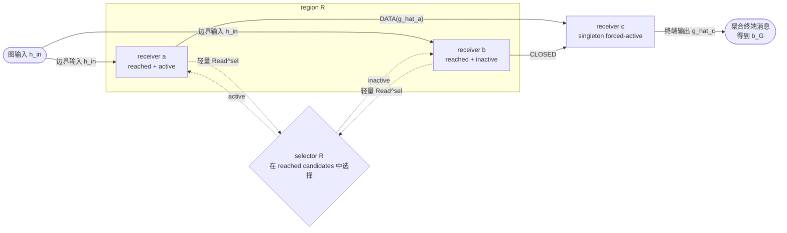

# TIDE 实验语义、命名与数学符号

> 本文从更上层研究计划继承 **[TIDE](https://github.com/ZichaoLong/ObsidianVault.git)** 这个名字，其余内容均可独立阅读。
>
> 本文描述的是新实验的目标语义，只定义“模型实际怎样计算”和“实验名称怎样反映计算图”。
>
> 实验晋级、结果报告组织和 checkpoint 保留策略另行讨论。
>
> 第 4.5 节拓扑 Builder 中的候选默认值仍待逐项核验，详见核验台帐 [`experiment-semantics-review-ledger.md`](experiment-semantics-review-ledger.md)。

## 阅读入口：先看完整图景

我们希望设计一套 TIDE Graph 的语义服务于三个要求：**固定空间拓扑**（底层节点和边固定，但每个 Token 的 active 子图可以变化）、**单节点成本有界**（每个节点的参数、状态、连接和工作量有上界）以及**可达容量增长**（扩容后仍能沿这些固定局部连接到达更多节点）。

为此，本文档定义一种 Single-Settlement Graph，下文简称 **SettleGraph** 是一个具备单输入单输出的计算图。它用一个固定空间拓扑的 Graph 表示，
- 对每个 Token，SettleGraph 接受一个输入 hidden，沿内部固定边传播 hidden，在固定的局部候选 receiver nodes 中选择少量节点做昂贵计算，再把结果送往下游并最终输出一个与输入 hidden 同维度的张量。
- SettleGraph 的每个节点称为 **receiver node**。它聚合实际到达的入口或父消息，是否更新状态由 propagation profile 决定，是否执行完整计算并向下游发送由局部 region selector 决定。节点内部设计的典型例子是 Transformer block，具体定义见 2.2 节。
SettleGraph 的更详细定义见下文。

因此，SettleGraph 可以多种方式接入各类由 blocks 串连组成的 Base LLM 模型。

Base 模型接入 SettleGraph 后，Base 模型部分可原样复用已训练 checkpoint，SettleGraph 部分可进行适当的初始化。我们还额外要求，SettleGraph 在某些初始化下，接入后的总模型与 Base 模型函数等价，这时可避免研究起步时，待验证点过多、过于不成熟，永远无法获得有效正面验证结果。

## 1. Base block 与 SettleGraph 顶层边界

### 1.1 Base Qwen3 block
第 \(\ell\) 个 block 接收到的第 \(0,...,t\) 个 token 的输入 hidden 是 \(t+1\) 个 \(d_{\mathrm{model}}\) 维向量，记作
$$
X_{\ell,\le t}
:=(x_{\ell,0},x_{\ell,1},\ldots,x_{\ell,t}).
$$

则对位置 \(t\)，一个原始 Pre-Norm Qwen3 block 计算：

$$
u_{\ell,t}
=x_{\ell,t}
+\left[
A_\ell\!\left(N_A(X_{\ell,\le t})\right)
\right]_t,
$$

$$
v_{\ell,t}
=u_{\ell,t}
+F_\ell\!\left(N_F(u_{\ell,t})\right).
$$

其中， \(N_A\) 和 \(N_F\) 分别表示两个位置的归一化操作；当前 Qwen3 base block 中二者都实现为 RMSNorm。\(A_\ell\) 表示 causal self-attention，\(F_\ell\) 表示原 dense SwiGLU MLP。

### 1.2 SettleGraph 的单入口、单出口契约
在 Base 模型中第 \(\ell(j)\) 个 block 插入的第 \(j\) 个 SettleGraph，记作 \(\mathcal G_j\)，下文也把这个插入位置称为 site \(j\)。其中，每个 block 位置最多插入一个 SettleGraph。

对每个 Token，\(\mathcal G_j\) 可作为一个有逐序列持久状态的函数接受一个输入 hidden \(h^{\mathrm{in}}_{j,t}\)，并始终对外返回一个同维 hidden \(b_{\mathcal G,j,t}\)：
$$
b_{\mathcal G,j,t}
=\mathcal G_j\!\left(h^{\mathrm{in}}_{j,t}\right),
$$
另外记 \(\mathcal G_j\) 输出值的 residual 为：
$$
\Delta_{\mathcal G,j,t}
=b_{\mathcal G,j,t}-h^{\mathrm{in}}_{j,t}.
$$

记 block \(\ell(j)\) 的最终输出，也就是下一个 block \(\ell+1\) 的输入为 \(y_{\ell,t}\triangleq x_{\ell+1,t}\)，则 \(y_{\ell,t}\) 同时取决于 SettleGraph 的 placement 配置及其输出 hidden \(b_{\mathcal G,j,t}\)。对于未插入 SettleGraph 的情形有
$$
y_{\ell,t}=v_{\ell,t}.
$$

下面给出不同的 placement 配置如何起作用的说明。

### 1.3 SettleGraph 的四种 placement

SettleGraph 有四种 **placement** 配置，它们分别对应
- 不同的接入位置：因此 \(\mathcal G_j\) 将获得不同的输入 hidden \(h^{\mathrm{in}}\)
- 不同的合入位置：因此将与 \(u_{\ell,t}\) 或 \(v_{\ell,t}\) 合并 residual，并最终影响 \(y_{\ell,t}\)

#### 1.3.1 POST：完整 block 后串联

$$
h^{\mathrm{in}}_{j,t}=v_{\ell,t},
\qquad
y_{\ell,t}
=v_{\ell,t}+\Delta_{\mathcal G,j,t}
=b_{\mathcal G,j,t}.
$$

~~~text
x → Attention → u → 原 dense MLP → v → SettleGraph → y
~~~

SettleGraph 能看到当前 block 的 Attention 和原 MLP 结果。POST 是串联结构。

#### 1.3.2 PARBLK：与完整 block 并列

SettleGraph 和完整 base block 都从 \(x_{\ell,t}\) 开始，最后在 block 出口合并：

$$
h^{\mathrm{in}}_{j,t}=x_{\ell,t},
\qquad
y_{\ell,t}
=v_{\ell,t}+\Delta_{\mathcal G,j,t}.
$$

~~~text
          ┌→ 完整 base block → v ─────┐
x ────────┤                            + → y
          └→ SettleGraph → Δ_G(x) ────┘
~~~

SettleGraph 看不到当前 block 的 Attention 或 MLP 结果，也不改变它们的输入；两条路径可以并行执行。

#### 1.3.3 PARATTN：与 Attention 并列

SettleGraph 与 Attention 都读取 \(x_{\ell,t}\)。先在 Attention residual 位置合并，再让原 dense MLP 读取合并后的表示：

$$
h^{\mathrm{in}}_{j,t}=x_{\ell,t},
\qquad
u'_{\ell,t}=u_{\ell,t}+\Delta_{\mathcal G,j,t},
$$

$$
y_{\ell,t}
=u'_{\ell,t}+F_\ell\!\left(N_F(u'_{\ell,t})\right).
$$

~~~text
          ┌→ self-attention ─┐
x ────────┤                   + → u' → 原 dense MLP → y
          └→ SettleGraph ────┘
~~~

PARATTN 只说明 SettleGraph residual 的接入位置，不限制 SettleGraph 内部只能使用 Attention。

#### 1.3.4 PARMLP：与 MLP 并列

Attention residual 先得到 \(u_{\ell,t}\)；原 dense MLP 与 SettleGraph 都读取这个共同输入，最后在 MLP residual 位置合并：

$$
h^{\mathrm{in}}_{j,t}=u_{\ell,t},
\qquad
y_{\ell,t}
=v_{\ell,t}+\Delta_{\mathcal G,j,t}.
$$

~~~text
x → self-attention → u
                      ├→ 原 dense MLP ─┐
                      └→ SettleGraph ── + → y
~~~

SettleGraph 能看到当前 Attention 的结果，但看不到当前原 MLP 的结果，也不改变原 MLP 的输入。本文统一使用 **PARMLP**；**PARFFN** 指同一个 placement。原 dense MLP 是 always-on 路径，SettleGraph 是与它并列的稀疏、可有状态主旁路。

#### 1.3.5 直接比较与初始化

| Placement | \(h^{\mathrm{in}}\) | always-on 输出 | 看见当前 Attention | 看见当前原 MLP | 改变原 MLP 输入 | SettleGraph merge 后 |
| --- | --- | --- | ---: | ---: | ---: | --- |
| **POST** | \(v\) | \(v\) | 是 | 是 | 否 | 直接得到 \(y\) |
| **PARBLK** | \(x\) | \(v\) | 否 | 否 | 否 | 直接得到 \(y\) |
| **PARATTN** | \(x\) | \(u\) | 否 | 否 | 是 | 得到 \(u'\)，再执行原 MLP |
| **PARMLP** | \(u\) | \(v\) | 是 | 否 | 否 | 直接得到 \(y\) |

若 SettleGraph 可经过某种初始化变成 identity 函数，则 \(b_{\mathcal G}=h^{\mathrm{in}}\)、\(\Delta_{\mathcal G}=0\)，此时接入 \(\mathcal G_j\) 后的模型与原始 Base 模型函数等价。对于后文中给出的多种 SettleGraph 内部构型，这种初始化不难实现。

## 2. 一个 Token 如何穿过 SettleGraph

### 2.1 固定图、边结算与输入聚合

#### 固定图

SettleGraph 的内部拓扑是一张有限固定 DAG：

$$
G=(V,E,\mathfrak R).
$$

其中：

- \(V\) 是 receiver nodes 的集合；下文 (v\in V) 表示 receiver ID，与第 1 节的 base hidden (v_{\ell,t}) 不是同一个量；
- \(E\subseteq V\times V\) 是固定有向边集合；
- \(\mathfrak R\) 是对 \(V\) 的固定 region 划分，每个 receiver 恰好属于一个 region，每个 region 配置一个控制 receivers 激活与否的 selector。由 DAG \((V,E)\) 自然诱导的关于 \(\mathfrak R\) 的图，也被要求是 DAG。

令 \(\operatorname{In}(v)\) 和 \(\operatorname{Out}(v)\) 分别表示 receiver \(v\) 的固定入边和出边。没有 receiver 父节点的 nodes 是**入口 receivers**：

$$
V_{\mathrm{in}}
=\{v\in V\mid \operatorname{In}(v)=\varnothing\};
$$

没有 receiver 子节点的 nodes 是**终端 receivers**：

$$
V_{\mathrm{out}}
=\{v\in V\mid \operatorname{Out}(v)=\varnothing\}.
$$

每个入口 receiver 都获得同一个图输入 \(h^{\mathrm{in}}_{j,t}\)，每个 receiver 都必须位于某条从入口 receiver 到终端 receiver 的固定路径上。单个 receiver 可以同时是入口和终端，这正是第 3 节单层实例在只有一个候选时的最小形式。

#### 每条边恰好结算一次

对同一个 Token \(t\)，每条固定边 \(e\in E\) 的最终结果记为

$$
z_{e,t}
\in
\{\operatorname{CLOSED}\}
\cup
\{\operatorname{DATA}(y)\mid y\in\mathbb R^{d_{\mathrm{model}}}\}.
$$

- \(\operatorname{DATA}(y)\) 表示该边实际携带 hidden \(y\)；
- \(\operatorname{CLOSED}\) 表示该边已经确认本 Token 不会再有数据。

\(\operatorname{CLOSED}\) 只是完成标记，不是 hidden，也不参加聚合。一条边一旦结算就不能改写或再次结算。先到的结果可以缓存，但 receiver 不能在全部固定父边结算前提前重复执行。

#### Receiver 如何得到一个输入 hidden

入口 receiver 的消息序列只包含图输入；其他 receiver 等全部固定父边结算后，只收集其中的 \(\operatorname{DATA}\)。消息按固定 edge ID 排列，并允许不同父边携带数值相同的 hidden：

$$
\mathcal M_{v,t}
=
\begin{cases}
\bigl(h^{\mathrm{in}}_{j,t}\bigr),
&v\in V_{\mathrm{in}},\\[4pt]
\bigl(y_e:\ e\in\operatorname{In}(v),\
z_{e,t}=\operatorname{DATA}(y_e)\bigr)_{\text{按 edge ID}},
&v\notin V_{\mathrm{in}}.
\end{cases}
$$

由此定义 receiver 是否 **reached**：

$$
q_{v,t}=\mathbf 1[\mathcal M_{v,t}\ne\varnothing].
$$

当 \(q_{v,t}=1\) 时，receiver 的唯一入口 hidden 为

$$
h_{v,t}
=\operatorname{Aggregate}_v(\mathcal M_{v,t}).
$$

当 \(q_{v,t}=0\) 时，不产生 \(h_{v,t}\)，该 receiver 不参加当前选择、状态更新或完整计算。这里的 \(\operatorname{Aggregate}_v\) 是 receiver 的输入操作，不是另一个拓扑节点，也不增加 receiver 深度。

默认的 `AGG-MEAN` 为

$$
\operatorname{Aggregate}_v(\mathcal M_{v,t})
=\frac{1}{|\mathcal M_{v,t}|}
\sum_{y\in\mathcal M_{v,t}}y.
$$

因此只有一条实际消息时，输入 hidden 就是该消息本身。可选聚合只需满足输出仍为一个 \(d_{\mathrm{model}}\) 维 hidden：

| 设置 | 定义 |
| --- | --- |
| `AGG-MEAN` | 对实际到达的消息取均值；当前默认 |
| `AGG-LEARNED` | \(\sum_k\alpha_{v,k,t}y_k\)，其中 \(\alpha_k\ge0\)、\(\sum_k\alpha_k=1\) |
| `AGG-CUSTOM` | 自定义聚合，例如可针对每条父边进行线性变换后再平均；须记录完整公式、输入顺序及额外参数成本 |

若聚合依赖父边身份，可以同时读取对应 edge ID；其参数和计算量计入 receiver 的输入成本。selector 概率不在聚合中再次相乘。

#### 一个最小示意

下面是一张最小运行时示意图。固定图中 \(a,b\) 属于同一个 region；本例 selector 选择 \(a\)，因此二者都收到图输入，但只有 \(a\) 继续发送。receiver \(c\) 等来自 \(a,b\) 的两条固定父边都结算后，忽略 \(b\) 的 \(\operatorname{CLOSED}\)，聚合实际收到的 \(\operatorname{DATA}(\widehat g_a)\)。本例把 \(c\) 放在 forced-active singleton region 中。

一次局部结算可以概括成四步：

1. **收齐**：等全部固定父边返回 \(\operatorname{DATA}\) 或 \(\operatorname{CLOSED}\)。
2. **选择**：聚合实际数据，确定 reached candidates，再由 region selector 选出 active nodes。
3. **计算**：按状态传播规则提交状态；active nodes 执行完整 receiver 计算。
4. **发送**：active node 的固定出边全部携带同一个输出，其他出边全部关闭。

selector 不是发散点。固定边决定消息可能去往哪里，selector 只决定哪些已经 reached 的 receivers 本次继续计算和发送。一个 receiver 向多个 children 发送只是固定边的 fan-out；多个 parents 到达同一 receiver 时，则由该 receiver 的输入聚合操作完成 fan-in。

### 2.2 Receiver：状态与昂贵计算

receiver 是图中唯一的拓扑计算节点。每个 receiver 持有自己的参数、可选私有状态和昂贵计算；参数默认不跨 node 或 site 共享。拓扑只依赖本节规定的输入、状态和输出契约，不依赖状态模块内部采用 EMA、Gated DeltaNet、Attention 还是其他算法。

对 reached receiver \(v\)，先对入口 hidden 做本地归一化：

$$
m_{v,t}=N_{R,v}(h_{v,t}).
$$

令 \(s^-_{v,t}\) 表示当前 Token 到来前的 receiver 状态。状态模块可以根据当前输入产生 proposal：

$$
\widetilde s_{v,t}
=\operatorname{Update}_v(s^-_{v,t},m_{v,t}).
$$

proposal 本身不等于状态已经更新；只有第 2.3 节定义的 Observe/commit 才会把它提交为当前计算可见的状态。无状态 receiver 的 \(s^-\)、\(\operatorname{Update}\) 和 commit 都是空操作。

receiver 向 selector 提供一个固定、有界的轻量读出。三种 selector 时序对应：

$$
r^{\mathrm{sel}}_{v,t,\mathrm{content}}
=\operatorname{Read}^{\mathrm{sel}}_v(m_{v,t}),
$$

$$
r^{\mathrm{sel}}_{v,t,\mathrm{pre}}
=\operatorname{Read}^{\mathrm{sel}}_v(s^-_{v,t},m_{v,t}),
$$

$$
r^{\mathrm{sel}}_{v,t,\mathrm{post}}
=\operatorname{Read}^{\mathrm{sel}}_v(\widetilde s_{v,t},m_{v,t}).
$$

\(\operatorname{Read}^{\mathrm{sel}}\) 可以是输出范数、历史激活统计或低维投影，不要求把完整 receiver 状态交给 selector。post-update 必须在选择前生成 proposal；content-only 和 pre-update 只需在选择后为实际 Observe 的 receivers 生成 proposal。

active receiver 使用已经提交、可供当前计算读取的状态 \(s^{\mathrm{cmp}}_{v,t}\)，执行一次完整计算：

$$
g_{v,t}
=\operatorname{NodeCompute}_v
\left(h_{v,t},m_{v,t},s^{\mathrm{cmp}}_{v,t}\right).
$$

当前默认的 \(\operatorname{NodeCompute}\) 采用 Pre-Norm 双 residual：

$$
r^{\mathrm{ffn}}_{v,t}
=\operatorname{Read}^{\mathrm{ffn}}_v
\left(s^{\mathrm{cmp}}_{v,t},m_{v,t}\right),
\qquad
u^{\mathrm{node}}_{v,t}
=h_{v,t}+r^{\mathrm{ffn}}_{v,t},
$$

$$
g_{v,t}
=u^{\mathrm{node}}_{v,t}
+E_v\!\left(N_{F,v}(u^{\mathrm{node}}_{v,t})\right).
$$

其中，\(\operatorname{Read}^{\mathrm{ffn}}\) 是 receiver 内部较大的状态/上下文读出，可以包含 normalization、Attention/SSM 和 output projection；\(E_v\) 是昂贵 FFN 或实验声明的等价计算。第一条 residual 的基底是未归一化的 \(h_{v,t}\)。无状态 receiver 默认令 \(r^{\mathrm{ffn}}_{v,t}=0\)。

\(g_{v,t}\) 是一个完整 hidden，而不是相对 \(h_{v,t}\) 的增量。receiver 不自行决定是否 active，也不在 \(\operatorname{NodeCompute}\) 内部乘 selector 概率；只有 active receiver 执行较大的 \(\operatorname{Read}^{\mathrm{ffn}}\) 和昂贵计算。

#### 内部设计速览

不同 receiver 复用上述接口，只替换状态更新与两类读出；状态形状和完整公式见附录 A。

| 样例 | \(\operatorname{Update}\) 或历史写回 | 轻量 \(\operatorname{Read}^{\mathrm{sel}}\) | active node 的 \(\operatorname{Read}^{\mathrm{ffn}}\) |
| --- | --- | --- | --- |
| 无状态 MLP | 无 | 当前 \(m\) 的低维投影或范数 | \(0\) |
| 历史激活 | 选择后写回激活次数、最近激活位置或 \(p\) 的移动平均 | 当前 \(m\) 与少量历史标量 | 只服务 selector 时为 \(0\) |
| EMA | \(\widetilde s=\lambda\odot s^-+(1-\lambda)\odot o(m)\) | 状态或 proposal 的低维摘要 | \(W^{\mathrm{out}}s^{\mathrm{cmp}}\) |
| GDN / KDA | 有界关联状态的 delta-rule 更新 | 状态或 query 读出的轻量摘要 | 投影后的关联读出 |
| SSM / Mamba | 有界递归状态更新 | 状态或递归输出的轻量摘要 | 投影后的 state-space 输出 |
| Attention | 写入完整、窗口或压缩 key/value 历史 | 历史统计或 Attention 读出摘要 | 投影后的 Attention 输出 |

content-only 始终只读当前 \(m\)；历史激活通常在 selector 决策后写回。无状态 MLP 令 \(\operatorname{Read}^{\mathrm{ffn}}=0\)，因此

$$
\operatorname{NodeCompute}_v(h_{v,t},m_{v,t},\varnothing)
=h_{v,t}+E_v\!\left(N_{F,v}(h_{v,t})\right).
$$

其他样例把各自的 \(\operatorname{Read}^{\mathrm{ffn}}\) 代入本节已经定义的双 residual；较大的读出仍只由 active nodes 执行。

### 2.3 Region：选择、Observe 与发送

每个 region \(\mathcal R\in\mathfrak R\) 对应一个 selector。region 中所有 receivers 的输入状态都已经确定后，它对当前 Token 只选择和结算一次；这要求每个成员要么已经 reached，要么已经确认所有父边关闭。候选集只包含前者：

$$
\mathcal C_{\mathcal R,t}
=\{v\in\mathcal R\mid q_{v,t}=1\}.
$$

#### Selector

selector 只接收 candidates 各自在本地产生的轻量 \(r^{\mathrm{sel}}\)。令 \(c^{\mathrm{ctx}}_{\mathcal R,t}\) 表示可选的固定、有界局部公共摘要；没有时取空。一次局部打分得到：

$$
(a_{v,t})_{v\in\mathcal C_{\mathcal R,t}}
=\operatorname{Score}_{\mathcal R}
\left(
c^{\mathrm{ctx}}_{\mathcal R,t},
(r^{\mathrm{sel}}_{v,t,\tau})_{v\in\mathcal C_{\mathcal R,t}}
\right),
$$

$$
(p_{v,t})_{v\in\mathcal C_{\mathcal R,t}}
=\operatorname{softmax}
\left((a_{v,t})_{v\in\mathcal C_{\mathcal R,t}}\right).
$$

这里 \(\tau\in\{\mathrm{content},\mathrm{pre},\mathrm{post}\}\) 是 selector 时序，\(p_{v,t}\) 是 soft 选择概率，不是消息聚合权重。Top-K 得到 active set：

$$
\mathcal A_{\mathcal R,t}
=\operatorname{TopKIndex}
\left(
p,
\min(K^{\mathrm{req}}_{\mathcal R,t},|\mathcal C_{\mathcal R,t}|)
\right),
$$

其中候选非空时

$$
1\le K^{\mathrm{req}}_{\mathcal R,t}
\le K^{\max}_{\mathcal R};
$$

平票按固定 node ID 打破。候选为空时 \(\mathcal A_{\mathcal R,t}=\varnothing\)，该 region 不执行 Score。forced-active receiver 使用独立的 singleton region；它只要 reached 就令 \(p=1\) 并直接 active。

三种 selector 时序为：

| 时序 | selector 读取的信息 |
| --- | --- |
| **Content-only** | 当前本地输入的轻量读出 |
| **Pre-update state** | 当前输入与旧状态 \(s^-\) 的轻量读出 |
| **Post-update state** | 当前输入产生的 proposal \(\widetilde s\) 的轻量读出 |

Pre 与 post 不是包含关系：如果 \(\operatorname{Update}\) 会覆盖、压缩或遗忘旧状态，post readout 不一定能恢复 pre readout 的信息。\(c^{\mathrm{ctx}}\) 的信息时刻必须与 \(\tau\) 一致；content-only 只能使用当前内容，不能读取持久状态或历史激活。任何跨 region 公共摘要或控制输入都必须来自固定、有界的上游，并在图描述中声明依赖；selector 不读取未声明的全图信息。

#### Observe 与状态提交

propagation profile 决定哪些 reached receivers 提交当前内容；selector 决定哪些 receivers 执行完整计算：

| Profile | Observe/commit 范围 | 完整计算与发送范围 | 标准 selector 时序 |
| --- | --- | --- | --- |
| **N（stateless）** | 无状态 | active | content-only |
| **SD（selected-dispatch）** | active | active | content-only、pre-update |
| **BO（broadcast-observe）** | 全部 reached | active | content-only、pre-update、post-update |

令 Observe set 为

$$
\mathcal O_{\mathcal R,t}
=
\begin{cases}
\varnothing,&\text{N},\\
\mathcal A_{\mathcal R,t},&\text{SD},\\
\mathcal C_{\mathcal R,t},&\text{BO}.
\end{cases}
$$

对有状态 receiver，commit 后供当前 \(\operatorname{NodeCompute}\) 使用的状态为

$$
s^{\mathrm{cmp}}_{v,t}
=
\begin{cases}
\widetilde s_{v,t},&v\in\mathcal O_{\mathcal R,t},\\
s^-_{v,t},&v\notin\mathcal O_{\mathcal R,t}.
\end{cases}
$$

content-only 和 pre-update 先选择，再只为 \(\mathcal O\) 中的 receivers 生成 proposal 并 commit；标准 post-update + BO 则先为全部 reached receivers 生成 proposal，再选择并全部 commit。pre-update 只限制 selector 读取旧状态，active receiver 的默认完整计算仍读取本 Token 已提交的 \(s^{\mathrm{cmp}}\)。post-update 中 proposal 到 selector 的计算图默认保留，任何 detach 或 stop-gradient 都必须记录。其他组合必须标为自定义 profile，并明确 proposal、read、selection 和 commit 的顺序。

#### 发送

active receiver 得到 \(g_{v,t}\) 后，发送规则产生实际消息：

$$
\widehat g_{v,t}
=\operatorname{Emit}_v(h_{v,t},g_{v,t},p_{v,t}).
$$

同一个 \(\widehat g_{v,t}\) 被复制到该 receiver 的全部固定出边。当前推荐的 `EMIT-HST`（Hard Straight-Through）为

$$
\rho_{v,t}
=1+\zeta^{\mathrm{ST}}_v
\bigl(p_{v,t}-\operatorname{sg}(p_{v,t})\bigr),
$$

$$
\widehat g_{v,t}
=h_{v,t}+\rho_{v,t}(g_{v,t}-h_{v,t}).
$$

\(\operatorname{sg}\) 是 stop-gradient，\(\zeta^{\mathrm{ST}}_v\) 是固定梯度缩放常数，默认取 1。前向恒有 \(\widehat g=g\)，反向则允许主任务梯度经 \(p\) 返回 selector；离散 Top-K 本身不求导。`EMIT-HARD` 直接令 \(\widehat g=g\) 且不提供这条梯度；`EMIT-SOFTP` 令 \(\widehat g=h+p(g-h)\)，会同时改变前向强度，使用时必须单独标记。

active receiver 的每条固定出边结算为 \(\operatorname{DATA}(\widehat g_{v,t})\)；inactive 或未 reached receiver 的每条固定出边结算为 \(\operatorname{CLOSED}\)。训练期 balance loss 只提供辅助梯度，不改变这套推理数据流。

### 2.4 合法图与通用结算算法

#### 哪些固定图可以执行

一张合法 SettleGraph 至少满足：

1. receiver 图有限、无环、没有重复平行边，每个 receiver 位于某条入口—终端固定路径上；
2. 每个 receiver 恰好属于一个 region，同一 region 内不存在 receiver-to-receiver 边；
3. 将每个 region 收缩成一个点，并加入全部已声明的跨 region 控制依赖后，所得 region 依赖图仍然无环；
4. hidden、状态、读出和参数的 shape/dtype 已确定，所有聚合、receiver、selector、profile 和发送规则均已完整定义；
5. 固定 fan-in、fan-out、region 大小、入口/终端 receiver 数，以及单节点参数、状态和计算成本满足实验声明的上界。

第三条保证 region 不会为了执行 selector 而相互等待。例如，只要存在 receiver 边 \(u\to v\)，就必须满足

$$
\lambda(\mathcal R(u))
<\lambda(\mathcal R(v)),
$$

其中 \(\mathcal R(v)\) 是 receiver \(v\) 所属 region，\(\lambda\) 是 region 依赖图的某个拓扑序。共享只读参数不会产生控制依赖；任何跨 region 共享可变状态或 selector 输入都必须声明读写顺序，并一起通过无环检查。

原始图描述经过这些静态校验和规范化后得到的静态记录称为 **Plan**，记为 \(\Pi\)。Plan 包含 receivers、固定边、regions、稳定 ID、各项运算、Tensor/状态契约和依赖顺序；它不包含某个 Token 的 reached、active 或边结算结果，也不是人工编写的动态执行步骤。

#### 一个解释器执行所有合法 Plan

令 \(\Theta\) 表示 Plan 绑定的参数与 Tensor 操作，\(S^-_t\) 表示当前 Token 前的全部 receiver state 和 selector-history。单 Token 执行统一写成

$$
(b_{\mathcal G,j,t},S_t)
=\operatorname{Interpret}
(\Pi,\Theta,S^-_t,h^{\mathrm{in}}_{j,t}).
$$

同一个解释器可以执行任意合法 Plan，不需要枚举入口—终端路径：

~~~text
InterpretToken(Plan, states_before, h_in):
  把每条固定边初始化为“未结算”
  入口 receivers 的消息序列初始化为 [h_in]

  只要仍有未结算 region：
    选取一个数据依赖、控制依赖和跨 Token 状态依赖都已满足的 region R

    对每个 v ∈ R：
      若 v 不是入口 receiver，断言全部固定父边已经结算
      按 edge ID 收集父边中的全部 DATA；CLOSED 不进入消息序列
      消息非空则 reached，并执行 Aggregate 与入口归一化

    按第 2.3 节为 R 完成一次：
      Read^sel / Score / Top-K
      Observe commit / NodeCompute / Emit

    对每个 v ∈ R 的每条固定出边：
      v active  ⇒ 结算为 DATA(g_hat[v])
      其他情况 ⇒ 结算为 CLOSED

  等所有终端 receivers 完成本 Token 的角色结算
  收集 active 终端 receivers 的 g_hat
  若集合为空，报告配置失败
  否则用 Aggregate_out 聚合为 b_G，并返回最终状态
~~~

图输出的数学定义为

$$
\mathcal M_{\mathrm{out},t}
=\bigl(\widehat g_{v,t}:
v\in V_{\mathrm{out}},\ v\text{ active}\bigr)_{\text{按 node ID}},
$$

$$
b_{\mathcal G,j,t}
=\operatorname{Aggregate}_{\mathrm{out}}
(\mathcal M_{\mathrm{out},t}).
$$

\(\operatorname{Aggregate}_{\mathrm{out}}\) 遵守第 2.1 节相同的聚合契约。有效 Token 上 \(\mathcal M_{\mathrm{out},t}\) 必须非空；否则动态可达性保证失效，该 run 记为配置失败，不能静默回退或伪造 hidden。

每个 region 对每个 Token 只结算一次，每个 receiver 最多执行一次完整计算，每条固定边恰好返回一次 \(\operatorname{DATA}\) 或 \(\operatorname{CLOSED}\)。“单次结算”不表示每个 receiver 都会 active。独立、同时 ready 的 regions 可以串行或并行结算；只要满足声明的依赖并使用确定的聚合顺序，结果相同。

不等长路径不需要另一套算法：短路径结果先缓存，receiver 和图输出继续等待其余固定父结果；未激活路径用 \(\operatorname{CLOSED}\) 完成等待。模型语义不依赖 wall-clock timeout。拓扑若另外记录逻辑层级或边延迟，它只用于调度与 profile；除非某项运算明确把它作为输入，否则不改变上述 Tensor 结果。

第 3 节的单层实例是所有 receivers 同时属于 \(V_{\mathrm{in}}\cap V_{\mathrm{out}}\) 的最小规则图。第 4 节的 HB-Lattice 则用规则化生成器产生 \(V\)、\(E\) 和 \(\mathfrak R\)，并附加适合批处理的 Line/phase 信息；它仍遵守同一个结算算法。

### 2.5 跨 Token 状态

令 \(\mathrm{sid}\) 表示一条稳定序列的标识。receiver 状态按 \((\mathrm{site},\mathrm{receiver},\mathrm{sid})\) 隔离，selector-history 若存在，则按 \((\mathrm{site},\mathrm{region},\mathrm{sid})\) 或声明的 node-level 键隔离。默认不跨 site、receiver 或稳定序列共享可变状态。

对同一个状态键，有效 Token 必须按全局 \(t=0,1,\ldots\) 的因果顺序执行。Token \(t\) 开始时读取 \(s^-_{v,t}\)，按第 2.3 节完成 proposal、selection 和 commit；若还要写入本次 active、\(p\) 等历史统计，则在完整计算后写回，形成最终状态 \(s_{v,t}\)，并从下一有效 Token 起可见。写入 active 或 \(p\) 的历史默认 stop-gradient：

$$
s^-_{v,t+1}=s_{v,t}.
$$

未 reached receiver 以“不更新状态”的空操作完成自己的因果位置。物理调度即使提前得到 Token \(t+1\) 的父边结果，也必须等同一状态键的 Token \(t\) 完成后，才能读取或提交 \(t+1\) 的状态；提前结果只保存在对应 Token 的缓存中。

每条独立序列从声明的首状态开始：EMA、Gated DeltaNet/KDA 和 SSM 通常置零，Attention 历史为空，历史激活统计清零；使用可学习或其他首状态时必须记录。padding 等无效 Token 不进入 SettleGraph，图直接返回入口 hidden，因此 \(\Delta_{\mathcal G}=0\)，也不更新状态或产生路由 loss。

chunk 是一次前向接收的连续 Token 片段；prefill 是一次处理一段已有 Token，decode 是逐 Token 生成。状态值跨 chunk 保留，chunk 边界默认 detach：只截断 chunk 之间的梯度，chunk 内仍保留因果梯度。在 deterministic/eval（或固定随机掩码）且聚合顺序相同的条件下，同一有效前缀的整段 prefill、分块 prefill 和逐 Token decode 应得到相同的逐 Token 输出与最终状态。

写作 \(s_{t-1}\) 时，只表示同一稳定序列上一个有效 Token 结算后的状态；\(t\) 是跨 chunk 不重置的全局 Token 索引。具体状态模块见附录 A。

## 3. 最小实例：单层并列 receivers

本节把第 2 节的公共语义放入一个最小 Plan，展示固定拓扑、selector、receiver 和图输出怎样共同工作。它不引入新的组件或执行规则。

### 3.1 展开的 Plan

令 \(R\ge1\) 为并列 receiver 数量，并定义

$$
V=V_{\mathrm{in}}=V_{\mathrm{out}}=\{0,1,\ldots,R-1\},
\qquad
E=\varnothing,
\qquad
\mathfrak R=\{V\}.
$$

所有 receivers 同时是入口和终端，属于同一个 region；它们之间没有 receiver-to-receiver 边。图边界把同一个 \(h^{\mathrm{in}}_{j,t}\) 交给全部 receivers，selector 再从这 \(R\) 个 reached candidates 中选择少量 active nodes：

~~~text
图输入 h_in
  ├→ receiver 0 ─┐
  ├→ receiver 1 ─┤
  ├→ ...         ├→ Aggregate_out → b_G
  └→ receiver R-1┘
       一个 selector 在 R 个 candidates 中选择
~~~

“单层”表示任一入口—终端路径只经过一个 receiver node，不表示图中只有一个 node，也不限制 receiver 内部只能有一个计算子层。公共 selector 摘要若存在，直接使用第 2.3 节的 \(c^{\mathrm{ctx}}\)；它是可选配置，不属于该拓扑的必要组成。

### 3.2 一个 Token 的完整结算

固定一个 site \(j\)，并省略唯一 region 的下标。默认聚合对单条消息原样返回，因此对每个 \(v\in V\)，

$$
h_{v,t}=h^{\mathrm{in}}_{j,t},
\qquad
q_{v,t}=1,
\qquad
\mathcal C_t=V.
$$

selector 按第 2.3 节得到 \((p_{v,t})_{v\in V}\)；将该 region 的请求激活数简写为 \(K^{\mathrm{req}}_t\)，则

$$
\mathcal A_t
=\operatorname{TopKIndex}
\left((p_{v,t})_{v\in V},\min(K^{\mathrm{req}}_t,R)\right).
$$

三种 propagation profile 在本例中的 Observe 集为

$$
\mathcal O_t=
\begin{cases}
\varnothing,&\mathrm{N},\\
\mathcal A_t,&\mathrm{SD},\\
V,&\mathrm{BO}.
\end{cases}
$$

每个 \(v\in\mathcal A_t\) 按第 2.2、2.3 节完成状态提交、\(\operatorname{NodeCompute}\) 和发送。图输出为

$$
b_{\mathcal G,j,t}
=\operatorname{Aggregate}_{\mathrm{out}}
\left(
(\widehat g_{v,t}:v\in\mathcal A_t)_{\text{按 node ID}}
\right).
$$

Top-1 时只有一条终端消息；Top-K 使用 `AGG-MEAN` 时，聚合的是 active receivers 的完整输出，不再额外乘 selector 概率。因为所有 receivers 始终 reached，本例的 balance loss 使用第 6.1 节的固定候选形式。

### 3.3 实验作用与边界

单层实例适合分别验证 receiver 状态、content/pre/post selector 时序、N/SD/BO、Top-K、发送规则和输出聚合。它也便于与平铺 MoE 对照。

它不是固定局部度有界的容量扩展方案：增大 \(R\) 会同时扩大 selector region、入口宽度和终端宽度。验证沿固定局部连接到达更多容量，需要第 2.4 节的非平凡 Plan；第 4 节的 HB-Lattice 是其中一种规则化形态。

## 4. HB-Lattice：多层固定波前

HB-Lattice 是第 2 节合法 Plan 的一个规则化子集。它不改变 receiver、selector、聚合或发送语义，只增加有序 Lines、Line barrier、逻辑边延迟以及生成这种 Plan 的规则。

第 4.1—4.4 节定义 HB-Lattice 的规范语义；第 4.5 节只给出仍待核验的候选拓扑 Builder。

### 4.1 先看完整波前

一个小型 HB-Lattice 可以采用“扩展—平台—收拢”的宽度序列：

~~~text
图输入
   ↓
L0:  root                         扩展起点
L1:  0, 1                         扩展
L2:  00, 01, 10, 11               平台首层
L3:  00, 01, 10, 11               平台混合
L4:  0, 1                         收拢
L5:  root                          收拢终点
   ↓
Aggregate_out → b_G
~~~

相邻扩展、平台和收拢 Lines 之间由固定局部边连接；还可以配置从较浅扩展节点直达更深收拢节点的 mirror 边。每个 Line 划分为一个或多个 regions，同一 Token 结算完整个 Line 后才进入下一 Line。扩展、平台和收拢只是宽度形状及拓扑生成标签，不改变 node 的计算公式。

例如，tree 边可以包含 \(L_0:\mathrm{root}\to L_1:0,1\) 和 \(L_1:0\to L_2:00,01\)，平台边可以包含 \(L_2:00\to L_3:00,01\)，mirror 边可以包含 \(L_1:0\to L_4:0\)。这些只用于展示边的角色；实际实验必须在展开 Plan 中列出全部确切端点。

### 4.2 HB Plan 的形式约束

HB-Lattice 把 receiver 集合静态划分到 \(D+1\) 个有序 Lines：

$$
V=\bigsqcup_{d=0}^{D}L_d,
\qquad
\operatorname{level}(v)=d\iff v\in L_d.
$$

除第 2.4 节的一般合法性条件外，HB Plan 还必须满足：

1. 每个 region 完全位于唯一一个 Line；同一 Line 内没有 receiver 边，也没有 region 间控制依赖。
2. 所有边都严格指向更深的 Line：
   $$
   (u,v)\in E
   \Longrightarrow
   \operatorname{level}(u)<\operatorname{level}(v).
   $$
3. 图边界固定为 \(V_{\mathrm{in}}=L_0\)、\(V_{\mathrm{out}}=L_D\)。
4. Line \(L_d\) 只有在同一 Token 的 \(L_0,\ldots,L_{d-1}\) 全部结算后才开始；同一 Line 内相互独立的 regions 可以并行结算。

selector 的公共上下文若存在，只能来自固定常量或更浅 Line 已结算的有界读出，并作为控制依赖写入 Plan。跨多个 Lines 的消息在产生后缓存，到目标 Line 开始时再参与该 receiver 唯一一次输入聚合。

边 \((u,v)\) 的逻辑延迟定义为

$$
\delta(u,v)
=\operatorname{level}(v)-\operatorname{level}(u)>0.
$$

因此，对任意从 \(v_0\in L_0\) 到 \(v_n\in L_D\) 的完整路径 \(P=(v_0,\ldots,v_n)\)，

$$
\sum_{k=1}^{n}\delta(v_{k-1},v_k)
=\operatorname{level}(v_n)-\operatorname{level}(v_0)
=D.
$$

这保证不同长度的固定路径在同一个逻辑波前终点结算。\(t\) 始终表示序列中的 Token 位置，\(d\) 才是图内的逻辑波前位置；两者不是同一个时间轴。

为补全后续 loss 的下标，site \(j\) 的 Line \(d\) 中第 \(r\) 个 region 记作 \(\mathcal R_{j,d,r}\)。补回 batch/序列下标 \(b\) 后，其当前候选集仍是第 2.3 节的 reached nodes：

$$
\mathcal C_{j,d,r,b,t}
=\{v\in\mathcal R_{j,d,r}\mid q_{v,b,t}=1\}.
$$

HB Plan 的静态检查只需在第 2.4 节基础上增加 Line 唯一归属、region 不跨 Line、边严格向深层、边界位于首尾 Line，以及所有边类合计后的 fan-in/fan-out 上界。有效 Token 仍须得到非空终端消息；若 Builder 依靠 forced-active backbone 保证这一点，完整路径必须出现在展开 Plan 中。

### 4.3 一个 Token 如何逐 Line 结算

第 2.4 节的通用解释器可以直接执行 HB Plan；HB 的 Line barrier 给出一个更规则的合法调度：

~~~text
对一个 Token：
  for d = 0 ... D:
    等待发往 L_d 的全部固定父边结算
    对 L_d 的各 regions，按第 2 节完成：
      输入聚合 → selector → Observe/commit → NodeCompute → Emit
    等 L_d 的全部 regions 与出边完成结算

  按第 2.4 节聚合 L_D 的终端消息并返回最终状态
~~~

fan-out 仍是把 active node 的同一输出复制到固定 children，fan-in 仍由目标 receiver 的 \(\operatorname{Aggregate}\) 完成；HB-Lattice 不增加发散节点或汇合节点。未发送的固定边仍结算为 \(\operatorname{CLOSED}\)，跨 Line 的提前消息只做缓存，不会提前触发目标 receiver。

Line barrier 按 Token 生效，不要求整个 batch 同步停住。token-major、Line-major 或其他等价批处理都可以使用；有状态 receiver 和 selector-history 仍必须遵守第 2.5 节的逐序列跨 Token 因果顺序。不同调度只要保持这些依赖和确定性聚合顺序，就必须得到与第 2.4 节解释器相同的输出和最终状态。

### 4.4 Builder 与展开 Plan

拓扑 Builder 根据紧凑配置 \(\Gamma\) 产生完全展开的 HB Plan：

$$
\Pi_{\mathrm{HB}}
=\operatorname{Build}_{\mathrm{name},\mathrm{version}}(\Gamma).
$$

展开 Plan 必须列出 Lines 及其 phase、nodes、regions、固定边及其来源标签、稳定 ID、forced-active 设置和所有第 2.4 节要求的运算契约。执行语义只由展开 Plan 决定；Builder 名称和配置不能替代它。正式实验同时保存规范化 Plan 及其哈希，以及 Builder 的名称、版本和配置。

Builder 可以给边附加以下来源标签，用于生成、诊断和消融：

| 标签 | 生成含义 |
| --- | --- |
| tree | 扩展、收拢及其与平台首尾之间的结构边 |
| local | 相邻平台 Lines 之间的局部空间边 |
| shortcut | 相邻平台 Lines 之间的长程空间边 |
| mirror | 从较浅 Line 直达更深 Line 的直通边 |

这些标签不对应不同的执行操作；进入解释器后，它们都是第 2 节定义的普通固定边。所有标签的边都计入同一组入度、出度和消息成本上界。

### 4.5 两类候选拓扑 Builder

下面两类 Builder 用于缩小首轮设计空间，其具体连接默认值仍需按核验台帐逐项确认。无论采用哪一类，展开 Plan 都必须满足第 4.2 节。

#### 4.5.1 B 叉扩展与逐坐标平台混合

设分支因子 \(B\ge2\)、扩展深度 \(D_{\mathrm{up}}\ge1\)、额外平台 Line 数 \(P_{\mathrm{plat}}\ge0\)。最大宽度为 \(W_{\max}=B^{D_{\mathrm{up}}}\)，Line 宽度为

$$
1,B,\ldots,B^{D_{\mathrm{up}}},
\underbrace{B^{D_{\mathrm{up}}},\ldots,B^{D_{\mathrm{up}}}}_{P_{\mathrm{plat}}\text{ 个额外 Lines}},
B^{D_{\mathrm{up}}-1},\ldots,1,
$$

因此最后一个 Line 的下标为 \(D=2D_{\mathrm{up}}+P_{\mathrm{plat}}\)。峰值 Line 的 node 可以使用长度为 \(D_{\mathrm{up}}\) 的 base-\(B\) 空间坐标；扩展、平台 hop、收拢、region 划分和可选 mirror 映射都由 Builder 配置生成，并在展开 Plan 中列出确切端点。

例如 \(B=2,D_{\mathrm{up}}=2,P_{\mathrm{plat}}=2\) 时：

~~~text
L0:  root
L1:  0, 1
L2:  00, 01, 10, 11
L3:  00, 01, 10, 11
L4:  00, 01, 10, 11
L5:  0, 1
L6:  root
~~~

相同坐标出现在不同 Line 时仍表示不同 receiver，默认不共享参数或状态。tree、平台和 mirror 边的合计 fan-in/fan-out 必须保持为与宽度和平台长度无关的固定上界。

#### 4.5.2 统一空间图平台

第二类 Builder 沿用已声明的扩展与收拢映射，用一个有向空间图生成相邻平台 Lines 的连接。设平台坐标集合为 \(Q\)，\(G_{\mathrm{space}}=(Q,E_{\mathrm{space}})\)，则一个平台 hop 可以生成

$$
E_d
=\left\{
((d,\xi),(d+1,\xi'))
\mid(\xi,\xi')\in E_{\mathrm{space}}
\right\}.
$$

同一个 \(G_{\mathrm{space}}\) 可以在各 hop 重复，也可以逐 hop 指定不同的 \(E_d\)。空间图自身即使有环，逐 Line 展开后仍是 DAG。local 与 shortcut 可以同时存在，但每个坐标的合计入度、出度必须具有与 \(|Q|\) 无关的固定上界；长程连接不能随着宽度增长形成高入度枢纽。

## 5. Dense 与 mixture-of-experts（MoE）基线

### 5.1 DENSE

DENSE 使用原 block：

$$
y_{\ell,t}
=v_{\ell,t}
=u_{\ell,t}+F_\ell\!\left(N_F(u_{\ell,t})\right).
$$

### 5.2 MOE

M8 是本项目采用的每个 site 含 8 个 experts 的硬 Top-1 MoE 对照；正式名称用 **MOE-R8** 表示 expert 数（这里的 R 不属于 TIDE 单层/HB 的 R 字段），用 **I** 表示 site 数。它把每个 expert 初始化为原 dense MLP 的副本，每个有效 Token 只执行一个 expert，不设 capacity、不丢 Token、也不 reroute。这里 capacity 指一个 expert 在当前 batch 最多接收多少 Token；本设置不设上限，因此被选 Token 不会因 expert 过载而跳过，也不会改送其他 expert。

为避免与带 router gate 的 Switch 实现混淆，本文把这个对照明确记为 **hard-dispatch/no-gate**；它是本项目的 matched baseline，不声称复现所有 Switch 变体。

对插在 block \(\ell=\ell(j)\) 的 MoE site \(j\)，计算为：

$$
m^{\mathrm{moe}}_{j,t}=N_F(u_{\ell(j),t}).
$$

$$
a_{j,t}=W_{\mathrm{moe}}m^{\mathrm{moe}}_{j,t},
\qquad
p_{j,t}=\operatorname{softmax}(a_{j,t}),
$$

$$
c_{j,t}=\arg\max_i p_{j,t}^{(i)}.
$$

这里 \(W_{\mathrm{moe}}\) 是 router 的可训练权重，\(E_{j,i}\) 表示 site \(j\) 的第 \(i\) 个 expert；它与第 2 节 receiver node 的 \(E_v\) 不是同一组参数。

若多个 expert 的概率相同，按 expert id 升序打破平票，以保证重放顺序确定。

这里 \(i=0,1,\ldots,E_{\mathrm{MOE}}-1\)，且 \(E_{\mathrm{MOE}}=8\)；本节的 \(i\) 仅表示 expert 下标，不表示第 2 节的 receiver node。

$$
z_{j,t}^{\mathrm{exp},(c_{j,t})}=m^{\mathrm{moe}}_{j,t}.
$$

$$
y_{\ell,t}
=u_{\ell,t}
+E_{j,c_{j,t}}\!\left(z_{j,t}^{\mathrm{exp},(c_{j,t})}\right).
$$

这里沿用相同的符号风格；\(z^{\mathrm{exp}}\) 专指送入 expert 的 dispatch 输入，不与其他模块的中间量混用。M8 直接合并被选 expert 的输出，不乘 soft 概率；这是本项目的硬 Top-1 对照约定，并非所有 Switch-style 实现都如此（有些实现会乘 router gate）。它没有 receiver 私有状态。

在这个硬 argmax/dispatch 设定下，主任务梯度不经过离散路由返回 router；M8 的 router 只由第 6.3 节的 balance loss 和 z-loss 更新。

它与 PARMLP 位于同一个 block 位置，但语义不同：

- MOE 用一个 routed expert 替换原 dense MLP；
- PARMLP 保留原 dense MLP，再增加一个并列 SettleGraph residual。

当 PARMLP 的 SettleGraph 采用第 3 节的单层实例时，也可以在结构上看作一种 shared-expert MoE：原 dense MLP 是 always-on shared expert，receiver nodes 是 routed experts；这只是结构类比，不表示参数或计算完全等价。

## 6. 实际训练时的损失函数

为简洁起见，把输入位置及其对应的目标位置都记为 \(t\)；实际的 next-token shift 由 data pipeline 完成。令 \(\theta\) 表示全部可训练参数，\(\mathcal T\) 表示一个 micro-batch 中所有有效目标 Token 的 \((b,t)\) 集合，\(N_T=|\mathcal T|>0\)；\(w_{b,t}\) 是目标 Token，\(P_\theta(w_{b,t}\mid w_{b,<t})\) 是模型给它的条件概率。这里的 \(w_{b,t}\) 是目标词元，与前文偶尔表示父节点的 \(w\) 无关。若一个 batch 没有有效 Token，训练器跳过该 batch（或把相应 loss 记为 0）。自回归语言模型损失为：

$$
\mathcal L_{\mathrm{LM}}
=-\frac{1}{N_T}
\sum_{(b,t)\in\mathcal T}
\log P_\theta(w_{b,t}\mid w_{b,<t}).
$$

路由辅助项使用的 Token 集合略有不同。当前单层实例中，每个 site 的 selector 都处理同一个集合 \(\mathcal V\)；标准 MoE 中，对应的是每个 site 的 router。

\(\mathcal V\) 包含 attention mask 标记为有效、实际经过相应选择模块的全部 \((b,t)\) 位置，\(N_V=|\mathcal V|\)。它与 receiver node 或 expert \(i\) 无关，不是候选 \(i\) 实际被选中的 Token 集；若 \(N_V=0\)，相应辅助 loss 记为 0。

balance loss 不要求单个 Token 均匀选择所有候选，而是避免整个 micro-batch 长期集中到少数 nodes 或 experts。令 \(\mathcal I\) 表示所有 routed sites，\(I=|\mathcal I|\)。

每个 routed site 独立计算 balance loss，再在 sites 间等权平均；当前实验中每个 site 都是 routed site，因此下文简称 \(I=|\mathcal I|\)。若实验混合 dense 与 routed site，应改用 \(I_{\mathrm{route}}\) 计数并在记录中说明。若没有 routed site，辅助 loss 记为 0。统计范围是当前 micro-batch；梯度累积只累积各 micro-batch 的梯度，不预先把多个 micro-batches 合并成 global-batch balance loss。

当前规范假定同一 run 的 routed sites 使用同一个有效 Token 集 \(\mathcal V\)；若某个 site 有不同的有效 mask，应改用该 site 的 \(\mathcal V_j,N_{V,j}\) 计算并在 manifest（完整实验设置记录）中记录。

### 6.1 单层实例中 N、SD、BO 的 receiver balance loss

以下公式仅在 \(N_V>0\) 时计算；若 \(N_V=0\)，本节的 receiver balance loss 记为 0。这里默认 \(R\) 个 receivers 都参加普通竞争；含 forced-active node 的设置应将其另行拆分，并在 manifest 中给出对应统计。对 site \(j\) 的 \(R\) 个 receivers，平均 softmax 概率为：

$$
\bar p_{j,i}
=\frac{1}{N_V}
\sum_{(b,t)\in\mathcal V}p_{j,b,t}^{(i)}.
$$

下式由当前单层结构的 N、SD、BO 共同使用，也是 **BAL-AVAIL-SOFT** 在全部候选始终 reached 时的特例：

$$
\mathcal L_{\mathrm{bal}}^{\mathrm{receiver}}
=\frac{1}{I}
\sum_{j\in\mathcal I}
\frac{1}{R}\sum_{i=0}^{R-1}
\left(\bar p_{j,i}-\frac1R\right)^2.
$$

上式假定所有 site 的候选宽度都为同一个 \(R\)；使用 RVAR 时，按各 site 的实际固定宽度替换内层 \(R\)，并在 manifest 中记录。

它约束的是平均 soft 概率，不直接约束 \(\operatorname{TopKIndex}\) 后各 receiver 真正执行了多少次；Top-1 时，后者就是 \(\arg\max\) 的选择次数。因此它鼓励均衡，但不能严格保证 hard active counts 均衡。

由于这里是对节点平方误差取均值，\(R\) 改变时 loss 的数值尺度也会改变；跨宽度比较必须分别记录并校准 \(\omega_{\mathrm{receiver}}\)。

固定候选时的 hard active share 显式写为：

$$
\bar f_{j,i}
=\frac{1}{N_V}
\sum_{(b,t)\in\mathcal V}
\frac{\mathbf 1[i\in\mathcal A_{j,b,t}]}
{|\mathcal A_{j,b,t}|}.
$$

这里的分母是有效 Token 事件数 \(N_V\)，每个事件内部再按实际 active 数 \(\lvert\mathcal A_{j,b,t}\rvert\) 分摊；Top-1 时该分摊值就是 0 或 1。

在采用 **BAL-AVAIL-SOFT** 时，N、SD、BO 的实际反向传播目标都是：

$$
\boxed{
\mathcal L_{\mathrm{train}}^{\mathrm{N/SD/BO}}
=\mathcal L_{\mathrm{LM}}
+\omega_{\mathrm{receiver}}\mathcal L_{\mathrm{bal}}^{\mathrm{receiver}}
}.
$$

\(\omega_{\mathrm{receiver}}\ge0\) 由实验设置记录；本文定义的单层 receiver 目标不含第 6.3 节的 MoE router z-loss。

若使用 **BAL-NONE**，令该 balance 项为 0；其他均衡规则用其自身公式替换该项。

### 6.2 非平凡固定 DAG 的 region balance loss

非平凡固定 DAG 中每个 region 只处理实际 reached 的节点。以下用 HB-Lattice 的 site \(j\)、Line \(d\)、region \(r\) 下标写公式；规范固定 DAG 使用全局唯一的 region ID \(\rho\) 替换 \((d,r)\)，其余定义不变。

下文的 \(\mathcal L_{\mathrm{bal}}^{\mathrm{HB}}\) 和 \(\omega_{\mathrm{HB}}\) 是 HB 实例的记号；其他固定 DAG 分别改记为 \(\mathcal L_{\mathrm{bal}}^{\mathrm{DAG}}\) 和 \(\omega_{\mathrm{DAG}}\)。固定节点集合记为 \(\mathcal R_{j,d,r}\)，并令：

$$
\mathcal V_{j,d,r}
=\left\{
(b,t)\mid\mathcal C_{j,d,r,b,t}\ne\varnothing
\right\},
\qquad
N_{j,d,r}=|\mathcal V_{j,d,r}|
$$

表示该 region 在当前 micro-batch 中真正发生选择的 Token 事件。selector 只在 \(\mathcal C_{j,d,r,b,t}\) 内做 masked softmax；未 reached 节点不进入当前候选集合，也不能被 balance loss 当作本次本应选择的候选。

HB-Lattice 中的 \(\mathcal C_{j,d,r,b,t}\) 是第 4.2 节的候选集；规范固定 DAG 则直接使用第 2.3 节按 region \(\rho\) 定义的候选集。

首个均衡规则使用 **BAL-AVAIL-SOFT**。对 \(N_{j,d,r}>0\) 的 region，约定未 reached 时 \(p_{j,d,r,b,t}^{(v)}=0\)（仅作为 balance 统计的扩展记号，运行时并没有该概率），并定义节点 \(v\) 实际得到的平均 soft mass：

$$
\bar p_{j,d,r,v}
=\frac{1}{N_{j,d,r}}
\sum_{(b,t)\in\mathcal V_{j,d,r}}
\mathbf 1[v\in\mathcal C_{j,d,r,b,t}]
p_{j,d,r,b,t}^{(v)}.
$$

在相同可达性（availability）条件下，若每次都在当前 reached candidates 中均匀选择，节点 \(v\) 应得到的基准 mass 为：

$$
\bar p_{j,d,r,v}^{\mathrm{avail}}
=\frac{1}{N_{j,d,r}}
\sum_{(b,t)\in\mathcal V_{j,d,r}}
\frac{
\mathbf 1[v\in\mathcal C_{j,d,r,b,t}]
}{
\lvert\mathcal C_{j,d,r,b,t}\rvert
}.
$$

region 的 loss 对 region 内节点取平均：

$$
\mathcal L_{\mathrm{bal},j,d,r}^{\mathrm{avail}}
=\frac{1}{|\mathcal R_{j,d,r}|}
\sum_{v\in\mathcal R_{j,d,r}}
\left(
\bar p_{j,d,r,v}
-\bar p_{j,d,r,v}^{\mathrm{avail}}
\right)^2.
$$

这里的节点均值不保证不同 region 宽度下的塌缩惩罚完全同尺度；跨宽度比较时必须记录并重新校准 \(\omega_{\mathrm{HB}}\)（通用 DAG 对应 \(\omega_{\mathrm{DAG}}\)），或另行定义带宽度归一化的 BAL-CUSTOM。

令 \(\mathcal Z\) 表示当前 micro-batch 中至少出现过一次 \(|\mathcal C_{j,d,r,b,t}|\ge2\) 的普通竞争 region 实例；forced-active region 不加入 \(\mathcal Z\)。则：

$$
\mathcal L_{\mathrm{bal}}^{\mathrm{HB}}
=\frac{1}{|\mathcal Z|}
\sum_{(j,d,r)\in\mathcal Z}
\mathcal L_{\mathrm{bal},j,d,r}^{\mathrm{avail}},
$$

在采用 **BAL-AVAIL-SOFT** 时，HB-Lattice 的实际反向传播目标为：

$$
\boxed{
\mathcal L_{\mathrm{train}}^{\mathrm{HB}}
=\mathcal L_{\mathrm{LM}}
+\omega_{\mathrm{HB}}\mathcal L_{\mathrm{bal}}^{\mathrm{HB}}
}.
$$

\(\omega_{\mathrm{HB}}\ge0\) 由实验设置记录；若 \(\mathcal Z=\varnothing\)，约定 \(\mathcal L_{\mathrm{bal}}^{\mathrm{HB}}=0\)。若使用 BAL-NONE，令该项为 0；其他均衡规则用其自身公式替换。

这个 reduction 先对每个 region 内的节点取平均，再对本 micro-batch 中至少出现过一次竞争选择的 regions 等权平均。singleton-only region 不加入 \(\mathcal Z\)；若一个 region 同时出现 singleton 和竞争事件，singleton 事件仍按 availability 基准参与该 region 的统计。

在这个规则中，reached mask、\(\mathcal C\)、\(\bar p^{\mathrm{avail}}\) 和 hard active set 都视为 stop-gradient；balance 梯度只通过当前 region 的 \(p\) 返回 selector。

这个目标只比较“在同样已经 reached 的候选范围内，selector 是否长期偏向某些节点”：

- 若一个 region 的全部节点始终 reached，则 \(\bar p_v^{\mathrm{avail}}=1/|\mathcal R_{j,d,r}|\)；在单层实例中这就是 \(1/R\)，退化为第 6.1 节的单层目标；
- 若某次只有一个候选 reached，该事件的实际 \(p\) 与均匀基准都为 1，不会产生无法完成的均衡要求；
- 从未 reached 的节点在 \(\bar p\) 和 \(\bar p^{\mathrm{avail}}\) 中都为 0。

例如一个 region 只有 A、B 两个节点：第一个 Token 只 reached A，第二个 Token 同时 reached A、B，则两个事件的均匀基准分别是 \((1,0)\) 和 \((1/2,1/2)\)，micro-batch 基准为 \(\bar p^{\mathrm{avail}}=(3/4,1/4)\)，而不是强行要求 \((1/2,1/2)\)。

它在 micro-batch 的平均值上约束分布，不强迫每个 Token 的 selector 概率都均匀，因此仍允许按内容形成专业化。它也不负责修复上游路由或 topology 造成的 reach starvation；那是独立问题。

同时记录 hard active share：

$$
\bar f_{j,d,r,v}
=\frac{1}{N_{j,d,r}}
\sum_{(b,t)\in\mathcal V_{j,d,r}}
\frac{
\mathbf 1[v\in\mathcal A_{j,d,r,b,t}]
}{
\lvert\mathcal A_{j,d,r,b,t}\rvert
}.
$$

\(\bar p\) 是可导的 soft mass，\(\bar p^{\mathrm{avail}}\) 是 availability 基准，\(\bar f\) 是实际 active slots 的份额；三者应一起报告。\(\bar f\) 只对 \(N_{j,d,r}>0\) 的 region 计算；没有事件的 region 不填 0 代替。

另按所有有效 site-Token 事件分别记录每个节点的 reached、Observe、active 和发送率。这四个 rate 都以该 node 所在 site 的全部有效 Token 事件为分母，以对应事件发生次数为分子；它们用来区分：

| 现象 | 首先检查 |
| --- | --- |
| 节点很少 reached | topology 与上游路径选择 |
| reached 后总是落选 | region selector 的 \(\bar p,\bar f\) |
| Observe 少 | reached 情况与 N/SD/BO profile |
| 发送少或计算量失衡 | active set、forced-active 与实际执行 |

**BAL-NONE** 可作为无辅助均衡的消融；其他 opportunity-normalized 或跨 micro-batch 方案统一写 **BAL-CUSTOM**，并在实验设置中给出完整公式、统计范围和 reduction。

### 6.3 M8（hard-dispatch/no-gate）的 balance loss 与 router z-loss

M8 使用不同的 Switch-style balance loss。以下公式仅在 \(N_V>0\) 且 \(I>0\) 时计算；否则相应辅助项记为 0。令 \(E_{\mathrm{MOE}}=8\) 表示本节的 expert 数（与单层实例的 \(R\) 无关），\(p_{j,b,t}^{(i)}\) 为 MoE router 的 softmax 概率，\(c_{j,b,t}\) 为硬 Top-1 expert，定义：

$$
\bar p_{j,i}
=\frac{1}{N_V}
\sum_{(b,t)\in\mathcal V}p_{j,b,t}^{(i)},
\qquad
f_{j,i}
=\frac{1}{N_V}
\sum_{(b,t)\in\mathcal V}
\mathbf 1[c_{j,b,t}=i].
$$

其中 \(f_{j,i}\) 是 expert \(i\) 真正收到的 Token 比例。M8 使用：

$$
\mathcal L_{\mathrm{bal}}^{\mathrm{MoE}}
=\frac{1}{I}
\sum_{j\in\mathcal I}
E_{\mathrm{MOE}}\sum_{i=0}^{E_{\mathrm{MOE}}-1}
\operatorname{sg}(f_{j,i})\,\bar p_{j,i}.
$$

其中 \(\operatorname{sg}\) 表示 stop-gradient（停止梯度）：前向值不变，反向梯度为零。\(f_{j,i}\) 来自不可导的硬路由，梯度只通过 \(\bar p_{j,i}\) 返回 router。完全均衡时，\(\mathcal L_{\mathrm{bal}}^{\mathrm{MoE}}=1\)，而 receiver balance loss 完全均衡时等于 0，所以两种 `balance_loss` 的原始数值不能直接比较。

沿用第 5.2 节，MoE router 收到的消息、expert 输入和 router logits 为：

$$
m^{\mathrm{moe}}_{j,b,t}=N_F(u_{\ell(j),b,t}),
\qquad
z_{j,b,t}^{\mathrm{exp},(c_{j,b,t})}=m^{\mathrm{moe}}_{j,b,t},
\qquad
a_{j,b,t}=W_{\mathrm{moe}}m^{\mathrm{moe}}_{j,b,t}.
$$

M8 还使用 router z-loss，限制 logits 的整体尺度：

$$
\mathcal L_z
=\frac{1}{I N_V}
\sum_{j\in\mathcal I}
\sum_{(b,t)\in\mathcal V}
\left[
  \log\sum_{i=0}^{E_{\mathrm{MOE}}-1}\exp(a_{j,b,t}^{(i)})
\right]^2.
$$

因此 M8 的实际反向传播目标是：

$$
\boxed{
\mathcal L_{\mathrm{train}}^{\mathrm{M8}}
=\mathcal L_{\mathrm{LM}}
+\omega_{\mathrm{MoE}}\mathcal L_{\mathrm{bal}}^{\mathrm{MoE}}
+\omega_z\mathcal L_z
}.
$$

\(\omega_{\mathrm{MoE}},\omega_z\ge0\) 由实验设置记录。

> **备注：**M8 是采用经典 MoE 辅助项、便于匹配的对照，但不是所有先进 MoE 统一采用的标准实现；下表只是代表性示例，具体实现以各项目的官方资料为准。

| 机制或路线 | 当前定位 | 代表性采用情况 |
| --- | --- | --- |
| **Switch-style balance loss** | 常见的标准基线，但不是唯一推荐路线 | [Mixtral](https://huggingface.co/mistralai/Mixtral-8x7B-v0.1)、[OLMoE](https://huggingface.co/allenai/OLMoE-1B-7B-0924) 使用 |
| **Router z-loss** | 常用的可选稳定项，但采用并不统一 | [ST-MoE](https://arxiv.org/abs/2202.08906) 推荐，OLMoE 使用 |
| **其他负载均衡路线** | 用动态 bias、分位数校准或系统级 dispatch 替代或补充经典辅助损失 | [DeepSeek-V3/R1](https://arxiv.org/abs/2412.19437)：动态 expert bias；[Qwen3](https://huggingface.co/Qwen/Qwen3-235B-A22B)：公开资料描述的全局负载均衡变体；[Kimi K3](https://github.com/MoonshotAI/Kimi-K3)：Quantile Balancing；[GLM-5.2](https://huggingface.co/zai-org/GLM-5.2)/5.3：`noaux_tc`，5.3 沿用 5.2 base；[MiniMax-Text-01](https://huggingface.co/MiniMaxAI/MiniMax-Text-01)：GShard-style auxiliary loss + global token dispatch |

这里的动态 expert bias 和 Quantile Balancing 都是训练期均衡；Kimi K3 的最终 bias 在推理时冻结，不等于第 6.4 节的推理期负载感知 selector。

DENSE 没有 router，实际目标只有 \(\mathcal L_{\mathrm{LM}}\)。训练日志中的 `loss` 是包含该架构实际启用的辅助项的总损失，`lm_loss` 只表示 Token 预测损失；跨架构比较模型质量时应使用验证集 `lm_loss` 或 perplexity，而不是直接比较总 `loss` 或两种定义不同的 `balance_loss`。

### 6.4 训练期均衡与推理期负载感知

| 机制 | 训练时 | 推理时 | 作用 |
| --- | --- | --- | --- |
| **训练期 balance loss** | 加入训练目标 | 不再计算 | 让模型学出较均衡的路由倾向，但不保证推理时始终均衡 |
| **负载感知 selector** | 作为前向规则参与训练 | 继续使用 | 根据当前序列的路由历史动态调整后续选择 |

下面给出一个最简单的单层固定候选样例；具体实验可以根据训练和推理情况选择其他公式。每个 receiver 可以把近期激活负载作为一个历史标量发给 selector；非平凡固定 DAG 按实际 region 事件定义同一语义。本例把 load 定义为“该 receiver 最近是否 active”的 EMA，并按稳定序列标识初始化为 \(\operatorname{load}_{j,\mathrm{sid},-1}^{(i)}=0\)。这里的 load 是模型内部按序列维护的路由历史，不是硬件实时负载：

$$
a_{j,\mathrm{sid},t}^{(i)}
=\left[\operatorname{Score}(\cdots)\right]_i
-\kappa_{\mathrm{load}}\,\operatorname{load}_{j,\mathrm{sid},t-1}^{(i)},
$$

完成选择后按这个额外 selector-history 规则更新；对进入本次候选集的 receiver 写回本次是否 active，未进入候选集的 receiver 可保持原值或只做衰减：

$$
\operatorname{load}_{j,\mathrm{sid},t}^{(i)}
=\begin{cases}
\lambda_{\mathrm{load}}\,\operatorname{load}_{j,\mathrm{sid},t-1}^{(i)}
+(1-\lambda_{\mathrm{load}})\mathbf 1[i\in\mathcal A_{j,\mathrm{sid},t}],
&i\in\mathcal C_{j,\mathrm{sid},t},\\
\operatorname{load}_{j,\mathrm{sid},t-1}^{(i)},&
i\notin\mathcal C_{j,\mathrm{sid},t},\ \delta_{\mathrm{miss}}=\mathrm{hold},\\
\lambda_{\mathrm{load}}\,\operatorname{load}_{j,\mathrm{sid},t-1}^{(i)},&
i\notin\mathcal C_{j,\mathrm{sid},t},\ \delta_{\mathrm{miss}}=\mathrm{decay}.
\end{cases}
$$

其中 \(\mathcal C_{j,\mathrm{sid},t}\) 和 \(\mathcal A_{j,\mathrm{sid},t}\) 分别是该稳定序列的当前候选集和 active 集；单层固定候选时，前者恒为全部 \(R\) 个 receiver。这里使用的是 active 0/1 指示量；若 \(K>1\) 改用 active share，应在实验记录中明确分母。参数满足 \(\kappa_{\mathrm{load}}\ge0\)、\(0\le\lambda_{\mathrm{load}}<1\)，并在设置中记录 \(\delta_{\mathrm{miss}}\) 取保持还是衰减。

这里的 load 是按 receiver 归属的额外轻量 selector 历史机制。若它独立存储，则不计入 receiver 的 Observe 集，且按选择后写回；若并入 receiver state，则只适用于有状态 profile，其 commit 按 SD/BO 的 Observe 集处理。N 没有 receiver 私有状态。两种存储方式都遵守第 2.5 节的序列隔离、跨 chunk carry/detach 规则。

负载历史不是三种基本 selector 时序本身：独立存储时名称使用 **SEL-CUSTOM**；并入 receiver state 且按旧/新状态读取时，保留 **SEL-PRE/SEL-POST**，并在 **STATE** 中标出复合状态。无论哪种方式，都要在 manifest 中记录历史的来源、读取和写回时序；独立 history 或改变基本时序时使用 SEL-CUSTOM。

同一前向规则可以同时用于训练和推理。训练期 balance loss 只留下学到的均衡倾向；动态负载路由则形成更强的闭环反馈，但也会引入跨 Token 递归，并可能造成路由振荡或增加训练难度。

## 7. 规范命名

### 7.1 科学条件名

单层实例采用：

~~~text
<TRAIN>-<PLACEMENT>-<PROFILE>-R<WIDTH>-I<SITES>-H<DEPTH>-<STATE>-<SELECTOR>-K<ACTIVE>-<EMIT>-<AGG>-<BAL>
~~~

非平凡固定 DAG（包括 HB-Lattice）使用：

~~~text
<TRAIN>-<PLACEMENT>-<PROFILE>-R<WIDTH>-I<SITES>-H<DEPTH>-T<TOPO_ID>-<STATE>-<SELECTOR>-K<ACTIVE>-<EMIT>-<AGG>-<BAL>
~~~

这里的 **H** 和 **T** 都只是可读索引。H 表示一个 site 的 SettleGraph 在**静态入口—终端路径**上最多顺序经过多少个 receiver nodes，不按某个 Token 的 active subgraph 变化；所有 site 深度相同时写该深度，只要不一致就一律使用 HVAR 并在 manifest 中逐 site 列出。H 由固定单层结构或最终 Plan 推导；短名称中的 H1、H2 分别表示最大深度为 1、2。H 不是拓扑名称，也不是独立配置。

HB-Lattice 中的 \(D\) 是最后一个 Line 的下标，因此共有 \(D+1\) 个 Lines；H 是任一静态入口—终端路径经过的最大 receiver node 数，所以 \(H\le D+1\)。若存在经过每个 Line 的完整路径，则 \(H=D+1\)；否则 H 更小。

T 中的 `TOPO_ID` 索引已展开 Plan，不代替 manifest（完整实验配置记录）中的 Plan 与规范化哈希。除本文固定的单层实例外，任何固定 DAG 即使同样是 H1，也必须提供 T。

字段定义如下：

| 字段 | 允许值或形式 | 含义 |
| --- | --- | --- |
| TRAIN | PT / CPT / FT / SFT | 初始化与训练阶段 |
| PLACEMENT | POST / PARBLK / PARATTN / PARMLP | SettleGraph 的输入与 residual 返回位置 |
| PROFILE | N / SD / BO / CUSTOM | 状态接收与稀疏计算语义；混合或扩展规则使用 CUSTOM，并在 manifest 中给出 Observe 集合 |
| R | R4、R8、R16、RVAR 等 | 单层实例的固定候选总数，或非平凡固定 DAG 中 selector region 的固定大小摘要；运行时 reached 数和激活上限不写入 R；不统一时用 RVAR |
| I | I1、I4、I8 等 | 一个 Token 沿 base 执行顺序经过的 routed 插入位置数；当前实验默认每个 site 都 routed |
| H | H1、H2、HVAR 等 | 从固定结构或 Plan 推导的最大 receiver node 深度；多 site 不统一时用 HVAR |
| T | T\<TOPO_ID\> | 已展开 topology 的索引；只有本文固定的单层实例省略 |
| STATE | NONE、EMA128、GDN-K32-V32、ATTN-FULL、ATTN-W128、STATE-VAR、STATE-CUSTOM 等 | 状态结构和必要尺寸；STATE 值整体解析，其中 GDN 的 K/V 表示 key/value 维度，不是激活数 K；不统一时使用 STATE-VAR，未登记的压缩 Attention、复合状态或其他自定义算法使用 STATE-CUSTOM；ATTN-FULL 是探索性参考，不属于单节点成本有界的核心设置 |
| SELECTOR | SEL-CONTENT / SEL-PRE / SEL-POST / SEL-CUSTOM | 第 2.3 节定义的 selector 输入时序；独立 selector-history 或自定义读写顺序使用 SEL-CUSTOM |
| K | K1 / K2 / KALL / KVAR | 单层实例或非平凡固定 DAG 的激活数摘要；Kx 仅在对应 region 的 \(K^{\mathrm{req}}=K^{\max}=x\) 时使用，候选不足时实际激活数可更少；二者不等或不统一时用 KVAR |
| EMIT | EMIT-HARD / EMIT-HST / EMIT-SOFTP / EMIT-CUSTOM / EMIT-VAR | 第 2.3 节定义的 active receiver 发送语义 |
| AGG | AGG-MEAN / AGG-LEARNED / AGG-CUSTOM / AGG-VAR | 第 2.1 节定义的 receiver 输入与图输出聚合；不统一时用 VAR |
| BAL | BAL-AVAIL-SOFT / BAL-NONE / BAL-CUSTOM / BAL-VAR | 第 6.1、6.2 节定义的训练期路由均衡；不改变推理前向 |

字段组合必须满足第 2.3 节的时序兼容关系；未覆盖的组合使用自定义标签，并在 manifest 中给出完整定义。

同一字段在不同 node 或 region 不统一时，短名称使用相应的 VAR/CUSTOM 摘要，具体映射以 manifest 为准。

核心规范中 N 与 STATE=NONE 配套；若保留未启用的状态参数，只在 manifest 中记录。SD/BO 若配 STATE=NONE，状态操作为空；若因此与 N 前向等价，仍应在实验记录中说明保留该 profile 的目的。已知状态类型或尺寸在 node/region 间不一致时使用 STATE-VAR；采用自定义状态实现时使用 STATE-CUSTOM，并在 manifest 中列出映射；selector 时序不统一时使用 SEL-CUSTOM。SEL-PRE/SEL-POST 必须有相应的持久 receiver state；STATE=NONE 只与 SEL-CONTENT 配套，除非 CUSTOM 明确声明外部历史。

**SEL-CONTENT**、**SEL-PRE** 和 **SEL-POST** 分别表示 \(\operatorname{Read}^{\mathrm{sel}}\) 不读取持久 receiver state、额外读取旧状态或额外读取更新后状态；三者都以当前消息的轻量读出为基础，并可附加已声明的当前公共上下文。

\(\operatorname{Score}\) 只读取候选 nodes 的轻量读出和已声明的有界 \(c^{\mathrm{ctx}}\)；任何拓扑都不默认存在全图公共摘要。逐父边 DATA/CLOSED 标记仅在明确声明时加入。

名称不限定打分采用线性层、MLP 或其他实现；精确读出、打分公式以及状态中是否包含历史激活记录仍由 manifest 和实验设置保存。

如果历史激活记录并入 receiver state 并影响 selector 或输出，它就是模型前向语义的一部分，不能隐藏在同一个纯 EMA/GDN 条件名下；已登记的复合状态使用固定 STATE 枚举，未登记的一律使用 **STATE-CUSTOM**，具体组成写入 manifest。独立且只供 selector 使用的历史记在 **SELECTOR=SEL-CUSTOM**，不冒充 receiver state；维度、衰减和写回规则也写入 manifest。

**K** 只表示 selector 激活多少个候选，**EMIT** 只表示 active receiver 怎样产生发送消息，**AGG** 只表示 receiver 输入或图输出怎样合并实际收到的消息。三者不能互相代替。

单层输出聚合、固定 DAG 的 receiver 多父输入和最终输出都使用同一个 **AGG** 语义；AGG-MEAN 在单消息输入上自然退化为 identity。selector 的 soft 概率对主任务前向的额外权重或梯度作用由 **EMIT** 承担，Top-K 成员仍由 selector 决定，消息聚合不再次读取 soft 概率。SettleGraph 与 backbone 的 RESIDUAL_ADD 已由 placement 固定，不属于 AGG。若同一实验的发送或聚合规则不统一，使用对应的 **VAR**，并在 manifest 中列出逐 receiver 输入或图输出设置。

**BAL-AVAIL-SOFT** 在单层实例中退化为第 6.1 节的固定候选均衡，在非平凡固定 DAG 中使用第 6.2 节的 availability 基准。**BAL-CUSTOM** 和 **BAL-VAR** 必须附完整公式与聚合范围。

TRAIN 的含义必须严格区分：

- **PT**：随机初始化后做自回归预训练；
- **CPT**：加载预训练 checkpoint，继续做语言模型目标训练；
- **FT**：加载预训练 checkpoint，使用不同于基础自回归预训练的下游任务目标；
- **SFT**：FT 中特指有监督的指令或输入输出微调。

TRAIN 描述 base 权重与训练目标；新增 SettleGraph 及其 receiver nodes 的初始化方式由实验设置单独记录。

口语中的“finetune”不能直接写入正式名称：如果实际仍是 FineWeb 或领域语料上的自回归语言模型训练，应记为 CPT；只有训练目标确实改变时才记为 FT 或 SFT。

读完字段定义后，三个完整例子分别是：

~~~text
CPT-PARMLP-BO-R8-I4-H1-EMA128-SEL-POST-K1-EMIT-HST-AGG-MEAN-BAL-AVAIL-SOFT
PT-POST-SD-R8-I4-H1-EMA128-SEL-PRE-K1-EMIT-HST-AGG-MEAN-BAL-AVAIL-SOFT
PT-POST-BO-R2-I4-H7-THBL2D2P2CMIR-GDN-K32-V32-SEL-POST-K1-EMIT-HST-AGG-MEAN-BAL-AVAIL-SOFT
~~~

### 7.2 R、I、H 与 K 不得混用

- **R8** 表示单层实例有 8 个固定候选，或非平凡固定 DAG 的 selector regions 固定大小均为 8；每个 Token 实际 reached 候选可以更少，R8 也不表示模型共有 8 个 receiver nodes。
- **I8** 表示每个 Token 顺序经过 8 个插入位置，不表示 Transformer 只有 8 个 blocks。
- **H2** 表示该 run 中 SettleGraph 的最大 receiver node 深度为 2；它由 Plan 推导，不能唯一确定拓扑。
- **K2** 表示相应 region 固定请求且最多激活 2 个候选（\(K^{\mathrm{req}}=K^{\max}=2\)）；候选不足时实际激活数随之减少。只固定上限、请求数不同或各 region/token 不统一时使用 **KVAR**，并在 manifest 中分别记录 \(K^{\max}\) 与 \(K^{\mathrm{req}}\)。**KALL** 表示按 \(K^{\mathrm{req}}=|\mathcal C|\) 请求当前全部 reached candidates；只有配置的 \(K^{\max}\) 允许该数量时才会全部 active。
- **AGG** 不携带 K；例如 **K2-EMIT-HST-AGG-MEAN** 表示最多激活两个候选，各自按 Hard-ST 发送，下游输入或图输出再均匀聚合实际消息。

receiver node 内部串行的状态/上下文 residual 与 FFN residual 合计仍算一层；只有该 node 的完整输出继续进入下一层 receiver node 时，H 才增加。图边界与输入/输出聚合都不增加 H。

例如 **R4-I8-H1-K1** 表示 8 个顺序插入位置，每处采用固定单层实例，有 4 个候选且激活 1 个。它不是 8 层递归。

如果不同插入位置或非平凡 selector regions 采用不同候选宽度，短名字中使用 **RVAR**，并在 manifest 和报告中列出完整宽度；Line 的节点总数变化不直接决定 R。forced-active node/region 不参与 R 的摘要。除本文固定的单层实例外，平台期、多父边、镜像直通以及任何其他结构差异都不能靠 R/H 推断，必须同时给出 **TOPO_ID** 和完整 Plan。

### 7.3 具体 run 实例名

科学条件之外，真实 run 还需要模型、seed 和尝试编号：

~~~text
<MODEL>-<scientific-condition>-s<SEED>-r<ATTEMPT>
~~~

例如：

~~~text
q3-06b-cpt-parmlp-bo-r8-i4-h1-ema128-sel-post-k1-emit-hst-agg-mean-bal-avail-soft-s42-r1
~~~

模型 checkpoint、数据 revision、精确 block 编号、Token 预算、学习率、dtype、设备和代码 commit 仍由 manifest 保存，不强行塞进短名字。名称是可读索引，不代替完整实验设置。

解析实例名按固定字段顺序，从左至右匹配最长的已知字段枚举；字段边界由下一个字段的前缀确定，字段值内部的连字符不作为分隔符。若仍有歧义，以 manifest 中的字段值为准。

### 7.4 基线名称

Dense 与 MoE 基线不使用 TIDE placement/profile 字段：

~~~text
PT-DENSE
CPT-DENSE
PT-MOE-R8-I4
CPT-MOE-R8-I4
~~~

MOE 的精确插入 block、Top-K、capacity、token-drop、shared expert 和路由辅助项必须在完整设置中声明。

## 8. 名称之外仍必须明确的语义

即使规范名称相同，每个正式设置仍要明确记录：

- 精确插入 block 编号；
- 不同 sites、regions、Lines 和节点之间是否共享参数；默认不共享；
- 若使用非平凡固定 DAG，记录完整展开的 Plan、规范化哈希、入口/终端 receivers、region 划分、每条固定边的端点及任何声明的逻辑延迟、全部显式跨 region 控制依赖，以及校验器生成的规范 region 拓扑序；
- 若使用 HB-Lattice，另外记录每条 Line 的 phase、节点和 regions，每条边的 tree/local/shortcut/mirror 类别，以及逐节点镜像直通开关；
- 若使用非平凡固定 DAG，记录最大 fan-in/fan-out、region 大小、forced-active 节点，以及逐 Token 至少到达一个 active 终端 receiver 的保证方式；
- 每个 selector 的 active 数规则，以及逐 region 的 \(K^{\max}\)；
- 每个 receiver 输入及图输出的 \(\operatorname{Aggregate}\) 公式、逐父边 DATA/CLOSED 特征与任何轻量聚合打分的精确公式；
- 若边上传输压缩消息，记录每条边的编码/恢复公式、是否有损、消息形状和成本；
- \(\operatorname{Emit}\) 的精确公式，以及 EMIT-HST 的 \(\zeta^{\mathrm{ST}}\)；
- receiver 的精确 \(\operatorname{NodeCompute}\) 公式、内部执行顺序、归一化、residual、昂贵计算与 identity 初始化条件；
- \(N_{\mathrm{sel}}\)、\(N_{R,i}\) 与 \(N_{F,i}\) 的精确实现和初始化；
- \(\operatorname{Read}^{\mathrm{sel}}\)、\(\operatorname{Read}^{\mathrm{ffn}}\) 与 \(\operatorname{Score}\) 的精确公式、输出维度以及是否包含历史激活记录；
- \(\operatorname{Update}\) proposal、selector、commit / Observe 和历史激活写回的精确顺序，proposal 到 selector 的梯度是否保留，以及写入 \(p\) 时是否 stop-gradient；
- SettleGraph 与 backbone 的 RESIDUAL_ADD 公式以及任何额外缩放；
- 训练期均衡规则、各辅助 loss 的公式、系数与 reduction；
- 状态初始化、稳定 \(\mathrm{sid}\)、有效 Token mask、跨 chunk 的 carry/reset 与梯度 detach 规则；
- 若物理调度允许改变算子先后，记录与调度顺序无关的随机键规则；
- 可训练与冻结的参数集合、optimizer 分组、学习率及其他参数更新规则；
- 辅助 loss 的 Token 范围、site/Line/region 聚合范围、reached mask 处理以及是否跨 micro-batch 或设备统计；
- reached、Observe、active、发送、soft mass 与 hard share 等诊断量的分母和聚合范围；
- 每个 Token 实际执行多少次消息聚合、本地入口归一化、轻量 selector 读出、\(\operatorname{Update}\) proposal、Observe commit、较大状态读出、昂贵 FFN 和发送；
- 初始化怎样保持或改变 base 函数；
- MOE 是否有 expert capacity、token drop 或 reroute。

这些项目不会全部进入短名字，但它们决定两个 run 是否构成真正的匹配对照。

## 附录 A：可选的 Receiver node 状态模块样例

本附录不属于某一种拓扑，只列出状态模块和 selector-history 的可选样例。它们用于展示设计空间，不表示已经通过 TIDE 实验，也不预设哪一种必然最好。

对任意 receiver \(v\)，\(m_{v,t}\) 是其本地消息，\(s^{\mathrm{cmp}}_{v,t}\) 是本 Token commit 后供当前计算读取的状态。A.3—A.5 不另设本步末历史写回，因此其中 \(s_{v,t}=s^{\mathrm{cmp}}_{v,t}\)；A.2 的历史激活按自身规则写回。

并入 receiver state 的样例遵守第 2.2、2.3 节规定的 \(s\)、\(\operatorname{Update}\)、\(\operatorname{Read}^{\mathrm{sel}}\) 和 \(\operatorname{Read}^{\mathrm{ffn}}\) 语义；独立 selector-history 不计入 receiver 的 Observe 集，昂贵 FFN \(E\) 保持不变。状态算法与 selector 时序是两个独立坐标：content-only 的 \(\operatorname{Read}^{\mathrm{sel}}\) 只读取当前本地消息，pre/post state 才额外读取对应时刻的状态；\(\operatorname{Read}^{\mathrm{ffn}}\) 的输入状态按相应 proposal/commit 顺序确定。

各公式中的 EMA、GDN、Attention 等后缀只是标出具体算法，操作仍统一写作 \(\operatorname{Update}\)、\(\operatorname{Read}^{\mathrm{sel}}\) 和 \(\operatorname{Read}^{\mathrm{ffn}}\)。

下面固定一条序列并省略其 batch 下标 \(b\)；公式用 \(j\) 表示 site，并将第 2 节的 receiver ID \(v\) 改写为全局唯一的整数 ID \(i\)（包含 Line/坐标）。参数下标 \(i\) 隐含固定的 \(j\)，默认不跨 site 共享。这里定义 node-level 的 \(\mathcal O_{j,t}:=\{i\mid\text{site }j\text{ 的 receiver }i\text{ 在 Token }t\text{ Observe/commit}\}\)，它是第 2.3 节各 region Observe 集的并集。

本附录把当前 Token 前的状态统一写成 \(s_{j,t}^{(i),-}\)；它沿用 2.5 节的约定，跨 chunk 不因位置重新编号而清零。式中的 \(\sigma\)、\(\operatorname{softplus}\) 和 \(\odot\) 分别表示 sigmoid、softplus 和逐元素乘法。

### A.1 一览

| 样例 | 主要保留什么 | 典型消费者 | 主要特点 |
| --- | --- | --- | --- |
| **历史激活** | 激活次数、最近激活位置、概率或局部预算 | selector | 最轻量；记录控制历史，不直接保存内容语义 |
| **EMA（指数移动平均）** | 一个固定长度的低通内容摘要 | selector / FFN | 简单、稳定，但不同历史会持续混合 |
| **Gated DeltaNet（GDN）** | 固定大小的 key-value 关联矩阵 | selector / FFN | 可以按 query 关联读取，并按预测误差写入 |
| **Kimi Delta Attention（KDA）** | 带细粒度门控的 delta-rule 矩阵状态 | selector / FFN | delta-rule 家族的近期增强，门控更细但实现更复杂 |
| **SSM（state-space model）/ Mamba-2** | 固定大小的状态空间递归状态 | selector / FFN | 与 delta-rule 不同的成熟有界状态路线 |
| **Attention** | 完整历史、局部窗口或压缩后的 key/value | selector / FFN | 设计空间大；信息保留与状态/计算成本由具体实现决定 |

两类读出都在 receiver 局部完成：\(\operatorname{Read}^{\mathrm{sel}}\) 输出固定且有界的读出（通常是低维投影、范数或历史统计），\(\operatorname{Read}^{\mathrm{ffn}}\) 则在内部完成必要的 output projection，并统一输出 hidden 维 residual。“典型消费者”只是常见用法，不是硬限制。

对 EMA、GDN、SSM 或 Attention，\(\operatorname{Read}^{\mathrm{sel}}\) 都可取相应状态的低维投影、范数或历史标量；具体读出式由实验设置给出。

### A.2 历史激活

历史激活可以记录每个候选被选中的次数、距上次激活的 Token 数、soft probability 的移动平均、剩余局部预算或历史 selector 打分。本次选择只能在 selector 决策后写回，因此只影响以后 Token。

它可以作为按 receiver 归属的独立轻量 selector-history，也可以并入 receiver state；前者不受 receiver Observe profile 约束，名称记在 **SELECTOR=SEL-CUSTOM**，后者按第 2.3 节的 \(\mathcal O\) 约束并记在 STATE 中。

若历史只服务于 selector，则对应的状态读出 \(r^{\mathrm{ffn}}=0\)。默认 content-only 不读取这些历史量；独立 history 或其他例外必须用 SEL-CUSTOM 明确声明，pre/post 则可按声明读取 receiver state 中的历史量。

### A.3 EMA（指数移动平均）

EMA\(d_s\) 把收到的内容压缩成一个长度为 \(d_s\) 的固定向量：

$$
s_{j,t}^{(i)}\in\mathbb R^{d_s},
\qquad
o_{j,t}^{(i)}
=\tanh\!\left(W_i^{\mathrm{obs}}m_{j,t}^{(i)}+b_i^{\mathrm{obs}}\right).
$$

其中 \(W_i^{\mathrm{obs}}\in\mathbb R^{d_s\times d_{\mathrm{model}}}\)、\(b_i^{\mathrm{obs}}\in\mathbb R^{d_s}\)；\(W_i^{\mathrm{out}}\in\mathbb R^{d_{\mathrm{model}}\times d_s}\)。

以下 proposal 只在所选 selector 时序或 propagation profile 需要该次状态更新时计算。EMA 的更新和 FFN 读出为：

$$
\operatorname{Update}_i^{\mathrm{EMA}}(s_{j,t}^{(i),-},m_{j,t}^{(i)})
=\lambda_i\odot s_{j,t}^{(i),-}
+(1-\lambda_i)\odot o_{j,t}^{(i)},
$$

$$
\operatorname{Read}_i^{\mathrm{ffn,EMA}}(s_{j,t}^{(i)},m_{j,t}^{(i)})
=W_i^{\mathrm{out}}s_{j,t}^{(i)}.
$$

其中 \(W_i^{\mathrm{out}}\) 把 \(d_s\) 维状态映射回 \(d_{\mathrm{model}}\) 维，\(0\le\lambda_i<1\) 可以是标量，也可以是逐维向量；EMA 是最简单的内容记忆基线：新观察按 \(1-\lambda_i\) 写入，旧状态按 \(\lambda_i\) 保留。EMA128 就是 \(d_s=128\)。

### A.4 Gated DeltaNet 与 KDA

Gated DeltaNet（GDN）把同一个框架状态 \(s\) 实现为固定大小的关联矩阵：

$$
s_{j,t}^{(i)}\in\mathbb R^{d_k\times d_v}.
$$

读写该状态的 \(q^{\mathrm{qry}},k\in\mathbb R^{d_k}\) 和 \(\nu\in\mathbb R^{d_v}\) 都是列向量。这里的 \(q^{\mathrm{qry}}\) 是 query，与核心语义中表示 reached 的 \(q_{v,t}\) 无关。

这里先抽取 gated delta-rule 的核心状态语义，不默认复制完整开放模型 block 中的短卷积、输出门或其他外围结构；若实验加入这些部件，必须单独声明。

需要 proposal 时，receiver \(i\) 从本地消息 \(m_{j,t}^{(i)}\) 生成 key、value 和写入门；默认只有 active node 执行较大的 \(\operatorname{Read}^{\mathrm{ffn}}\) 时才生成 query。若某个 \(\operatorname{Read}^{\mathrm{sel}}\) 也需要 query，则为相应 reached node 提前生成，并把这项成本记入实验设置。

以下 \(W_i^\cdot,w_i^\cdot,b_i^\cdot,\beta_i\) 均为 node 参数，\(N_k,N_q\) 是 query/key 的向量归一化；\(k,\nu,\eta,\gamma\) 供 \(\operatorname{Update}\) 使用，\(q^{\mathrm{qry}}\) 供 \(\operatorname{Read}^{\mathrm{sel}}\) 或 \(\operatorname{Read}^{\mathrm{ffn}}\) 使用。下列 proposal 公式只对本 Token 确实需要 proposal 的 receiver 定义，其他 receiver 不计算。

$$
k_{j,t}^{(i)}=N_k(W_i^k m_{j,t}^{(i)}),
\qquad
\nu_{j,t}^{(i)}=W_i^\nu m_{j,t}^{(i)},
$$

$$
\eta_{j,t}^{(i)}
=\sigma\!\left((w_i^\eta)^\top m_{j,t}^{(i)}+b_i^\eta\right),
\qquad
\gamma_{j,t}^{(i)}
=\exp\!\left[
-\exp(\beta_i)\,
\operatorname{softplus}\!\left((w_i^\gamma)^\top m_{j,t}^{(i)}+b_i^\gamma\right)
\right].
$$

$$
q^{\mathrm{qry},(i)}_{j,t}=N_q(W_i^q m_{j,t}^{(i)}),
$$

前一组 \(k,\nu,\eta,\gamma\) 只在需要 proposal 时计算；默认 \(q^{\mathrm{qry}}\) 只在 active node 的 \(\operatorname{Read}^{\mathrm{ffn}}\) 中计算，若 selector readout 需要它则按上文规则提前计算。\(N_q,N_k\) 表示 query/key 的向量归一化，\(\gamma\) 控制旧状态保留量，\(\eta\) 控制本次误差写入量，\(\beta_i\) 是可学习的衰减参数。

GDN 先衰减旧状态，再只写入当前 value 与已有预测之间的误差：

$$
s_{j,t,\mathrm{decay}}^{(i)}
=\gamma_{j,t}^{(i)}s_{j,t}^{(i),-},
\qquad
e_{j,t}^{(i)}
=\nu_{j,t}^{(i)}
-\left(s_{j,t,\mathrm{decay}}^{(i)}\right)^\top k_{j,t}^{(i)},
$$

$$
\operatorname{Update}_i^{\mathrm{GDN}}(s_{j,t}^{(i),-},m_{j,t}^{(i)})
=s_{j,t,\mathrm{decay}}^{(i)}
+\eta_{j,t}^{(i)}k_{j,t}^{(i)}(e_{j,t}^{(i)})^\top,
$$

$$
\operatorname{Read}_i^{\mathrm{ffn,GDN}}(s_{j,t}^{(i)},m_{j,t}^{(i)})
=W_i^{\mathrm{out}}
\left[\left(s_{j,t}^{(i)}\right)^\top q^{\mathrm{qry},(i)}_{j,t}\right].
$$

其中 \(W_i^{\mathrm{out}}\) 把 \(d_v\) 维读出映射回 \(d_{\mathrm{model}}\) 维。

因此 GDN 比 EMA 多了“按 key 写入、按 query 读取”的结构。它已经被开放权重的 [Qwen3-Next](https://huggingface.co/Qwen/Qwen3-Next-80B-A3B-Instruct) 和 [Qwen3.5](https://huggingface.co/Qwen/Qwen3.5-0.8B-Base) 系列直接采用，是很强的现代参考点，但这不证明它对 TIDE receiver 必然最优。

[Kimi Linear](https://huggingface.co/moonshotai/Kimi-Linear-48B-A3B-Base) 使用的 Kimi Delta Attention（KDA）同样为 delta rule 引入细粒度门控，并公开了训练权重与 chunk/recurrent kernel。它可以作为 GDN 之后的增强候选；代价是状态更新、参数匹配和 kernel 移植都更复杂，因此不必在首轮同时实验。

### A.5 Attention 状态

Attention receiver 可以把实际 Observe 到的 key/value 作为状态 \(s\)，再用当前 query 执行普通 Attention。下面以初始历史为空、保留最近 \(W\in\mathbb N_{>0}\) 次 Observe 为例；这里的 \(W\) 是历史窗口长度，与投影权重矩阵 \(W_i^{\cdot}\) 无关。

以下公式沿用跨 chunk 不重置的全局 Token 序号 \(t\)。若使用非空或可学习首状态，必须把它作为状态组成部分另行记录，不能直接套用后面的历史集合展开式。

状态相关量只在时序/profile 需要时计算：\(k,\nu\) 用于 proposal，默认 \(q^{\mathrm{qry}}\) 只在 active node 的 \(\operatorname{Read}^{\mathrm{ffn}}\) 中计算；若 selector readout 也需要 query，则对相应 reached node 提前计算并记录成本。

本节取 \(q^{\mathrm{qry}},k\in\mathbb R^{d_k}\)、\(\nu\in\mathbb R^{d_v}\)，并令 \(N_q,N_k\) 表示 query/key 的向量归一化；\(q^{\mathrm{qry}}\) 是 query，与核心语义中表示 reached 的 \(q_{v,t}\) 无关。下列 \(k,\nu\) 只对需要 proposal 的 receiver 定义：

$$
k_{j,t}^{(i)}=N_k(W_i^k m_{j,t}^{(i)}),
\qquad
\nu_{j,t}^{(i)}=W_i^\nu m_{j,t}^{(i)}.
$$

默认只有 active node 执行 \(\operatorname{Read}^{\mathrm{ffn}}\) 时才计算 \(q^{\mathrm{qry}}\)：

$$
q^{\mathrm{qry},(i)}_{j,t}=N_q(W_i^q m_{j,t}^{(i)}).
$$

令 \(\operatorname{AppendEvict}_W\) 表示把当前 \((k_{j,t}^{(i)},\nu_{j,t}^{(i)})\) 追加到旧历史并删除最早项；本例默认把当前 Observe 的 Token 写入后再读，因此 active node 可以读取当前 Token；若要严格只读更早历史，应改用旧状态并在设置中声明。于是：

$$
\widetilde s_{j,t}^{(i)}
=\operatorname{AppendEvict}_W
 \left(s_{j,t}^{(i),-},(k_{j,t}^{(i)},\nu_{j,t}^{(i)})\right),
\qquad
s_{j,t}^{(i)}
=\begin{cases}
\widetilde s_{j,t}^{(i)}, & i\in\mathcal O_{j,t},\\
s_{j,t}^{(i),-}, & i\notin\mathcal O_{j,t}.
\end{cases}
$$

令 \(\mathcal H_{j,t}^{(i)}\) 表示截至 Token \(t\) 已被 receiver \(i\) Observe 的位置集合，\(\mathcal W_{j,t}^{(i)}\) 表示其中最近的至多 \(W\) 个位置：

$$
\mathcal H_{j,t}^{(i)}
:=\{t'\le t\mid i\in\mathcal O_{j,t'}\},
\qquad
\mathcal W_{j,t}^{(i)}
:=\operatorname{Last}_W(\mathcal H_{j,t}^{(i)}),
$$

\(\operatorname{Last}_W\) 表示按时间保留集合中最近的至多 \(W\) 个位置。

等价地，以上状态可展开为：

$$
s_{j,t}^{(i)}
=\left((k_{j,t'}^{(i)},\nu_{j,t'}^{(i)})\right)_{
t'\in\mathcal W_{j,t}^{(i)}}.
$$

令 \(\mathbf K_{j,t}^{(i)}\in\mathbb R^{|\mathcal W_{j,t}^{(i)}|\times d_k}\) 和 \(\mathbf V_{j,t}^{(i)}\in\mathbb R^{|\mathcal W_{j,t}^{(i)}|\times d_v}\) 分别表示状态中按时间堆叠的 key 和 value，并取 \(W_i^{\mathrm{out}}\in\mathbb R^{d_{\mathrm{model}}\times d_v}\)。位置编码或其他时间标识若需要，也必须作为状态的一部分记录。若历史非空，则：

$$
\operatorname{Read}_i^{\mathrm{ffn,Attn}}(s_{j,t}^{(i)},m_{j,t}^{(i)})
=W_i^{\mathrm{out}}
\left[
\mathbf V_{j,t}^{(i)\top}
\operatorname{softmax}\!\left(
\frac{\mathbf K_{j,t}^{(i)}q^{\mathrm{qry},(i)}_{j,t}}{\sqrt {d_k}}
\right)
\right].
$$

若 \(|\mathcal W_{j,t}^{(i)}|=0\)，由 attention 历史产生的状态相关读出为零；\(\operatorname{Read}^{\mathrm{ffn}}\) 因而返回零向量。SEL-CONTENT 仍可从当前 \(m_{j,t}^{(i)}\) 产生读出，SEL-PRE/SEL-POST 再按声明附加历史读出（例如 attention 向量的范数）。若把历史激活并入 receiver state，则按 pre/post 读取；独立 selector-history 可用 SEL-CUSTOM 单独声明。

其他实验也可以保留完整历史，或使用分层/稀疏选择、压缩 key/value、固定记忆槽位。完整历史的状态和读取成本随上下文增长，不满足单节点成本有界，只作探索性参考；其他方案成本更可控，但会引入不同的信息选择。实验应如实记录实际状态量、读取成本和被保留的历史范围。

### A.6 其他有界状态路线与当前定位

SSM（state-space model）/ Mamba-2 是另一类重要的固定状态候选，开放权重的 [Falcon-H1](https://huggingface.co/tiiuae/Falcon-H1-0.5B-Base) 已采用 Transformer 与 Mamba 的混合结构；RWKV-7、Lightning Attention 等也提供了可参考的递归或线性注意力状态。它们证明“有界 recurrent state”有多条成熟路线，但不必全部进入首轮 TIDE 实验。

当前更合适的定位是：历史激活用于最轻量的 selector 控制，EMA 作为简单内容基线，GDN 作为第一种先进关联记忆锚点，Attention 保留为可按预算选择的宽泛设计族；KDA 和 Mamba / structured state-space duality（SSD）则是增强或跨家族候选。这只是帮助建立全局观，不是固定实验顺序。能够用单一已登记格式表达的维度写入名称，例如 **GDN-K32-V32** 有 \(32\times32=1024\) 个状态标量；STATE-VAR/STATE-CUSTOM 的精确维度和映射写入 manifest。无论采用哪种名称，实际状态量都必须记录，不能把 GDN-K32-V32 与 EMA128 当作等状态量对照。
